<div align="center">

# 🌾 Kansas Frontier Matrix — **USDM Drought Datasets (Ingestion & FAIR+CARE QA)**  
`data/work/tmp/climate/staging/usdm_drought/`

**Purpose:**  
This directory stores **U.S. Drought Monitor (USDM) datasets** — geospatial drought indices and severity classifications — that have been validated for **FAIR+CARE compliance**, **ISO lineage integrity**, and **AI-audited ethical accuracy**.  
All data here forms the drought ingestion foundation of the Kansas Frontier Matrix (KFM).

[]()
[]()
[]()
[]()
[]()

</div>

---

## 🧭 Overview

The **USDM Drought Sub-Layer** manages raw **shapefile and GeoJSON drought datasets** during climate ETL ingestion.  
Each dataset is FAIR+CARE-validated, checksum-tracked, and governance-linked through blockchain records.  
Processes include:
- **GeoJSON schema validation and projection standardization**  
- **ISO 19115 lineage metadata embedding**  
- **Checksum and FAIR+CARE scoring**  
- **AI explainability for severity classification bias**  
- **Blockchain provenance logging**  

> *“Drought reveals imbalance — validation restores integrity.”*

---

## 🗂️ Directory Layout

```text
data/work/tmp/climate/staging/usdm_drought/
├── drought_usdm_2025_10_27.geojson          # USDM drought severity polygons
├── drought_usdm_2025_10_27.shp              # USDM drought index shapefile
├── drought_metadata.json                    # ISO 19115-compliant metadata record
├── drought_checksums.json                   # File integrity (SHA-256 hashes)
├── drought_validation_report.json           # FAIR+CARE and schema validation results
├── drought_ai_explainability.json           # AI explainability summary for drought bias review
├── provenance_log.json                      # Provenance and ledger reference log
└── README.md
```

---

## 🔁 Ingestion Workflow

```mermaid
flowchart TD
    A["USDM Drought Data Ingest (GeoJSON/Shapefile)"] --> B["Schema & CRS Validation → drought_validation_report.json"]
    B --> C["Checksum Verification → drought_checksums.json"]
    C --> D["FAIR+CARE Ethical Metadata Assessment"]
    D --> E["AI Explainability Review → drought_ai_explainability.json"]
    E --> F["Record Provenance → provenance_log.json"]
    F --> G["Ledger Sync → ai_climate_staging_usdm_ledger.json"]
```



---

## 🧩 Metadata Schema (Excerpt)

| Field | Description | Example |
|:--|:--|:--|
| `dataset_id` | Unique drought dataset ID | `drought_usdm_2025_10_27` |
| `source` | Data provider | `US Drought Monitor (USDM)` |
| `format` | File format | `GeoJSON / Shapefile` |
| `projection` | Spatial reference | `EPSG:4326` |
| `checksum` | File integrity hash | `a9f5e4b2c8d19a3...` |
| `fair_score` | FAIR compliance rating | `0.98` |
| `care_score` | CARE ethical compliance rating | `0.96` |
| `ai_explainability_score` | Model transparency score | `0.987` |
| `timestamp` | Validation timestamp | `2025-10-27T00:00:00Z` |

---

## ☀️ FAIR+CARE & Geospatial QA Summary

| Category | Metric | Result | Threshold | Status |
|:--|:--|:--|:--|:--|
| **FAIR Score** | Metadata completeness | 0.98 | ≥ 0.95 | ✅ |
| **CARE Score** | Ethical metadata compliance | 0.96 | ≥ 0.90 | ✅ |
| **GeoJSON Validation** | Topology and schema checks | Pass | Pass | ✅ |
| **Checksum Integrity** | File hashes verified | 100% | 100% | ✅ |
| **AI Explainability** | Bias audit transparency | 0.987 | ≥ 0.97 | ✅ |

---

## 🔐 Provenance Ledger Record

```json
{
  "ledger_id": "climate-staging-usdm-ledger-2025-10-27",
  "file_ref": "data/work/tmp/climate/staging/usdm_drought/drought_usdm_2025_10_27.geojson",
  "checksum": "a9f5e4b2c8d19a3...",
  "schema_validated": true,
  "fair_care_verified": true,
  "ai_explainability_score": 0.987,
  "verified_by": "@kfm-governance",
  "timestamp": "2025-10-27T00:00:00Z"
}
```

---

## 🧠 AI Explainability Snapshot

```json
{
  "model": "focus-climate-v4",
  "task": "Drought Severity Bias Audit",
  "method": "SHAP",
  "drift_detected": false,
  "key_features": [
    {"variable": "drought_severity_index", "impact": 0.27},
    {"variable": "soil_moisture", "impact": 0.18},
    {"variable": "precipitation_deficit", "impact": 0.14}
  ],
  "ai_explainability_score": 0.987
}
```

> Logs stored in `/reports/audit/ai_climate_staging_usdm_ledger.json`.

---

## 🌱 ISO & FAIR+CARE Compliance Metrics

| Standard | Description | Result | Verified By |
|:--|:--|:--|:--|
| **ISO 19115** | Metadata lineage & geospatial documentation | Pass | @kfm-fair |
| **ISO 14064** | Sustainability data audit | Pass | @kfm-security |
| **FAIR+CARE** | Ethical metadata framework | Certified | @kfm-governance |
| **STAC 1.0** | Spatial discoverability standard | Validated | @kfm-data |
| **Blockchain Provenance** | Governance ledger entry | Recorded | @kfm-security |

---

## 🧾 Version History

| Version | Date | Author | Reviewer | FAIR+CARE | ISO | Ledger | Notes |
|:--|:--|:--|:--|:--|:--|:--|:--|
| v9.1.0 | 2025-10-27 | @kfm-data | @kfm-governance | 100% | ✅ | ✅ | Added AI bias detection & improved topology validation |
| v9.0.0 | 2025-10-23 | @kfm-climate | @kfm-fair | 99% | ✅ | ✅ | Baseline drought ingestion and validation layer |

---

<div align="center">

### 🜂 Kansas Frontier Matrix — *Resilience · Transparency · Provenance*  
**“In every drought, we trace data — and ensure the trace is just.”**

[]()
[]()
[]()
[]()
[]()

<br><br>
<a href="#-kansas-frontier-matrix--usdm-drought-datasets-ingestion--faircare-validation-layer--diamond⁹-Ω--crown∞Ω-ultimate-certified">⬆ Back to Top</a>

</div>
