<div align="center">

# 🔄 Kansas Frontier Matrix — **Climate Transforms (Reprojection & CF Harmonization Layer)**
`data/work/tmp/climate/transforms/README.md`

**Purpose:**  
To document, validate, and govern all reprojection, resampling, CF (Climate and Forecast) compliance, and harmonization events applied during KFM’s climate data ETL workflows.  
This layer ensures transparency, reproducibility, and FAIR+CARE certification of every transformation performed across raw and intermediate climate datasets.

[](../../../../../docs/standards/faircare-validation.md)
[]()
[]()
[]()
[](../../../../../docs/architecture/repo-focus.md)

</div>

---

## 📚 Overview

The **Climate Transform Layer** acts as the harmonization and QA checkpoint for all reprojected and standardized climate datasets before FAIR+CARE validation.  
It enforces CF Convention compliance, performs unit standardization, and validates AI-assisted resampling or interpolation for accuracy and ethics governance.

### Core Responsibilities
- Apply reprojection, normalization, and CF-compliant harmonization.  
- Validate data consistency and variable metadata per ISO/CF standards.  
- Log AI-audited interpolation and bias correction steps.  
- Register all transformations and metadata lineage in governance ledgers.  

---

## 🗂️ Directory Layout

```plaintext
data/work/tmp/climate/transforms/
├── README.md                             # This file — documentation for the climate transform layer
│
├── cf_fix_logs.json                      # CF metadata correction and variable standardization logs
├── reprojection_trace.log                # EPSG reprojection and coordinate transformation details
├── harmonization_summary.json            # Aggregated climate transformation summary
├── interpolation_audit.json              # AI-assisted interpolation and resampling validation
├── checksum_verification.json            # SHA-256 checksums for transformation verification
├── transform_manifest.json               # Master record of transformation operations
└── metadata.json                         # Transformation lineage and governance traceability
```

---

## ⚙️ Transformation Workflow

```mermaid
flowchart TD
    A["Raw Climate Data (NOAA / NIDIS / USDM)"] --> B["Reprojection (EPSG:4326 / CF Convention Alignment)"]
    B --> C["Variable Harmonization (Units / Attributes / FAIR Metadata)"]
    C --> D["AI Validation and Explainability Audit"]
    D --> E["Checksum Verification and FAIR+CARE Ethics Review"]
    E --> F["Provenance Logging → transform_manifest.json"]
    F --> G["Governance Ledger Synchronization (Immutable Ledger Entry)"]
```



### Description
1. **Reprojection:** Convert datasets to EPSG:4326 (WGS84) and ensure CF metadata consistency.  
2. **Harmonization:** Apply standardized CF naming conventions and metadata attributes.  
3. **AI Validation:** Evaluate bias correction and interpolation using explainable AI models.  
4. **Checksum Verification:** Validate transformation output integrity.  
5. **Governance Registration:** Record transformation events in the provenance ledger.  

---

## 🧩 Example Transform Manifest Entry

```json
{
  "transform_id": "climate_transform_2025_11_03_001",
  "input_file": "noaa_daymet_precip_2025_raw.tif",
  "output_file": "climate_daymet_precip_cf_2025.tif",
  "process_type": "Reprojection and CF Harmonization",
  "crs_source": "EPSG:5070",
  "crs_target": "EPSG:4326",
  "ai_audit_score": 0.992,
  "checksum": "sha256:7e3a9d4b2f5a6c9b1a8f4e2c7b5a3d8e9c1a7f2b3a5c9d4e7f8b2c1d3a4f9b6e",
  "status": "Validated",
  "timestamp": "2025-11-03T23:59:00Z",
  "ledger_ref": "reports/audit/ai_climate_transform_ledger.json#transform_2025_11_03_001"
}
```

---

## 🧠 FAIR+CARE & CF Governance Matrix

| Standard | Description | Validation | Oversight |
|:--|:--|:--|:--|
| **FAIR+CARE** | Ethical governance and open data stewardship. | ✅ | @faircare-council |
| **CF Conventions 1.10** | Variable, unit, and metadata harmonization. | ✅ | @kfm-climate |
| **ISO 19115** | Spatial metadata lineage and schema documentation. | ✅ | @kfm-data |
| **STAC 1.0 / DCAT 3.0** | Catalog integration and discoverability compliance. | ✅ | @kfm-architecture |
| **Blockchain Provenance** | Immutable registration of transformation lineage. | ✅ | @kfm-governance |

Audit reports referenced in:  
`reports/audit/ai_climate_transform_ledger.json`  
and  
`reports/fair/climate_transforms_summary.json`

---

## ⚙️ AI Explainability Snapshot

```json
{
  "model": "focus-climate-v5",
  "method": "SHAP",
  "bias_detected": false,
  "influential_features": [
    {"variable": "temperature_scaling_factor", "impact": 0.16},
    {"variable": "precipitation_bias_correction", "impact": 0.11},
    {"variable": "elevation_adjustment", "impact": 0.07}
  ],
  "explanation_score": 0.992,
  "validated_by": "@kfm-ai"
}
```

> AI interpretability audits ensure fairness, non-bias, and reproducibility of all harmonized data transformations.

---

## ⚙️ Sustainability & ISO Metrics

| Metric | Standard | Value | Verified By |
|:--|:--|:--|:--|
| **Energy Use (Wh/run)** | ISO 50001 | 7.9 | @kfm-sustainability |
| **Carbon Output (gCO₂e/run)** | ISO 14064 | 9.3 | @kfm-security |
| **Renewable Power Offset** | RE100 | 100% | @kfm-infrastructure |
| **FAIR+CARE Ethics Compliance** | MCP-DL v6.3 | 100% | @faircare-council |

Telemetry captured in:  
`releases/v9.6.0/focus-telemetry.json`

---

## ⚖️ Provenance Integration

| Record | Description |
|---------|-------------|
| `transform_manifest.json` | Central record for all reprojection and harmonization events. |
| `checksum_verification.json` | Validation of hash integrity for transformed files. |
| `ai_climate_transform_ledger.json` | AI explainability and ethics compliance ledger. |
| `metadata.json` | Context for governance lineage and validation cycles. |

All transformation and governance events are automatically logged via `climate_transform_sync.yml`.

---

## 🧾 Internal Use Citation

```text
Kansas Frontier Matrix (2025). Climate Transforms (v9.6.0).
FAIR+CARE-certified transformation workspace for reprojection, CF harmonization, and AI-audited interpolation of climate datasets.
Ensures ethical reproducibility, checksum verification, and immutable provenance logging under MCP-DL v6.3 governance standards.
```

---

## 🧾 Version Notes

| Version | Date | Notes |
|----------|------|--------|
| v9.6.0 | 2025-11-03 | Added SHAP-based AI validation and checksum lineage synchronization. |
| v9.5.0 | 2025-11-02 | Enhanced CF compliance traceability and FAIR+CARE registry integration. |
| v9.3.2 | 2025-10-28 | Established reprojection and harmonization pipeline for climate TMP operations. |

---

<div align="center">

**Kansas Frontier Matrix** · *Climate Transformation × FAIR+CARE Ethics × Provenance Assurance*  
[🔗 Repository](https://github.com/bartytime4life/Kansas-Frontier-Matrix) • [🧭 Docs Portal](../../../../../docs/) • [⚖️ Governance Ledger](../../../../../docs/standards/governance/DATA-GOVERNANCE.md)

</div>
