<div align="center">

# 🔄 **Kansas Frontier Matrix — Climate Transforms (Reprojection & CF Harmonization Layer)**  
`data/work/tmp/climate/transforms/README.md`

**Purpose:**  
Central, FAIR+CARE-governed transformation layer for **reprojection, resampling, CF-conformance, and harmonization** of climate datasets during KFM ETL workflows.

This workspace:

- Enforces **EPSG:4326** alignment and CF conventions  
- Standardizes units and variable names across climate sources  
- Captures AI-audited interpolation & bias-correction steps  
- Logs telemetry (energy, carbon, runtime) and governance events  
- Prepares CF/FAIR-compliant climate products for validation  

[](../../../../../docs/architecture/README.md)  
[](../../../../../docs/standards/faircare/FAIRCARE-GUIDE.md)  
[]()  
[]()  
[]()

</div>

---

## 1. 📘 Overview

The **Climate Transforms** workspace is the **harmonization checkpoint** where domain ETL and AI/ML operations:

- Reproject, resample, and align climate products (e.g., NOAA, NIDIS, USDM, Daymet, PRISM)  
- Enforce CF-compliant metadata (units, standard_names, coordinate systems)  
- Produce intermediate, high-quality, reproducible COG/NetCDF/Parquet climate layers  
- Execute AI-based interpolation & bias-correction with explainability  

All outputs here are short-lived but **fully governed and auditable**.

### v11.0.0 Enhancements

- Upgraded to **KFM v11** document + telemetry schema (`work-climate-transforms-v16`).  
- Improved alignment with `data/processed/climate/` CF/FAIR schema.  
- Expanded governance hooks for AI explainability and transformation lineage.  
- Updated directory layout + metadata paths for `releases/v11.0.0/`.

---

## 2. 🗂️ Directory Layout (Mobile-Safe)

```text
data/work/tmp/climate/transforms/
├── README.md                       ← this file
├── cf_fix_logs.json                # CF/metadata validation logs
├── reprojection_trace.log          # CRS transform operations
├── harmonization_summary.json      # Variable/unit harmonization results
├── interpolation_audit.json        # AI interpolation audit metadata
├── checksum_verification.json      # SHA-256 checks for transform outputs
├── transform_manifest.json         # Canonical list of transform events
└── metadata.json                   # Local context: provenance + telemetry
```

---

## 3. ⚙️ Transformation Workflow

```mermaid
flowchart TD
    RAW["Raw Climate (NOAA · NIDIS · USDM · Daymet)"]
      --> REPROJ["Reprojection (to EPSG:4326)"]
    REPROJ --> CFALIGN["CF Metadata Alignment (standard_name · units)"]
    CFALIGN --> HARM["Variable Harmonization (units · attributes)"]
    HARM --> AIQA["AI-Assisted Interpolation + QA"]
    AIQA --> CHECK["Checksum Verification + FAIR+CARE Pre-Audit"]
    CHECK --> MANIFEST["Update transform_manifest.json"]
    MANIFEST --> LEDGER["Governance Ledger Sync (ai_climate_transform_ledger)"]
    MANIFEST --> TMPVALID["Hand-off → tmp/climate/validation/"]
```



### Step Summary

1. **Reprojection** — Convert all rasters to **EPSG:4326** with rigorous reprojection logs.  
2. **CF Alignment** — Apply CF-compliant `standard_name`, `units`, `grid_mapping`.  
3. **Harmonization** — Standardize units (e.g., mm → kg m⁻²), variable names, and attributes.  
4. **AI QA** — Run explainable models to check interpolation, bias correction, and outliers.  
5. **Checksum Verification** — Compute SHA-256 digests; log into `checksum_verification.json`.  
6. **Provenance & Governance** — Register transformation events in `transform_manifest.json` and `ai_climate_transform_ledger.json`.  
7. **Transition** — Pass validated CF/FAIR-ready outputs into `tmp/climate/validation/`.

---

## 4. 🧩 Example Transform Manifest Entry

```json
{
  "transform_id": "climate_transform_2025_11_20_001",
  "domain": "climate",
  "input_file": "data/raw/noaa/precip_2025_01_raw.tif",
  "output_file": "data/work/tmp/climate/transforms/precip_2025_01_cf.tif",
  "process_type": "Reprojection + CF Harmonization",
  "crs_source": "EPSG:5070",
  "crs_target": "EPSG:4326",
  "cf_version": "1.10",
  "variables_mapped": [
    {"from": "precip", "to": "precipitation_amount", "units_from": "mm", "units_to": "kg m-2"}
  ],
  "telemetry": {
    "energy_wh": 0.9,
    "carbon_gco2e": 1.1,
    "runtime_sec": 45
  },
  "ai_audit_score": 0.992,
  "checksum_sha256": "sha256:7e3a9d4b2f5a6c9b1a8f4e2c7b5a3d8e9c1a7f2b3a5c9d4e7f8b2c1d3a4f9b6e",
  "status": "validated",
  "timestamp": "2025-11-20T23:59:00Z",
  "governance_ref": "reports/audit/ai_climate_transform_ledger.json#climate_transform_2025_11_20_001"
}
```

This entry is a **prov:Entity** representing a single transformation, linked to:

- `prov:used` → raw climate asset  
- `prov:wasGeneratedBy` → ETL transform activity  
- `prov:wasAttributedTo` → KFM Climate Transform pipeline/software agent  

---

## 5. 🧠 FAIR+CARE & CF Governance Matrix

| Standard / Principle     | Description                                      | Status | Oversight            |
|--------------------------|--------------------------------------------------|--------|----------------------|
| **FAIR+CARE**            | Ethical, open, and community-aware governance    | ✅      | `@faircare-council`  |
| **CF Conventions 1.10**  | Climate metadata structure & naming              | ✅      | `@kfm-climate`       |
| **ISO 19115**            | Spatial metadata & lineage                       | ✅      | `@kfm-data`          |
| **STAC / DCAT**          | Cataloged access to transformed climate assets   | ✅      | `@kfm-architecture`  |
| **Provenance Logging**   | Immutable transform events in audit ledger       | ✅      | `@kfm-governance`    |

**Audit Reports & References:**

- `../../../../../reports/audit/ai_climate_transform_ledger.json`  
- `../../../../../reports/fair/climate_transforms_summary.json`  

---

## 6. 🧪 AI Explainability Snapshot

```json
{
  "model_id": "focus-climate-v5",
  "audit_method": "SHAP",
  "bias_detected": false,
  "top_influential_features": [
    {"feature": "baseline_precip_mean", "importance": 0.21},
    {"feature": "orographic_factor", "importance": 0.14},
    {"feature": "seasonal_cycle_index", "importance": 0.10}
  ],
  "explanation_score": 0.987,
  "validated_by": "@kfm-ai-review"
}
```

These audits are logged in `interpolation_audit.json` and referenced in the AI transform ledger.

---

## 7. ♻️ Sustainability & Telemetry

Per climate transform run (example):

| Metric                    | Value  | Verified By           |
|---------------------------|-------:|-----------------------|
| Energy Use (Wh/run)       | 6.9    | `@kfm-sustainability` |
| Carbon Output (gCO₂e/run) | 8.1    | `@kfm-security`       |
| Renewable Power Share     | 100%   | `@kfm-infrastructure` |
| FAIR+CARE Compliance      | 100%   | `@faircare-council`   |

Telemetry is reported to:

- `../../../../../releases/v11.0.0/focus-telemetry.json`  

---

## 8. ⚖️ Provenance & Governance Integration

Key files:

- `transform_manifest.json` — master list of all transform events  
- `checksum_verification.json` — post-transform integrity checks  
- `ai_climate_transform_ledger.json` — AI audit + transform lineage  
- `metadata.json` — local provenance + governance context  

Transform events are registered via:

- `climate_transform_sync_v2.yml` (GitHub Actions workflow)  

---

## 9. 🧾 Internal Citation

```text
Kansas Frontier Matrix (2025). Climate Transforms — Reprojection & CF Harmonization Layer (v11.0.0).
Diamond⁹ Ω / Crown∞Ω–certified climate transformation workspace ensuring reproducible,
CF-compliant, ethically audited, and telemetry-tracked reprojection and harmonization
of climate datasets under KFM-PDC v11 and MCP-DL v6.3.
```

---

## 🕰️ Version History

| Version | Date       | Author           | Summary                                                       |
|--------:|------------|------------------|---------------------------------------------------------------|
| v11.0.0 | 2025-11-20 | `@kfm-climate`   | Upgraded to v11; governance & TMP alignment; metadata updated |
| v10.0.0 | 2025-11-09 | `@kfm-climate`   | Telemetry v2, AI audit, CF mapping, initial transform layer   |

<div align="center">

**Kansas Frontier Matrix — Climate Transforms**  
🔄 FAIR+CARE Certified · CF-Compliant · Provenance-Assured · Diamond⁹ Ω / Crown⁹ Ω  

[Back to Climate TMP](../README.md) · [Data Architecture](../../../../ARCHITECTURE.md) · [Governance Charter](../../../../../docs/standards/governance/ROOT-GOVERNANCE.md)

</div>
