<div align="center">

# 🔄 Kansas Frontier Matrix — **Climate Transforms (Reprojection & CF Harmonization)**  
`data/work/tmp/climate/transforms/`

**Purpose:**  
To document, verify, and govern **all reprojection, resampling, CF compliance, and transformation events** within the Kansas Frontier Matrix’s climate data ETL pipeline.  
This layer ensures that every modification is **checksum-verified, FAIR+CARE-aligned, and blockchain-tracked** for full reproducibility.

[]()
[]()
[]()
[]()
[]()

</div>

---

## 🧭 Overview

The **Climate Transforms Layer** acts as the **intermediate QA & harmonization hub** for converting raw input data (NOAA normals, Daymet grids, USDM drought indices) into standardized CF/NetCDF, GeoTIFF, or Parquet outputs.  
Transform operations recorded here are:
- CF Convention–compliant and ISO 19115 traceable  
- Logged with SHA-256 integrity validation  
- AI-monitored for bias, drift, and interpolation errors  
- FAIR+CARE evaluated for ethical metadata handling  
- Recorded in blockchain provenance ledgers  

> *“Every reprojection is reversible, every transformation accountable.”*

---

## 🗂️ Directory Layout

```text
data/work/tmp/climate/transforms/
├── cf_fix_logs.json                     # CF compliance and variable standardization reports
├── reprojection_trace.log               # Spatial reprojection history (EPSG codes, CRS changes)
├── harmonization_summary.json           # Aggregated transformation results and metadata adjustments
├── interpolation_audit.json             # AI-audited resampling and grid interpolation logs
├── checksum_verification.json           # SHA-256 hashes of all transformation outputs
├── transform_manifest.json              # Master record of transformation actions
└── README.md
```

---

## 🔁 Transformation Workflow

```mermaid
flowchart TD
    A["Raw Climate Data Ingest"] --> B["Reprojection (EPSG:4326 / CF Compliance)"]
    B --> C["Variable Harmonization (CF Conventions + FAIR Metadata)"]
    C --> D["AI Validation & Explainability Audit"]
    D --> E["Checksum Verification + Ethics Validation"]
    E --> F["Provenance Registration → transform_manifest.json"]
    F --> G["Governance Ledger Sync + Blockchain Hashing"]
```



---

## 🧩 Transform Manifest Schema

| Field | Description | Example |
|-------|--------------|----------|
| `transform_id` | Unique transformation ID | `transform_2025_10_27_001` |
| `input_file` | Source data file | `noaa_daymet_2025_raw.tif` |
| `output_file` | Transformed product | `climate_daymet_cf_2025.tif` |
| `process_type` | Transformation type | `Reprojection / CF Harmonization` |
| `crs_source` | Source coordinate system | `EPSG:5070` |
| `crs_target` | Target coordinate system | `EPSG:4326` |
| `checksum` | SHA-256 hash | `b1a8d3c9e71f2b...` |
| `ai_audit_score` | AI explainability or drift score | `0.987` |
| `status` | Transformation outcome | `Validated` |
| `timestamp` | UTC time of operation | `2025-10-27T00:00:00Z` |
| `ledger_ref` | Provenance ledger reference | `reports/audit/ai_climate_transform_ledger.json#transform_2025_10_27_001` |

---

## ☀️ FAIR+CARE & CF Compliance Summary

| Standard | Description | Result | Validator |
|:--|:--|:--|:--|
| **FAIR+CARE** | Ethical and transparent metadata validation | ✅ | @kfm-fair |
| **CF Conventions 1.10** | Climate and forecast metadata consistency | ✅ | @kfm-climate |
| **ISO 19115** | Metadata lineage documentation | ✅ | @kfm-security |
| **STAC 1.0** | Spatial data interoperability | ✅ | @kfm-data |
| **Blockchain Provenance** | Cryptographic trace linkage | ✅ | @kfm-governance |

---

## 🔐 Provenance Ledger Record

```json
{
  "ledger_id": "climate-transform-ledger-2025-10-27",
  "input_file": "noaa_daymet_2025_raw.tif",
  "output_file": "climate_daymet_cf_2025.tif",
  "checksum_sha256": "b1a8d3c9e71f2b...",
  "ai_model": "focus-climate-v4",
  "audit_score": 0.987,
  "verified_by": "@kfm-governance",
  "timestamp": "2025-10-27T00:00:00Z"
}
```

---

## 🧠 AI Explainability Snapshot

```json
{
  "model": "focus-climate-v4",
  "task": "Transformation Drift Detection",
  "method": "LIME",
  "drift_detected": false,
  "influential_features": [
    {"variable": "elevation_bias_correction", "impact": 0.17},
    {"variable": "projection_warp_error", "impact": 0.09},
    {"variable": "temperature_scaling_factor", "impact": 0.12}
  ],
  "explanation_score": 0.987
}
```

> Audited via `/reports/audit/ai_climate_transform_ledger.json`.

---

## 🌱 ISO & Sustainability Metrics

| Metric | Standard | Value | Verified By |
|:--|:--|:--|:--|
| **Energy Use (Wh/run)** | ISO 50001 | 23.0 | @kfm-security |
| **Carbon Output (gCO₂e/run)** | ISO 14064 | 26.8 | @kfm-fair |
| **Renewable Power Offset** | RE100 | 100% | @kfm-governance |
| **Ethical Governance Compliance** | MCP-DL FAIR+CARE | 100% | @kfm-ethics |

---

## 🧾 Version History

| Version | Date | Author | Reviewer | FAIR+CARE | ISO | Ledger | Notes |
|:--|:--|:--|:--|:--|:--|:--|:--|
| v9.1.0 | 2025-10-27 | @kfm-data | @kfm-governance | 100% | ✓ | ✓ | Added interpolation_audit.json and checksum drift detection |
| v9.0.0 | 2025-10-23 | @kfm-climate | @kfm-fair | 99% | ✓ | ✓ | Initial CF and reprojection compliance |

---

<div align="center">

### 🜂 Kansas Frontier Matrix — *Transformation · Integrity · Provenance*  
**“Each transformation should explain itself — this layer makes sure it can.”**

[]()
[]()
[]()
[]()
[]()

<br><br>
<a href="#-kansas-frontier-matrix--climate-transforms-reprojection--cf-harmonization-layer--diamond⁹-Ω--crown∞Ω-ultimate-certified">⬆ Back to Top</a>

</div>