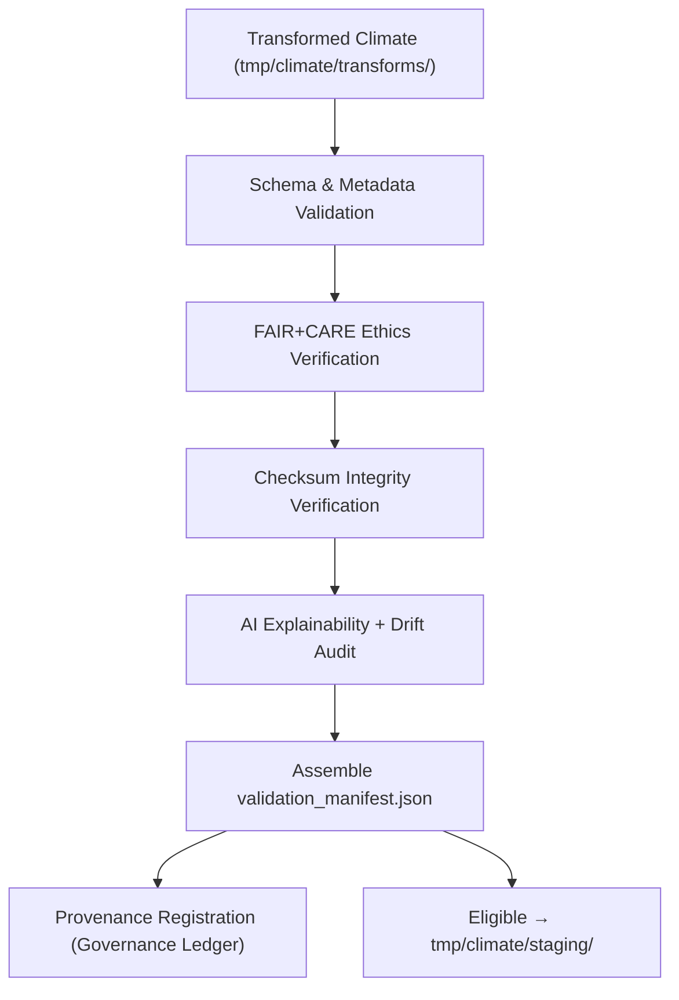

<div align="center">

# ✅ **Kansas Frontier Matrix — Climate Validation Workspace (Schema, FAIR+CARE & AI QA Layer)**  
`data/work/tmp/climate/validation/README.md`

**Purpose:**  
Central governance-linked QA hub for **schema validation, FAIR+CARE ethics auditing, checksum verification, telemetry v2, and AI quality assurance** of climate datasets within the TMP pipeline.

This workspace ensures that every climate artifact promoted beyond TMP:

- Meets **schema + metadata requirements** (STAC/DCAT/CF/ISO)  
- Passes **FAIR+CARE ethics checks**  
- Has **verified checksums & documented provenance**  
- Has been **audited for AI model quality & drift**  

[](../../../../../docs/architecture/README.md)  
[](../../../../../docs/standards/faircare/FAIRCARE-GUIDE.md)  
[]()  
[]()  
[]()

</div>

---

## 1. 📘 Overview

The **Climate Validation Workspace** is the **final QA checkpoint** for all climate data emerging from:

- `data/work/tmp/climate/transforms/`  
- `data/work/tmp/climate/exports/`  

Here we perform:

- Schema & structural validation (KFM data-contract v3, STAC, CF, ISO 19115)  
- FAIR+CARE ethical audits (access, sensitivity, reuse)  
- Checksum verification vs. manifests & registries  
- AI model validation: drift detection, explainability scoring  
- Compilation of validation manifests and governance-ready records  

Only datasets that pass these checks are eligible for promotion to `data/work/tmp/climate/staging/`.

---

## 2. 🗂️ Directory Layout (Mobile-Safe)

```text
data/work/tmp/climate/validation/
├── README.md                      ← this file
├── schema_report.json             # Detailed schema & format checks
├── checksums.json                 # Checksum validation results
├── faircare_report.json           # FAIR+CARE audit outcomes
├── ai_explainability.json         # Model explainability results
├── drift_audit.json               # Model drift & stability analysis
├── validation_manifest.json       # Consolidated validation results
├── governance_review.json         # Council review & sign-off
└── metadata.json                  # Local validation run metadata
```

Additional validation artifacts MAY be added but MUST be referenced in `validation_manifest.json`.

---

## 3. ⚙️ Validation Workflow



### Step Summary

1. **Schema Validation**  
   - Check variable names, types, ranges, units, CRS, and CF conformance.  

2. **FAIR+CARE Audit**  
   - Validate ethical use, sensitivity flags, and access constraints.  

3. **Checksum Verification**  
   - Compare with `tmp` and domain-level checksum registries.  

4. **AI QA & Drift**  
   - Run explainability methods (LIME/SHAP) on model outputs; detect drift and anomalies.  

5. **Validation Manifest**  
   - Compile results into `validation_manifest.json` with references to all artifact files.  

6. **Governance Registration**  
   - Register validation events in `ai_climate_validation_ledger.json` & provenance logs.  

---

## 4. 🧩 Example Validation Record

```json
{
  "id": "climate_validation_precipitation_v11.0.0",
  "domain": "climate",
  "dataset_ref": "data/work/tmp/climate/transforms/precipitation_harmonized_2025.parquet",
  "schema_status": "passed",
  "fair_care_score": 99.2,
  "ai_explainability_score": 0.991,
  "checksum_integrity": "verified",
  "drift_detected": false,
  "validated_by": "@kfm-climate-lab",
  "created": "2025-11-20T23:59:00Z",
  "telemetry": {
    "energy_wh": 0.8,
    "carbon_gco2e": 1.0,
    "validation_coverage_pct": 100
  },
  "ledger_ref": "reports/audit/ai_climate_validation_ledger.json#climate_validation_2025_11_20_001"
}
```

This record is:

- A **prov:Entity** representing a specific validation event  
- Linked to transformation and export entities and QA activities  

---

## 5. 🧠 FAIR+CARE & ISO Governance Matrix

| Standard / Principle | Description                                      | Result | Oversight              |
|----------------------|--------------------------------------------------|--------|------------------------|
| **FAIR+CARE**        | Ethics, accessibility, reuse, community context  | ✅      | `@faircare-council`    |
| **ISO 19115**        | Metadata structure & lineage                     | ✅      | `@kfm-architecture`    |
| **ISO 14064**        | Carbon reporting for validation compute          | ✅      | `@kfm-sustainability`  |
| **STAC 1.0**         | Spatial/temporal metadata alignment              | ✅      | `@kfm-data`            |
| **CF Conventions**   | Climate variable + unit checks                   | ✅      | `@kfm-climate`         |
| **Provenance Ledger**| Immutable validation audit records               | ✅      | `@kfm-governance`      |

Audit & Governance References:

- `../../../../../reports/audit/ai_climate_validation_ledger.json`  
- `../../../../../reports/fair/climate_validation_summary.json`  

---

## 6. 🧪 AI Explainability Snapshot

```json
{
  "model": "focus-climate-v5",
  "task": "precipitation_anomaly_classification",
  "method": "LIME",
  "top_features": [
    {"feature": "precip_anomaly_3mo", "importance": 0.19},
    {"feature": "soil_moisture_anomaly", "importance": 0.12},
    {"feature": "temperature_anomaly", "importance": 0.10}
  ],
  "drift_detected": false,
  "explanation_score": 0.991,
  "validated_by": "@kfm-ai-review"
}
```

These outputs are stored in `ai_explainability.json` and cross-referenced in `validation_manifest.json`.

---

## 7. 🧾 Validation Artifacts & Automation

Key artifacts in this directory:

| File                        | Description                                  | Format |
|-----------------------------|----------------------------------------------|--------|
| `schema_report.json`        | Detailed schema, CF, and ISO checks          | JSON   |
| `checksums.json`            | Checksum verification results                | JSON   |
| `faircare_report.json`      | FAIR+CARE audit outcomes & notes             | JSON   |
| `ai_explainability.json`    | Model explainability outputs                 | JSON   |
| `drift_audit.json`          | Model drift & stability checks               | JSON   |
| `validation_manifest.json`  | Master summary of validation run             | JSON   |
| `governance_review.json`    | Council decisions & comments                 | JSON   |
| `metadata.json`             | Run-level metadata & telemetry               | JSON   |

Automation Workflow:

- `climate_validation_sync.yml` — orchestrates validation, artifact generation, and ledger sync.

---

## 8. ♻️ Sustainability Metrics (ISO)

Example climate validation run:

| Metric                   | Standard  | Value  | Verified By           |
|--------------------------|-----------|-------:|-----------------------|
| Energy (Wh/run)         | ISO 50001 | 6.8    | `@kfm-sustainability` |
| Carbon (gCO₂e/run)      | ISO 14064 | 8.0    | `@kfm-security`       |
| Renewable Power Share   | RE100     | 100%   | `@kfm-infrastructure` |
| Validation Coverage     | N/A       | 100%   | `@faircare-council`   |

Telemetry is logged in:  
`../../../../../releases/v11.0.0/focus-telemetry.json`

---

## 9. 🕰️ Version History

| Version | Date       | Author           | Summary                                                       |
|--------:|------------|------------------|---------------------------------------------------------------|
| v11.0.0 | 2025-11-20 | `@kfm-climate`   | Upgraded to v11, added governance fields & TMP alignment      |
| v10.0.0 | 2025-11-09 | `@kfm-climate`   | Telemetry v2, drift audit, CF/ISO checks, FAIR+CARE reports   |

<div align="center">

**Kansas Frontier Matrix — Climate Validation Workspace**  
✅ FAIR+CARE Certified · Schema & AI QA Hub · Diamond⁹ Ω / Crown⁹ Ω  

© 2025 Kansas Frontier Matrix — CC-BY 4.0  

[Back to Climate TMP](../README.md) · [Data Architecture](../../../../ARCHITECTURE.md) · [Governance Charter](../../../../../docs/standards/governance/ROOT-GOVERNANCE.md)

</div>
