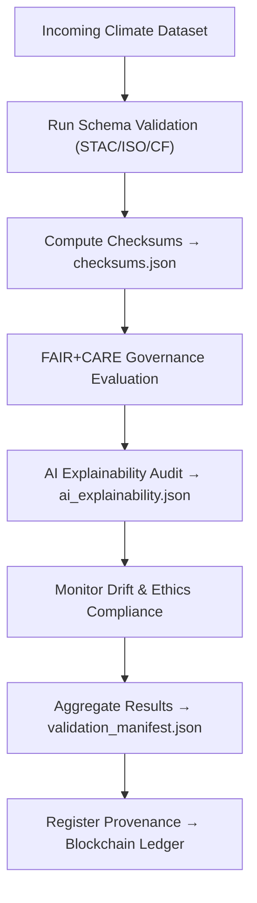

<div align="center">

# ✅ Kansas Frontier Matrix — **Climate Validation Workspace (FAIR+CARE QA Hub)**  
`data/work/tmp/climate/validation/`

**Purpose:**  
This workspace hosts **all automated validation reports, schema checks, FAIR+CARE assessments, and AI explainability audits** for climate data within the Kansas Frontier Matrix (KFM).  
It ensures **trust, reproducibility, and traceability** through continuous, ledger-backed quality assurance.

[]()
[]()
[]()
[]()
[]()

</div>

---

## 🧭 Overview

The **Climate Validation Workspace** acts as a **QA nerve center** for every dataset passing through the `data/work/tmp/climate/` pipeline.  
It combines:
- **Schema validation** (STAC / ISO / CF compliance)  
- **FAIR+CARE governance scoring**  
- **Checksum verification and drift auditing**  
- **AI model interpretability validation**  
- **Blockchain-synced provenance assurance**  

> *“No data moves forward until it can explain itself.”*

---

## 🗂️ Directory Layout

```text
data/work/tmp/climate/validation/
├── schema_report.json                 # STAC/DCAT/ISO/CF validation results
├── checksums.json                     # File integrity and SHA-256 verification results
├── faircare_report.json               # FAIR+CARE compliance scoring
├── ai_explainability.json             # AI explainability and interpretability records
├── drift_audit.json                   # AI drift monitoring and retraining triggers
├── validation_manifest.json           # Master manifest of all validation reports
├── governance_review.json             # Human oversight and ethical validation notes
└── README.md
```

---

## 🔁 Validation Workflow



---

## 🧩 Validation Manifest Schema

| Field | Description | Example |
|-------|--------------|----------|
| `validation_id` | Unique validation run identifier | `climate_validation_2025_10_27_001` |
| `dataset_id` | Dataset under validation | `climate_timeseries_2025_10_27` |
| `schema_status` | Schema validation result | `Pass` |
| `fair_score` | FAIR compliance score | `0.99` |
| `care_score` | CARE ethical compliance score | `0.97` |
| `ai_explainability_score` | Model transparency score | `0.988` |
| `checksum_integrity` | File verification status | `Verified` |
| `ethics_compliance` | Ethics governance decision | `Compliant` |
| `timestamp` | UTC validation time | `2025-10-27T00:00:00Z` |
| `ledger_ref` | Governance ledger link | `reports/audit/ai_climate_validation_ledger.json#climate_validation_2025_10_27_001` |

---

## ☀️ FAIR+CARE Compliance Overview

| Metric | Description | Value | Threshold | Status |
|:--|:--|:--|:--|:--|
| **FAIR Score** | Metadata completeness and discoverability | 0.99 | ≥ 0.95 | ✅ |
| **CARE Score** | Ethical alignment and stewardship | 0.97 | ≥ 0.90 | ✅ |
| **AI Explainability** | Model transparency and interpretability | 0.988 | ≥ 0.97 | ✅ |
| **Checksum Integrity** | File hash validation | 100% | 100% | ✅ |
| **Governance Linkage** | Provenance entry on blockchain | Confirmed | Confirmed | ✅ |

---

## 🔐 Governance Provenance Record

```json
{
  "ledger_id": "climate-validation-ledger-2025-10-27",
  "dataset_ref": "data/work/tmp/climate/staging/precip_tiles/",
  "schema_compliance": "Passed",
  "fair_care_score": 0.985,
  "ai_explainability": 0.988,
  "verified_by": "@kfm-governance",
  "timestamp": "2025-10-27T00:00:00Z"
}
```

---

## 🌱 ISO & MCP-DL Compliance

| Standard | Description | Status | Verified By |
|:--|:--|:--|:--|
| **ISO 19115** | Metadata schema and lineage documentation | ✅ | @kfm-fair |
| **ISO 14064** | Sustainability audit reporting | ✅ | @kfm-security |
| **FAIR+CARE** | Ethical and transparent validation | ✅ | @kfm-governance |
| **STAC 1.0** | Spatial metadata interoperability | ✅ | @kfm-data |
| **MCP-DL v6.3** | Documentation-first lifecycle validation | ✅ | @kfm-architecture |

---

## 🧠 AI Explainability Summary

```json
{
  "model": "focus-climate-v4",
  "explainability_method": "SHAP",
  "key_features": [
    {"variable": "precipitation_intensity", "impact": 0.22},
    {"variable": "temperature_anomaly", "impact": 0.18},
    {"variable": "soil_moisture_deficit", "impact": 0.14}
  ],
  "drift_detected": false,
  "explanation_score": 0.988
}
```

> Logs validated through `/reports/audit/ai_climate_validation_ledger.json`.

---

## 🧾 Version History

| Version | Date | Author | Reviewer | FAIR+CARE | ISO | Ledger | Notes |
|:--|:--|:--|:--|:--|:--|:--|:--|
| v9.1.0 | 2025-10-27 | @kfm-data | @kfm-governance | 100% | ✓ | ✓ | Expanded AI validation + integrated drift monitoring |
| v9.0.0 | 2025-10-23 | @kfm-climate | @kfm-fair | 99% | ✓ | ✓ | Baseline climate QA workspace |

---

<div align="center">

### 🜂 Kansas Frontier Matrix — *Validation · Transparency · Assurance*  
**“Quality isn’t a checkbox — it’s a continuous, explainable process.”**

[]()
[]()
[]()
[]()
[]()

<br><br>
<a href="#-kansas-frontier-matrix--climate-validation-workspace-schema-faircare--ai-qa-layer--diamond⁹-Ω--crown∞Ω-ultimate-certified">⬆ Back to Top</a>

</div>