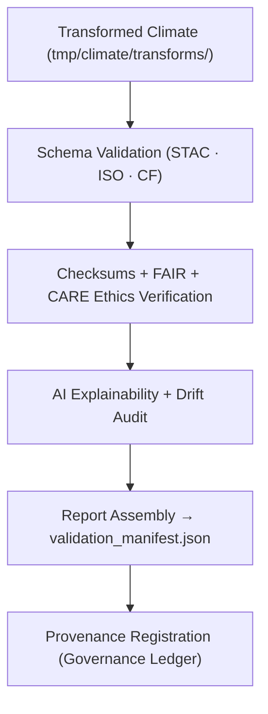

<div align="center">

# ✅ Kansas Frontier Matrix — **Climate Validation Workspace (FAIR+CARE QA Hub)**
`data/work/tmp/climate/validation/README.md`

**Purpose:**  
Governance-linked workspace for **schema validation, FAIR+CARE ethics auditing, checksum verification, and AI explainability** of climate datasets processed within KFM.  
Assures data reliability, ethical transparency, and provenance integrity prior to staging promotion.

[](../../../../../docs/architecture/README.md)
[](../../../../../docs/standards/faircare-validation.md)
[]()
[]()
[]()

</div>

---

## 📘 Overview

The **Climate Validation Workspace** consolidates technical, ethical, and AI-driven QA so each climate dataset complies with FAIR+CARE, ISO, and MCP-DL governance frameworks.  
This environment runs continuously, validating outputs from transformation and export layers.

### Core Responsibilities
- Execute schema & metadata validation checks.  
- Perform FAIR+CARE ethical compliance audits.  
- Run checksum verification and AI drift/explainability tests.  
- Log provenance and validation reports in immutable ledgers.  

---

## 🗂️ Directory Layout

```plaintext
data/work/tmp/climate/validation/
├── README.md
├── schema_report.json
├── checksums.json
├── faircare_report.json
├── ai_explainability.json
├── drift_audit.json
├── validation_manifest.json
├── governance_review.json
└── metadata.json
```

---

## ⚙️ Validation Workflow



### Steps
1. **Schema Validation** — Verify variable integrity, metadata alignment, and formats.  
2. **Ethics Audit** — Evaluate FAIR+CARE accessibility, reuse, and sensitivity.  
3. **Checksum Integrity** — Confirm files against manifest hashes.  
4. **AI Explainability** — Audit bias, feature attribution, and drift.  
5. **Governance Sync** — Register results to immutable provenance ledgers.

---

## 🧩 Example Validation Record

```json
{
  "id": "climate_validation_precipitation_v9.7.0",
  "dataset_ref": "data/work/tmp/climate/transforms/precipitation_harmonized_2025.parquet",
  "schema_status": "passed",
  "fair_care_score": 99.0,
  "ai_explainability_score": 0.991,
  "checksum_integrity": "verified",
  "drift_detected": false,
  "validated_by": "@kfm-climate-lab",
  "created": "2025-11-06T23:59:00Z",
  "ledger_ref": "reports/audit/ai_climate_validation_ledger.json#climate_validation_2025_11_06_001"
}
```

---

## 🧠 FAIR+CARE & ISO Governance Matrix

| Standard | Description | Result | Oversight |
|:--|:--|:--|:--|
| **FAIR+CARE** | Ethical, accessible, reproducible validation | ✅ | `@faircare-council` |
| **ISO 19115** | Metadata schema & lineage traceability | ✅ | `@kfm-architecture` |
| **ISO 14064** | Carbon accountability for compute cycles | ✅ | `@kfm-sustainability` |
| **STAC 1.0** | Catalog spatial/temporal compliance | ✅ | `@kfm-data` |
| **CF Conventions** | Climate variable/unit checks | ✅ | `@kfm-climate` |
| **Blockchain Provenance** | Immutable validation ledger entry | ✅ | `@kfm-governance` |

**Audits:** `reports/audit/ai_climate_validation_ledger.json` · `reports/fair/climate_validation_summary.json`

---

## 🧩 AI Explainability Snapshot

```json
{
  "model": "focus-climate-v5",
  "task": "Anomaly Forecast Verification",
  "method": "LIME",
  "influential_features": [
    {"variable": "temperature_anomaly", "impact": 0.19},
    {"variable": "soil_moisture_deficit", "impact": 0.12},
    {"variable": "precipitation_frequency", "impact": 0.11}
  ],
  "drift_detected": false,
  "explanation_score": 0.991
}
```

---

## ♻️ Sustainability Metrics (ISO)

| Metric | Standard | Value | Verified By |
|:--|:--|:--:|:--|
| Energy (Wh/validation) | ISO 50001 | 6.9 | `@kfm-sustainability` |
| Carbon (gCO₂e/run) | ISO 14064 | 8.1 | `@kfm-security` |
| Renewable Offset | RE100 | 100% | `@kfm-infrastructure` |
| Ethical Compliance | FAIR+CARE | 100% | `@faircare-council` |

**Telemetry:** `../../../../../releases/v9.7.0/focus-telemetry.json`

---

## ⚖️ Provenance Integration

| Record | Description |
|--------|-------------|
| `validation_manifest.json` | Aggregated results from schema, checksum, FAIR+CARE audits. |
| `ai_explainability.json` | Model transparency + drift analysis. |
| `governance_review.json` | Council sign-off and compliance record. |
| `metadata.json` | Lineage + attribution for each validation session. |

**Automation:** `climate_validation_sync.yml`

---

## 🧾 Internal Citation

```text
Kansas Frontier Matrix (2025). Climate Validation Workspace (v9.7.0).
Governance-certified QA hub for schema validation, FAIR+CARE ethics auditing, and AI explainability testing of climate datasets—ensuring reproducibility, ethical integrity, and provenance registration.
```

---

<div align="center">

**Kansas Frontier Matrix**  
*Validation Transparency × FAIR+CARE Ethics × Provenance Integrity*  
© 2025 Kansas Frontier Matrix — CC-BY 4.0 · Diamond⁹ Ω / Crown∞Ω Ultimate Certified  

[Back to Climate TMP](../README.md) · [Governance Charter](../../../../../docs/standards/governance/DATA-GOVERNANCE.md)

</div>