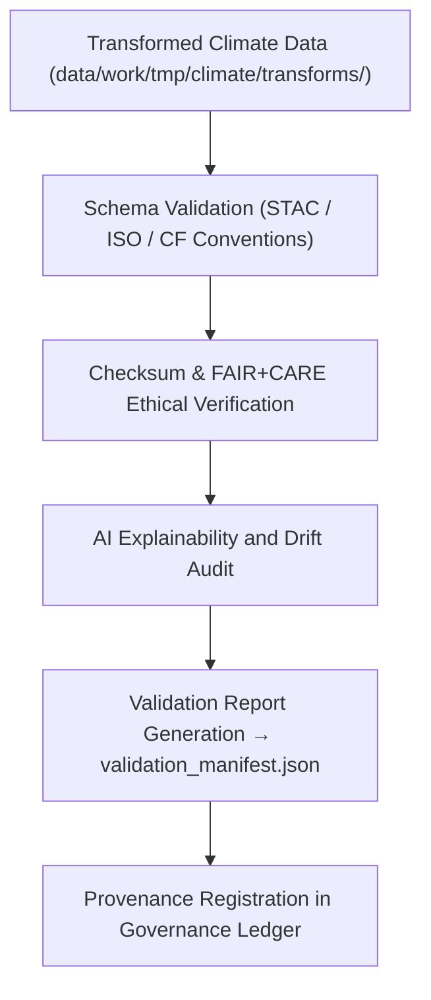

<div align="center">

# ✅ Kansas Frontier Matrix — **Climate Validation Workspace (FAIR+CARE QA Hub)**
`data/work/tmp/climate/validation/README.md`

**Purpose:**  
Governance-linked workspace for schema validation, FAIR+CARE ethics auditing, checksum verification, and AI explainability analysis of climate datasets processed within the Kansas Frontier Matrix (KFM).  
This layer ensures data reliability, ethical transparency, and provenance integrity prior to staging promotion.

[](../../../../../docs/standards/faircare-validation.md)
[]()
[]()
[]()
[](../../../../../docs/architecture/repo-focus.md)

</div>

---

## 📚 Overview

The **Climate Validation Workspace** consolidates technical, ethical, and AI-driven validation processes to ensure each climate dataset complies with FAIR+CARE, ISO, and MCP-DL governance frameworks.  
This environment operates autonomously, continuously validating outputs from transformation and export layers.

### Core Responsibilities
- Execute schema and metadata validation checks.  
- Perform FAIR+CARE ethical compliance audits.  
- Run checksum verification and AI drift explainability tests.  
- Log provenance and validation reports in immutable ledgers.  

---

## 🗂️ Directory Layout

```plaintext
data/work/tmp/climate/validation/
├── README.md                             # This file — overview of the validation workspace
│
├── schema_report.json                    # Schema and metadata validation results
├── checksums.json                        # Checksum registry for integrity verification
├── faircare_report.json                  # FAIR+CARE ethics and accessibility audit summary
├── ai_explainability.json                # AI interpretability and explainability report
├── drift_audit.json                      # AI model drift monitoring summary
├── validation_manifest.json              # Master manifest aggregating validation reports
├── governance_review.json                # Governance sign-off and compliance review record
└── metadata.json                         # Provenance and validation session metadata
```

---

## ⚙️ Validation Workflow



### Description
1. **Schema Validation:** Check variable integrity, metadata alignment, and format compliance.  
2. **Ethics Audit:** Evaluate FAIR+CARE accessibility, reusability, and data sensitivity compliance.  
3. **Checksum Verification:** Confirm file integrity against manifest hashes.  
4. **AI Explainability:** Audit model bias, feature influence, and prediction drift.  
5. **Governance Sync:** Register validation results into immutable provenance ledgers.  

---

## 🧩 Example Validation Record

```json
{
  "id": "climate_validation_precipitation_v9.6.0",
  "dataset_ref": "data/work/tmp/climate/transforms/precipitation_harmonized_2025.parquet",
  "schema_status": "passed",
  "fair_care_score": 98.9,
  "ai_explainability_score": 0.991,
  "checksum_integrity": "verified",
  "drift_detected": false,
  "validated_by": "@kfm-climate-lab",
  "created": "2025-11-03T23:59:00Z",
  "ledger_ref": "reports/audit/ai_climate_validation_ledger.json#climate_validation_2025_11_03_001"
}
```

---

## 🧠 FAIR+CARE & ISO Governance Matrix

| Standard | Description | Result | Oversight |
|:--|:--|:--|:--|
| **FAIR+CARE** | Ethical, accessible, and reproducible validation. | ✅ | @faircare-council |
| **ISO 19115** | Metadata schema and lineage traceability. | ✅ | @kfm-architecture |
| **ISO 14064** | Carbon accountability for computational cycles. | ✅ | @kfm-sustainability |
| **STAC 1.0** | Spatial and temporal catalog compliance. | ✅ | @kfm-data |
| **CF Conventions** | Climate variable and unit validation. | ✅ | @kfm-climate |
| **Blockchain Provenance** | Immutable ledger entry for every validation. | ✅ | @kfm-governance |

Audit results stored in:  
`reports/audit/ai_climate_validation_ledger.json` and  
`reports/fair/climate_validation_summary.json`

---

## 🧩 AI Explainability Snapshot

```json
{
  "model": "focus-climate-v5",
  "validation_task": "Anomaly Forecast Verification",
  "explainability_method": "LIME",
  "influential_features": [
    {"variable": "temperature_anomaly", "impact": 0.19},
    {"variable": "soil_moisture_deficit", "impact": 0.12},
    {"variable": "precipitation_frequency", "impact": 0.11}
  ],
  "drift_detected": false,
  "explanation_score": 0.991
}
```

> **Note:** AI validation ensures interpretability, fairness, and adherence to KFM’s explainability governance framework.

---

## 🌱 ISO Sustainability Metrics

| Metric | Standard | Value | Verified By |
|:--|:--|:--|:--|
| **Energy Use (Wh/validation)** | ISO 50001 | 6.9 | @kfm-sustainability |
| **Carbon Output (gCO₂e/run)** | ISO 14064 | 8.1 | @kfm-security |
| **Renewable Power Offset** | RE100 | 100% | @kfm-infrastructure |
| **Ethical Compliance** | FAIR+CARE MCP-DL | 100% | @faircare-council |

Metrics recorded in:  
`releases/v9.6.0/focus-telemetry.json`

---

## ⚖️ Provenance Integration

| Record | Description |
|---------|-------------|
| `validation_manifest.json` | Aggregates results from schema, checksum, and FAIR+CARE audits. |
| `ai_explainability.json` | Documents AI model transparency and drift analysis. |
| `governance_review.json` | Ethics and governance review record. |
| `metadata.json` | Session metadata capturing lineage and validator attribution. |

Automation executed by `climate_validation_sync.yml`.

---

## 🧾 Internal Use Citation

```text
Kansas Frontier Matrix (2025). Climate Validation Workspace (v9.6.0).
Governance-certified QA hub for schema validation, FAIR+CARE ethics auditing, and AI explainability testing of climate datasets.
Ensures reproducibility, ethical integrity, and provenance registration under MCP-DL v6.3 standards.
```

---

## 🧾 Version Notes

| Version | Date | Notes |
|----------|------|--------|
| v9.6.0 | 2025-11-03 | Enhanced AI explainability integration and drift auditing; added blockchain governance sync. |
| v9.5.0 | 2025-11-02 | Introduced checksum registry and FAIR+CARE compliance scoring automation. |
| v9.3.2 | 2025-10-28 | Established climate validation workspace for FAIR+CARE QA and schema integrity verification. |

---

<div align="center">

**Kansas Frontier Matrix** · *Validation Transparency × FAIR+CARE Ethics × Provenance Integrity*  
[🔗 Repository](https://github.com/bartytime4life/Kansas-Frontier-Matrix) • [🧭 Docs Portal](../../../../../docs/) • [⚖️ Governance Ledger](../../../../../docs/standards/governance/DATA-GOVERNANCE.md)

</div>
