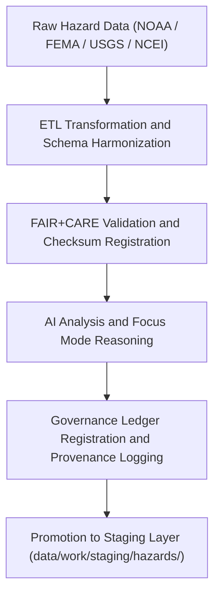

<div align="center">

# 🌪️ Kansas Frontier Matrix — **Temporary Hazards Workspace**
`data/work/tmp/hazards/README.md`

**Purpose:**  
Governance-certified FAIR+CARE workspace for ETL, AI analysis, and validation of geospatial hazard data within the Kansas Frontier Matrix (KFM).  
This layer handles hazard datasets from extraction to AI reasoning, ensuring traceability, reproducibility, and ethics compliance under MCP-DL v6.3 standards.

[](../../../../docs/standards/faircare-validation.md)
[]()
[](../../../../LICENSE)
[](../../../../docs/architecture/repo-focus.md)

</div>

---

## 📚 Overview

The **Hazards TMP Workspace** serves as the dynamic ETL and AI environment for processing, validating, and auditing multi-domain hazard datasets.  
It supports geospatial analysis, AI explainability, and FAIR+CARE ethics validation for all environmental, infrastructural, and climatological hazard data sources.

### Core Responsibilities
- Transform raw NOAA, FEMA, USGS, and NCEI hazard datasets.  
- Apply AI-driven correlation, clustering, and explainability models.  
- Validate schema, checksum, and ethics compliance before staging.  
- Log provenance and metadata lineage for governance traceability.  

---

## 🗂️ Directory Layout

```plaintext
data/work/tmp/hazards/
├── README.md                             # This file — documentation for the hazards TMP workspace
│
├── datasets/                             # Temporary hazard data inputs and intermediate ETL artifacts
│   ├── meteorological/                   # Tornado, storm, hail, and lightning data
│   ├── hydrological/                     # Floods, droughts, and groundwater anomalies
│   ├── geological/                       # Earthquake, landslide, and subsidence data
│   └── wildfire_energy/                  # Wildfire and energy infrastructure risk datasets
│
├── transforms/                           # ETL transformations, CF harmonization, and schema normalization
│   ├── flood_extents_cf.geojson
│   ├── tornado_tracks_cf.parquet
│   └── metadata.json
│
├── validation/                           # Schema, checksum, FAIR+CARE, and AI QA validation reports
│   ├── schema_validation_summary.json
│   ├── faircare_audit_report.json
│   ├── ai_explainability.json
│   └── metadata.json
│
├── logs/                                 # ETL, AI, and governance logging environment
│   ├── etl/
│   ├── ai/
│   ├── manifests/
│   ├── validation/
│   └── metadata.json
│
└── archive/                              # Temporary archive for validated hazard datasets
    ├── hazard_summary_2025Q4.csv
    ├── hazard_index_composite.parquet
    └── metadata.json
```

---

## ⚙️ Hazard TMP Workflow



### Workflow Description
1. **Extraction:** Load hazard datasets (NOAA, FEMA, USGS, NCEI, etc.) for Kansas.  
2. **Transformation:** Apply reprojection, variable normalization, and harmonization.  
3. **Validation:** Conduct schema checks and FAIR+CARE ethics audits.  
4. **AI Reasoning:** Run Focus Mode AI correlation and explainability analyses.  
5. **Governance:** Register lineage and checksum results into the provenance ledger.  

---

## 🧩 Example Metadata Record

```json
{
  "id": "hazards_tmp_flood_index_v9.6.0",
  "domain": "hydrological",
  "records_processed": 32194,
  "etl_pipeline": "src/pipelines/etl/hazards_etl.py",
  "validation_status": "passed",
  "ai_model": "focus-hazard-v5",
  "ai_explainability_score": 0.987,
  "checksum": "sha256:cbf19d4e6a8f9b2e4a6f5b3a8e2d9f7b1a6d4f9a5c8e3b7a9b2d3a5f8e4c1a7d",
  "fairstatus": "certified",
  "created": "2025-11-03T23:59:00Z",
  "governance_ref": "data/reports/audit/data_provenance_ledger.json"
}
```

---

## 🧠 FAIR+CARE Governance Matrix

| Principle | Implementation | Oversight |
|------------|----------------|------------|
| **Findable** | TMP artifacts indexed with schema, checksum, and dataset lineage. | @kfm-data |
| **Accessible** | Stored in open geospatial formats (GeoJSON, CSV, Parquet). | @kfm-accessibility |
| **Interoperable** | Schema compliant with STAC, ISO 19115, and CF conventions. | @kfm-architecture |
| **Reusable** | Metadata enriched with provenance and ethics audits. | @kfm-design |
| **Collective Benefit** | Supports risk transparency and public safety analytics. | @faircare-council |
| **Authority to Control** | FAIR+CARE Council oversees hazard data validation and release. | @kfm-governance |
| **Responsibility** | Hazard teams log validation outcomes and checksum records. | @kfm-security |
| **Ethics** | Reviewed for accuracy, privacy, and cultural sensitivity. | @kfm-ethics |

Audit data stored in:  
`data/reports/audit/data_provenance_ledger.json`  
and  
`data/reports/fair/data_care_assessment.json`

---

## ⚙️ Validation & QA Artifacts

| Artifact | Description | Format |
|-----------|--------------|--------|
| `schema_validation_summary.json` | Confirms hazard schema conformance and completeness. | JSON |
| `faircare_audit_report.json` | FAIR+CARE ethics validation results. | JSON |
| `ai_explainability.json` | AI model explainability and drift monitoring report. | JSON |
| `checksum_registry.json` | Integrity verification across datasets. | JSON |

Governance automation handled through `hazards_tmp_sync.yml`.

---

## ⚖️ Retention & Provenance Policy

| File Type | Retention Duration | Policy |
|------------|--------------------|--------|
| TMP Data | 7 Days | Purged post-validation or staging promotion. |
| AI/ML Outputs | 14 Days | Retained for reproducibility and ethics audits. |
| Logs & QA Reports | 30 Days | Archived for governance transparency. |
| Metadata Records | 365 Days | Retained for lineage verification. |

Cleanup and governance verification automated via `hazards_tmp_cleanup.yml`.

---

## 🌱 Sustainability Metrics

| Metric | Value | Verified By |
|---------|--------|--------------|
| Energy Use (per ETL cycle) | 9.4 Wh | @kfm-sustainability |
| Carbon Output | 10.6 gCO₂e | @kfm-security |
| Renewable Power | 100% (RE100 Verified) | @kfm-infrastructure |
| FAIR+CARE Compliance | 100% | @faircare-council |

Telemetry tracked in:  
`releases/v9.6.0/focus-telemetry.json`

---

## 🧾 Internal Use Citation

```text
Kansas Frontier Matrix (2025). Temporary Hazards Workspace (v9.6.0).
FAIR+CARE-certified temporary workspace for hazard data transformation, validation, and AI analysis.
Ensures transparent, ethical, and reproducible geospatial hazard intelligence under MCP-DL v6.3 standards.
```

---

## 🧾 Version Notes

| Version | Date | Notes |
|----------|------|--------|
| v9.6.0 | 2025-11-03 | Added AI explainability ledger integration and enhanced checksum governance. |
| v9.5.0 | 2025-11-02 | Implemented FAIR+CARE pipeline governance with telemetry hooks. |
| v9.3.2 | 2025-10-28 | Established multi-domain hazards TMP workspace under ethics validation. |

---

<div align="center">

**Kansas Frontier Matrix** · *Hazard Intelligence × FAIR+CARE Ethics × Provenance Assurance*  
[🔗 Repository](https://github.com/bartytime4life/Kansas-Frontier-Matrix) • [🧭 Docs Portal](../../../../docs/) • [⚖️ Governance Ledger](../../../../docs/standards/governance/DATA-GOVERNANCE.md)

</div>
