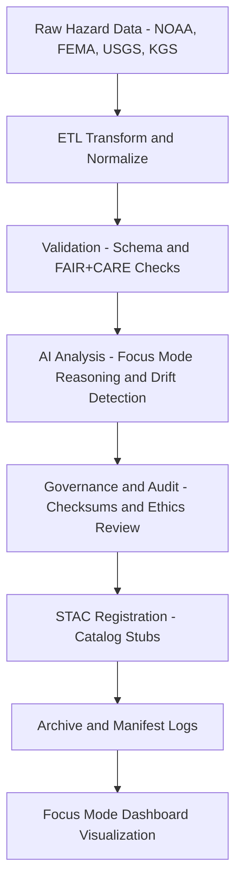

<div align="center">

# 🌦️ Kansas Frontier Matrix — **Temporary Hazards Workspace**
`data/work/tmp/hazards/README.md`

**Purpose:** Temporary processing and analysis environment for hazard-related datasets, AI models, and validation cycles.  
Supports dynamic ETL, geospatial correlation, and Focus Mode AI reasoning for environmental and infrastructure hazards across Kansas.

[](../../../docs/architecture/repo-focus.md)
[](../../../LICENSE)
[](../)
[](../../../.github/workflows/stac-validate.yml)
[](../../../docs/standards/faircare-validation.md)

</div>

---

## 📚 Overview

The **Hazards Temporary Workspace** provides a controlled sandbox for geospatial and tabular hazard datasets before they are finalized and moved to staging or processed layers.  
It integrates **ETL pipelines, AI reasoning modules, FAIR+CARE validation checks,** and **governance oversight** within the Kansas Frontier Matrix (KFM) ecosystem.

Hazards covered include:
- **Meteorological:** Tornadoes, severe storms, lightning, hail  
- **Hydrological:** Floods, droughts, groundwater stress  
- **Geological:** Earthquakes, landslides, subsidence  
- **Wildfire & Energy:** Fire risk, grid vulnerability, and critical infrastructure overlays

This workspace is the operational backbone for hazard-related Focus Mode intelligence.

---

## 🗂 Directory Layout

```plaintext
data/work/tmp/hazards/
├── README.md
├── datasets/          # Hazard inputs (NOAA SPC, NCEI Storm Events, FEMA, USGS, KGS, DASC)
├── transforms/        # Intermediate ETL transformations (GeoJSON, Parquet, GeoTIFF)
├── validation/        # Temporary FAIR+CARE and schema QA artifacts
├── models/            # AI/ML checkpoints, prompts, and explainability assets
├── stac/              # SpatioTemporal Asset Catalog stubs for hazard layers
├── archive/           # Archived, versioned hazard layers and metadata
└── logs/              # ETL, AI, validation, and governance logs
    ├── ai/
    ├── archive/
    ├── energy/
    ├── etl/
    ├── manifests/
    ├── sessions/
    ├── system/
    ├── tmp/
    └── validation/
```

> **Note:** This directory is a *living workspace* — all files are traceable, versioned, and validated per MCP-DL reproducibility requirements.

---

## ⚙️ Workflow Summary



The TMP workspace handles iterative processing steps across **data extraction, model evaluation, and AI explainability**, all fully logged under `logs/`.

---

## 🧠 Focus Mode Integration

Focus Mode consumes hazard TMP outputs to:
- Generate **AI-driven hazard correlation maps** (e.g., tornado path density vs. floodplain extents)  
- Identify **spatiotemporal drift** across ETL cycles and model updates  
- Visualize **risk evolution** in the KFM web app (map + timeline)  
- Produce **county-level narrative summaries** of hazard conditions

Outputs feed into:
- `data/work/tmp/hazards/logs/ai/`
- `data/work/tmp/hazards/logs/validation/`
- `releases/v9.5.0/focus-telemetry.json`

---

## 🧩 FAIR+CARE Compliance

**FAIR**  
- **Findable:** Indexed in STAC; referenced via manifest and governance logs  
- **Accessible:** Open formats (GeoTIFF, GeoJSON, CSV) with MIT license  
- **Interoperable:** Aligns to ISO 19115, DCAT, STAC schemas  
- **Reusable:** Versioned via CI artifacts and checksum verifications

**CARE**  
- **Collective Benefit:** Supports resilience planning and public safety  
- **Authority to Control:** Sensitive facility data generalized or masked  
- **Responsibility:** Bias checks and explainability recorded in AI logs  
- **Ethics:** FAIR+CARE Council review before dissemination

---

## 🧩 Governance & Provenance

Each artifact traces to:
- **Sources:** NOAA SPC/NCEI, FEMA OpenFEMA, USGS, KGS, Kansas DASC  
- **ETL:** `src/pipelines/etl/hazards_etl.py`  
- **Validation:** `schemas/telemetry/work-hazards-v15.json`  
- **AI Reasoning:** `src/pipelines/ai/focus_hazards.py`  
- **Governance:** `docs/standards/governance/hazards-governance.md`

All transactions logged in:
- `reports/audit/ai_hazards_ledger.json`  
- `reports/fair/hazards_summary.json`  
- `reports/self-validation/work-hazards-validation.json`

---

## 🧪 Example TMP Metadata Record

```json
{
  "id": "tmp_hazards_etl_v9.5.0",
  "domain": "hazards",
  "records_processed": 18234,
  "created": "2025-11-02T17:02:00Z",
  "pipeline": "src/pipelines/etl/hazards_tmp_pipeline.py",
  "validation_status": "passed",
  "fairstatus": "compliant",
  "ai_drift_detected": false,
  "checksum": "sha256:c8f9d9c6b16f5b15c3e46a9e5a24a019f15d24a9...",
  "telemetry_link": "releases/v9.5.0/focus-telemetry.json",
  "governance_ref": "data/reports/audit/data_provenance_ledger.json"
}
```

---

## 🧾 Version History

| Version | Date       | Author             | Summary                                                  |
|--------:|------------|--------------------|----------------------------------------------------------|
| v9.5.0  | 2025-11-02 | @kfm-architecture  | Telemetry v15, expanded sources (KGS), AI drift metrics. |
| v9.3.2  | 2025-10-28 | @kfm-architecture  | Completed TMP Hazards Workspace integration.             |
| v9.3.1  | 2025-10-27 | @bartytime4life    | Added Focus Mode integration and FAIR+CARE hooks.        |
| v9.3.0  | 2025-10-26 | @kfm-etl-ops       | Established hazards ETL + validation pipeline.           |

---

<div align="center">

**Kansas Frontier Matrix** · *Hazard Intelligence × Ethical AI × Open Science*  
[🔗 Project Repository](https://github.com/bartytime4life/Kansas-Frontier-Matrix) • [🧭 Docs Portal](../../../docs/)

</div>
