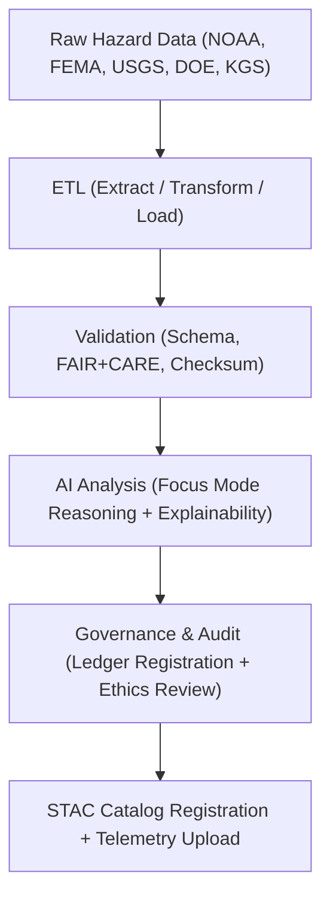

<div align="center">

# 🌪️ Kansas Frontier Matrix — **Temporary Hazards Workspace**
`data/work/tmp/hazards/README.md`

**Purpose:**  
Primary workspace for **temporary processing, validation, and AI-driven analytics of hazard datasets** in the Kansas Frontier Matrix (KFM).  
This environment integrates FAIR+CARE data ethics, ISO-compliant schema governance, and Focus Mode AI for reproducible hazard intelligence across Kansas.

[](../../../../docs/standards/faircare-validation.md)
[](../../../../LICENSE)
[](../../../../docs/architecture/repo-focus.md)

</div>

---

## 📚 Overview

The **Hazards Temporary Workspace (`data/work/tmp/hazards/`)** functions as a dynamic, reproducible sandbox for the **ETL, AI analysis, and validation** of hazard datasets.  
It consolidates meteorological, hydrological, geological, and energy-related hazard data into harmonized formats, validated under FAIR+CARE and ISO 19115 governance frameworks.

### Key Objectives
- Provide an ephemeral processing layer for hazard-related ETL operations.  
- Enable AI reasoning and Focus Mode explainability testing.  
- Conduct FAIR+CARE ethical and schema validation checks.  
- Maintain complete auditability through structured logs and governance ledgers.  

All temporary data, logs, and models generated here are **checksum-verified, version-tracked, and purged after staging promotion or validation**.

---

## 🗂️ Directory Layout

```plaintext
data/work/tmp/hazards/
├── README.md                            # This file — documentation of hazard TMP workspace
│
├── datasets/                            # Temporary input hazard datasets (NOAA, FEMA, USGS, DOE)
│   ├── meteorological/                  # Tornadoes, storms, hail, and lightning
│   ├── hydrological/                    # Flood extents, drought indices, and streamflow data
│   ├── geological/                      # Earthquakes, landslides, and subsidence
│   └── wildfire_energy/                 # Wildfire risk and energy grid exposure
│
├── transforms/                          # ETL transformation outputs and CF-compliant harmonization
├── validation/                          # FAIR+CARE schema validation, checksum, and audit outputs
├── models/                              # Temporary AI/ML models for hazard prediction and correlation
├── logs/                                # ETL, AI, and governance logs for all TMP operations
│   ├── ai/                              # Focus Mode AI explainability and drift monitoring
│   ├── energy/                          # Grid exposure and energy infrastructure hazard logging
│   ├── etl/                             # Extract, Transform, Load operational logs
│   │   ├── extract/                     # Extraction events (source ingestion tracking)
│   │   ├── transform/                   # Field normalization and reprojection operations
│   │   ├── load/                        # Publication and staging promotion records
│   │   ├── lineage/                     # Dataset dependency and provenance chains
│   │   └── summaries/                   # Performance and audit summaries for ETL cycles
│   ├── manifests/                       # TMP manifest records linking telemetry, checksum, and ledger
│   ├── validation/                      # FAIR+CARE validation reports and audits
│   └── system/                          # Internal runtime and orchestration logs
│
└── archive/                             # Archived hazard TMP results, manifests, and audit history
```

---

## ⚙️ TMP Hazard Workflow



### Workflow Description
1. **Extraction:** Ingest and catalog hazard data from authoritative sources.  
2. **Transformation:** Normalize formats, apply CF conventions, and harmonize schemas.  
3. **Validation:** Run schema conformance, FAIR+CARE audits, and integrity checks.  
4. **AI Analysis:** Execute Focus Mode reasoning, explainability, and bias detection.  
5. **Governance:** Register results in `ai_hazards_ledger.json` and publish telemetry to dashboards.  

---

## 🧩 Example Metadata Record

```json
{
  "id": "hazards_tmp_workspace_v9.5.0",
  "domains": ["meteorological", "hydrological", "geological", "wildfire_energy"],
  "records_processed": 426351,
  "checksum_verified": true,
  "validation_reports": 42,
  "ai_models_trained": 6,
  "fairstatus": "certified",
  "telemetry_ref": "releases/v9.5.0/focus-telemetry.json",
  "governance_ref": "reports/audit/ai_hazards_ledger.json",
  "created": "2025-11-02T18:58:00Z",
  "validator": "@kfm-hazards"
}
```

---

## 🧠 FAIR+CARE Governance Summary

| Principle | Implementation |
|------------|----------------|
| **Findable** | Indexed by hazard domain, dataset type, and version. |
| **Accessible** | Open formats (GeoJSON, CSV, Parquet) and internal FAIR+CARE dashboard visibility. |
| **Interoperable** | Aligned with STAC, DCAT, ISO 19115, and CIDOC CRM-HazardExt ontology. |
| **Reusable** | Contains complete provenance, validation, and checksum metadata. |
| **Collective Benefit** | Enables ethical and open hazard research for resilience planning. |
| **Authority to Control** | FAIR+CARE Council manages certification and ethics oversight. |
| **Responsibility** | Validators and AI auditors maintain full transformation lineage. |
| **Ethics** | Audited for transparency, inclusivity, and public data accountability. |

FAIR+CARE reports maintained in:  
`reports/fair/hazards_summary.json` • `reports/audit/ai_hazards_ledger.json`

---

## ⚙️ Core TMP Artifacts

| Category | Description | Example Output |
|-----------|-------------|----------------|
| **Transforms** | Harmonized GeoJSON and CF-compliant hazard datasets | `flood_extents_cf.geojson` |
| **Validation** | FAIR+CARE, checksum, and AI audit reports | `faircare_validation_report.json` |
| **AI Models** | Focus Mode reasoning models for risk forecasting | `focus_hazards_model_v6.pt` |
| **Logs** | ETL execution and governance synchronization events | `hazards_etl_run.log` |
| **Manifests** | TMP lifecycle and checksum linkage records | `tmp_manifest_cycle_2025Q4.json` |

Automation orchestrated through `hazards_tmp_sync.yml`.

---

## 🧾 Retention Policy

| Category | Retention Duration | Policy |
|-----------|--------------------|--------|
| TMP Data | 14 days | Purged post-validation and staging promotion. |
| FAIR+CARE Logs | 365 days | Archived for ethics and governance continuity. |
| AI Outputs | 30 days | Retained for retraining validation and explainability. |
| Metadata & Provenance | Permanent | Stored in ledger for lineage assurance. |

Retention workflows managed by `hazards_tmp_cleanup.yml`.

---

## 🧾 Internal Use Citation

```text
Kansas Frontier Matrix (2025). Temporary Hazards Workspace (v9.5.0).
FAIR+CARE-certified processing and AI governance workspace for hazard ETL, validation, and explainability workflows.
Integrates ethical data governance, provenance integrity, and open reproducibility under MCP-DL v6.3 standards.
```

---

## 🧾 Version Notes

| Version | Date | Notes |
|----------|------|--------|
| v9.5.0 | 2025-11-02 | Unified TMP hazard architecture, telemetry v2, and FAIR+CARE lineage integration. |
| v9.3.2 | 2025-10-28 | Added Focus Mode explainability and ontology alignment (CIDOC CRM-HazardExt). |
| v9.3.0 | 2025-10-26 | Established TMP workspace structure for multi-domain hazard processing. |

---

<div align="center">

**Kansas Frontier Matrix** · *Hazard Intelligence × FAIR+CARE Ethics × Provenance Accountability*  
[🔗 Repository](https://github.com/bartytime4life/Kansas-Frontier-Matrix) • [🧭 Docs Portal](../../../../docs/) • [⚖️ Governance Ledger](../../../../docs/standards/governance/)

</div>