<div align="center">

# 🌪️ **Kansas Frontier Matrix — Temporary Hazards Workspace**  
`data/work/tmp/hazards/README.md`

**Purpose:**  
FAIR+CARE-governed, internal TMP workspace for **ETL transformation, AI correlation analysis, and ethics-aware validation** of hazards data across the Kansas Frontier Matrix.

This environment:

- Integrates multi-source hazard data (NOAA, FEMA, USGS, NCEI, others)  
- Supports AI/ML-based multi-hazard interaction analysis (flood, drought, tornado, wildfire)  
- Enforces schema, CF, and ISO alignment for all intermediate hazard products  
- Captures telemetry (energy, carbon, coverage) and governance logs per run  

[](../../../../docs/architecture/README.md)  
[](../../../../docs/standards/faircare/FAIRCARE-GUIDE.md)  
[]()  
[]()  
[](../../../../LICENSE)

</div>

---

## 1. 📘 Overview

The **Hazards TMP Workspace** is where **hazards ETL and AI workflows** are executed, iterated, and audited before any data is considered for staging.

Core functions:

- Ingest and normalize hazard-related datasets:
  - **Meteorological:** severe storms, precipitation, hail, wind  
  - **Hydrological:** river stage, flood extents (e.g., NHD, NWM, NIDIS)  
  - **Geological:** landslides, seismic events  
  - **Wildfire:** perimeters, intensity, burn severity  

- Run **AI/ML models** (e.g., `focus-hazard-v3`) for:
  - Multi-hazard correlation analysis  
  - Hazard cascade detection  
  - Scenario-based risk exploration  

- Apply **FAIR+CARE & ISO-aligned** validation and telemetry across all processes.  

---

## 2. 🗂️ Directory Layout (Mobile-Safe)

```text
data/work/tmp/hazards/
├── README.md
├── datasets/                     # Input and intermediate hazard data
│   ├── meteorological/
│   ├── hydrological/
│   ├── geological/
│   └── wildfire_energy/
├── transforms/                   # Intermediate hazard transforms
│   ├── flood_extents_cf.geojson
│   ├── tornado_tracks_cf.parquet
│   └── metadata.json
├── validation/                   # Pre-staging validation artifacts
│   ├── schema_validation_summary.json
│   ├── faircare_audit_report.json
│   ├── ai_explainability.json
│   └── metadata.json
├── logs/                         # ETL, AI, and governance logs
│   ├── etl/
│   ├── ai/
│   ├── manifests/
│   ├── validation/
│   └── metadata.json
└── archive/                      # Short-lived hazard test outputs
    ├── hazard_summary_2025Q4.csv
    ├── hazard_index_composite.parquet
    └── metadata.json
```

---

## 3. ⚙️ Hazards TMP Workflow

```mermaid
flowchart TD
    RAW["Raw Hazards (NOAA · FEMA · USGS · NCEI)"]
      --> ETL["ETL Transform + Schema Harmonization"]
    ETL --> FAIR["FAIR+CARE Pre-Validation + Checksum Registration"]
    FAIR --> AI["AI Analysis + Focus Mode Reasoning"]
    AI --> LEDGER["Governance Ledger Sync + Provenance Logging"]
    LEDGER --> STAGE["Promotion → data/work/staging/hazards/"]
```



### Step Summary

1. **Extraction & Harmonization**  
   - Load raw hazard datasets (meteorological, hydrological, geological, wildfire).  
   - Normalize schema, CRS, and attribute domains.  

2. **Pre-Validation & Checksums**  
   - Run schema and FAIR+CARE pre-validation in `validation/`.  
   - Compute and log SHA-256 checksums for intermediate products.  

3. **AI/ML Analysis**  
   - Execute hazard correlation and impact models (`focus-hazard-v3`).  
   - Capture explainability metrics in `validation/ai_explainability.json`.  

4. **Governance Sync**  
   - Register transformation & AI events in `ai_hazards_ledger.json` and `data_provenance_ledger`.  

5. **Promotion**  
   - Pass validated outputs to `data/work/staging/hazards/` for further certification and processing.  

---

## 4. 🧩 Example TMP Metadata Record

```json
{
  "id": "hazards_tmp_flood_index_v11.0.0",
  "domain": "hazards",
  "records_processed": 34821,
  "etl_pipeline": "src/pipelines/etl/hazards_etl_v11.py",
  "validation_status": "passed",
  "ai_model": "focus-hazard-v3",
  "ai_explainability_score": 0.992,
  "checksum_sha256": "sha256:a3f8b9e6d2a4c7f5b1a8e9d3f6a4b9c8e7d1f5b3a9e2d4c6a7f3b8d9c2a5e1f4",
  "telemetry": {
    "energy_wh": 1.2,
    "carbon_gco2e": 1.5,
    "coverage_pct": 100,
    "runtime_sec": 73
  },
  "created": "2025-11-20T23:59:00Z",
  "governance_ref": "data/reports/audit/data_provenance_ledger.json"
}
```

This object is an internal TMP `prov:Entity` linked to:

- Upstream raw hazard datasets  
- ETL + AI `prov:Activity` nodes  
- Governance & audit records  

---

## 5. 🧠 FAIR+CARE Governance Matrix

| Principle              | Implementation                                                   | Oversight              |
|------------------------|------------------------------------------------------------------|------------------------|
| **Findable**           | Hazard TMP outputs indexed by domain, workflow, checksum.       | `@kfm-data`           |
| **Accessible**         | Internal-only access; redaction for sensitive attributes.       | `@kfm-accessibility`  |
| **Interoperable**      | ISO 19115, CF, and HazardExt-compliant schema & metadata.       | `@kfm-architecture`   |
| **Reusable**           | Full lineage, telemetry, and validation logs retained.          | `@kfm-design`         |
| **Collective Benefit** | Supports safety, resilience planning, and public good.          | `@faircare-council`   |
| **Authority to Control** | Hazard data promotion governed by Council & partners.         | `@kfm-governance`     |
| **Responsibility**     | Engineers document all hazard transforms & audits.              | `@kfm-security`       |
| **Ethics**             | Hazard data + AI outputs reviewed for harm mitigation.          | `@kfm-ethics`         |

Audit & Governance References:

- `data/reports/audit/data_provenance_ledger.json`  
- `data/reports/fair/hazards_summary.json`  
- `data/reports/audit/ai_hazards_ledger.json`  

---

## 6. 🧪 Validation & QA Artifacts

Key artifacts in `validation/`:

| File                             | Description                                      | Format |
|----------------------------------|--------------------------------------------------|--------|
| `schema_validation_summary.json` | Hazard schema & structural validation            | JSON   |
| `faircare_audit_report.json`     | FAIR+CARE audit outcomes                         | JSON   |
| `ai_explainability.json`         | Explainable AI validation & model QA             | JSON   |
| `checksum_registry.json`         | SHA-256 integrity verification for TMP assets    | JSON   |
| `metadata.json`                  | Local validation session metadata                | JSON   |

Automation: `hazards_tmp_sync_v2.yml` coordinates hazards TMP ETL, validation, and retention.

---

## 7. ♻️ Retention & Sustainability

| Category           | Retention | Policy                                               |
|--------------------|----------:|------------------------------------------------------|
| TMP Hazard Data    | 7 days    | Purged after promotion to staging or timeout.        |
| AI Outputs         | 14 days   | Retained for audit & model QA.                       |
| Logs & QA Reports  | 30 days   | Archived into governance & telemetry repositories.   |
| Metadata & Checks  | ≥ 365 days| Stored in ledger for long-term provenance.          |

Telemetry Reference:  
`../../../../releases/v11.0.0/focus-telemetry.json`

Example TMP run metrics:

| Metric                   | Value  | Verified By            |
|--------------------------|-------:|------------------------|
| Energy (per TMP cycle)   | 7.4 Wh | `@kfm-sustainability`  |
| Carbon Output (gCO₂e)    | 9.2    | `@kfm-security`        |
| Renewable Power Share    | 100%   | `@kfm-infrastructure`  |
| FAIR+CARE Compliance     | 100%   | `@faircare-council`    |

---

## 8. 🧾 Internal Citation

```text
Kansas Frontier Matrix (2025). Temporary Hazards Workspace (v11.0.0).
FAIR+CARE-governed transient environment for hazard ETL, AI correlation, and ethics auditing—
integrating ISO/CF-compliant schema normalization, telemetry v2, and blockchain-backed
provenance under MCP-DL v6.3 and KFM-PDC v11.
```

---

## 9. 🕰️ Version History

| Version | Date       | Author           | Summary                                                       |
|--------:|------------|------------------|---------------------------------------------------------------|
| v11.0.0 | 2025-11-20 | `@kfm-hazards`   | Upgraded to v11 format; added governance, telemetry, lineage  |
| v10.0.0 | 2025-11-09 | `@kfm-hazards`   | Telemetry v2; ontology link; AI v3 explainability integration |

<div align="center">

**Kansas Frontier Matrix — Temporary Hazards Workspace**  
🌪️ FAIR+CARE Certified · Hazard ETL & AI Sandbox · Diamond⁹ Ω / Crown⁹ Ω  

[Back to TMP Root](../README.md) · [Data Architecture](../../../../ARCHITECTURE.md) · [Governance Charter](../../../../docs/standards/governance/DATA-GOVERNANCE.md)

</div>
```
