<div align="center">

# 🌪️ Kansas Frontier Matrix — **Temporary Hazards Workspace**
`data/work/tmp/hazards/README.md`

**Purpose:**  
Governance-certified FAIR+CARE workspace for **ETL, AI analysis, and validation** of geospatial hazard data within KFM.  
Handles hazard datasets from extraction to AI reasoning, ensuring traceability, reproducibility, and ethics compliance under MCP-DL v6.3.

[](../../../../docs/architecture/README.md)
[](../../../../docs/standards/faircare-validation.md)
[]()
[](../../../../LICENSE)

</div>

---

## 📘 Overview

The **Hazards TMP Workspace** is the dynamic ETL + AI environment for processing, validating, and auditing multi-domain hazard datasets.  
It supports geospatial analysis, AI explainability, and FAIR+CARE ethics validation across environmental, infrastructural, and climatological sources.

### Core Responsibilities
- Transform raw NOAA, FEMA, USGS, and NCEI hazard datasets.  
- Apply AI-driven correlation, clustering, and explainability models.  
- Validate schema, checksums, and ethics compliance before staging.  
- Log provenance/metadata lineage for governance traceability.  

---

## 🗂️ Directory Layout

```plaintext
data/work/tmp/hazards/
├── README.md
├── datasets/
│   ├── meteorological/
│   ├── hydrological/
│   ├── geological/
│   └── wildfire_energy/
├── transforms/
│   ├── flood_extents_cf.geojson
│   ├── tornado_tracks_cf.parquet
│   └── metadata.json
├── validation/
│   ├── schema_validation_summary.json
│   ├── faircare_audit_report.json
│   ├── ai_explainability.json
│   └── metadata.json
├── logs/
│   ├── etl/
│   ├── ai/
│   ├── manifests/
│   ├── validation/
│   └── metadata.json
└── archive/
    ├── hazard_summary_2025Q4.csv
    ├── hazard_index_composite.parquet
    └── metadata.json
```

---

## ⚙️ Hazard TMP Workflow

```mermaid
flowchart TD
    A["Raw Hazards (NOAA · FEMA · USGS · NCEI)"] --> B["ETL Transform + Schema Harmonization"]
    B --> C["FAIR + CARE Validation + Checksum Registration"]
    C --> D["AI Analysis + Focus Mode Reasoning"]
    D --> E["Governance Ledger Sync + Provenance Logging"]
    E --> F["Promotion → Staging (data/work/staging/hazards/)"]
```



### Steps
1. **Extraction** — Load hazard datasets for Kansas.  
2. **Transformation** — Reproject, normalize variables, harmonize schema.  
3. **Validation** — Run schema checks + FAIR+CARE audits.  
4. **AI Reasoning** — Execute explainable Focus Mode analyses.  
5. **Governance** — Register lineage + checksum results in ledger.

---

## 🧩 Example Metadata Record

```json
{
  "id": "hazards_tmp_flood_index_v9.7.0",
  "domain": "hydrological",
  "records_processed": 32194,
  "etl_pipeline": "src/pipelines/etl/hazards_etl.py",
  "validation_status": "passed",
  "ai_model": "focus-hazard-v5",
  "ai_explainability_score": 0.987,
  "checksum_sha256": "sha256:cbf19d4e6a8f9b2e4a6f5b3a8e2d9f7b1a6d4f9a5c8e3b7a9b2d3a5f8e4c1a7d",
  "fairstatus": "certified",
  "created": "2025-11-06T23:59:00Z",
  "governance_ref": "data/reports/audit/data_provenance_ledger.json"
}
```

---

## 🧠 FAIR+CARE Governance Matrix

| Principle | Implementation | Oversight |
|-----------|----------------|-----------|
| **Findable** | Indexed with schema, checksum, and dataset lineage. | `@kfm-data` |
| **Accessible** | Open geospatial formats (GeoJSON/CSV/Parquet). | `@kfm-accessibility` |
| **Interoperable** | STAC + ISO 19115 + CF compliant schemas. | `@kfm-architecture` |
| **Reusable** | Provenance + ethics audits enrich metadata. | `@kfm-design` |
| **Collective Benefit** | Enables risk transparency + public safety analytics. | `@faircare-council` |
| **Authority to Control** | Council oversees validation & release. | `@kfm-governance` |
| **Responsibility** | Teams log validation + checksum outcomes. | `@kfm-security` |
| **Ethics** | Ensures accuracy, privacy, and cultural sensitivity. | `@kfm-ethics` |

**Audit refs:**  
`data/reports/audit/data_provenance_ledger.json` · `data/reports/fair/data_care_assessment.json`

---

## ⚙️ Validation & QA Artifacts

| Artifact                       | Description                                 | Format |
|--------------------------------|---------------------------------------------|--------|
| `schema_validation_summary.json` | Hazard schema conformance report           | JSON   |
| `faircare_audit_report.json`     | Ethics & accessibility validation          | JSON   |
| `ai_explainability.json`         | Model explainability + drift monitoring    | JSON   |
| `checksum_registry.json`         | Integrity verification across datasets     | JSON   |

**Automation:** `hazards_tmp_sync.yml`

---

## ♻️ Retention & Sustainability

| Type                | Retention | Policy                                      |
|--------------------|----------:|---------------------------------------------|
| TMP Data           | 7 Days    | Purged after validation/promotion.          |
| AI/ML Outputs      | 14 Days   | Kept for reproducibility & ethics audits.   |
| Logs & QA Reports  | 30 Days   | Archived for governance transparency.       |
| Metadata Records   | 365 Days  | Retained for lineage verification.          |

**Telemetry:** `../../../../releases/v9.7.0/focus-telemetry.json`

---

## 🧾 Internal Citation

```text
Kansas Frontier Matrix (2025). Temporary Hazards Workspace (v9.7.0).
FAIR+CARE-certified environment for hazard data transformation, validation, and AI analysis—ensuring transparent, ethical, and reproducible geospatial hazard intelligence under MCP-DL v6.3.
```

---

<div align="center">

**Kansas Frontier Matrix**  
*Hazard Intelligence × FAIR+CARE Ethics × Provenance Assurance*  
© 2025 Kansas Frontier Matrix — MIT · Diamond⁹ Ω / Crown∞Ω Ultimate Certified  

[Back to TMP Root](../README.md) · [Governance Charter](../../../../docs/standards/governance/DATA-GOVERNANCE.md)

</div>