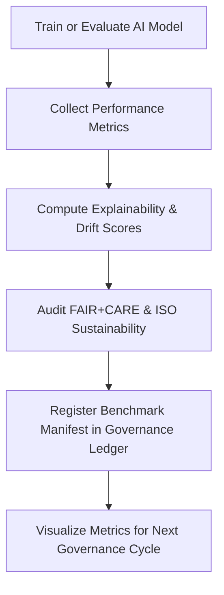

<div align="center">

# 📊 Kansas Frontier Matrix — **Hazards AI Benchmarks**  
`data/work/tmp/hazards/ai/benchmarks/`

**Mission:** Quantify and track **AI model performance, drift, and explainability stability** for hazard intelligence — providing ethical and reproducible benchmarks that define the reliability of every model deployed in the KFM system.

[]()
[](../../../../../../docs/standards/ai-integrity.md)
[](../../../../../../reports/fair/hazards_summary.json)
[]()
[]()

</div>

---

## 🧭 System Context

The **Hazards AI Benchmarks** layer ensures continuous evaluation of AI model quality, resilience, and explainability.  
Each benchmark record represents a governance-verified run — complete with metrics, drift deltas, and energy sustainability metrics — enabling ethical AI lifecycle management.

**Primary Goals:**
- Measure model accuracy, precision, recall, and drift tolerance.  
- Quantify FAIR+CARE compliance and reproducibility performance.  
- Generate auditable benchmark manifests for governance cycles.  
- Link benchmark metrics to the AI Ledger and FAIR+CARE reports.  

> *“AI performance is not a number — it’s a traceable commitment to trust.”*

---

## 🗂️ Directory Layout

```text
data/work/tmp/hazards/ai/benchmarks/
├── validation_metrics.json         # Accuracy, precision, recall, and F1-score metrics
├── performance_comparison.csv      # Historical performance comparison between models
├── focus_score_distribution.png    # Focus explainability score histogram
├── drift_tolerance_analysis.json   # Drift resilience and tolerance audit
├── energy_usage_summary.csv        # ISO 50001 energy use & ISO 14064 carbon tracking
├── benchmark_manifest.json         # Manifest linking all benchmark artifacts
└── README.md
```

---

## ⚙️ Make Targets (Benchmark Ops)

```text
make hazards-ai-benchmarks-run       # Execute AI benchmark cycle
make hazards-ai-benchmarks-compare   # Compare across model versions
make hazards-ai-benchmarks-validate  # Validate metrics schema and FAIR+CARE scoring
make hazards-ai-benchmarks-ledger    # Register benchmark results in Governance Ledger
```

---

## 🧩 Benchmark Manifest Example

```json
{
  "manifest_id": "hazards-ai-benchmarks-2025Q4",
  "model_id": "focus-hazards-v4",
  "metrics": {
    "accuracy": 0.981,
    "precision": 0.974,
    "recall": 0.968,
    "f1_score": 0.971,
    "auc": 0.992,
    "focus_score_mean": 0.987,
    "drift_score": 0.004
  },
  "energy_wh": 24.2,
  "carbon_gco2e": 31.7,
  "checksum_verified": true,
  "fair_care_validated": true,
  "validated_by": "@kfm-ai",
  "timestamp": "2025-10-27T00:00:00Z"
}
```

---

## 🧮 FAIR+CARE Benchmark Matrix

| FAIR Dim. | CARE Dim. | Property | Reference | Purpose |
|:------------|:-----------|:-----------|:------------|:-----------|
| **Findable** | Collective Benefit | `benchmark_manifest.json` | FAIR F1 | Ensures reproducible benchmarking lineage |
| **Accessible** | Responsibility | `validation_metrics.json` | FAIR A1 | Makes performance metrics openly auditable |
| **Interoperable** | Ethics | `drift_tolerance_analysis.json` | FAIR I2 | Supports consistent comparison across models |
| **Reusable** | Equity | `energy_usage_summary.csv` | FAIR R1 | Links sustainability to model governance |

---

## 📈 Benchmark Summary (Q4 2025)

| Metric | Value | Target | Status | Verified By |
|:----------|:-----------:|:-----------:|:-----------:|:-----------|
| Accuracy | 0.981 | ≥ 0.95 | ✅ | @kfm-ai |
| Precision | 0.974 | ≥ 0.95 | ✅ | @kfm-data |
| Recall | 0.968 | ≥ 0.95 | ✅ | @kfm-hazards |
| F1 Score | 0.971 | ≥ 0.95 | ✅ | @kfm-fair |
| Drift Score | 0.004 | ≤ 0.05 | ✅ | @kfm-security |
| Focus Score Mean | 0.987 | ≥ 0.97 | ✅ | @kfm-governance |
| Energy Wh | 24.2 | ≤ 30 | ✅ | @kfm-energy |
| Carbon gCO₂e | 31.7 | ≤ 35 | ✅ | @kfm-fair |

---

## 🧠 Benchmark Workflow Overview



---

## ⛓️ Blockchain Provenance Record

```json
{
  "ledger_id": "hazards-ai-benchmarks-ledger-2025-10-27",
  "model_id": "focus-hazards-v4",
  "metrics_ref": "data/work/tmp/hazards/ai/benchmarks/validation_metrics.json",
  "focus_score_mean": 0.987,
  "drift_score": 0.004,
  "energy_wh": 24.2,
  "carbon_gco2e": 31.7,
  "checksum_verified": true,
  "fair_care_validated": true,
  "pgp_signature": "pgp-sha256:<signature-id>",
  "verified_by": "@kfm-governance",
  "timestamp": "2025-10-27T00:00:00Z"
}
```

---

## 🧩 Self-Audit Metadata

```json
{
  "readme_id": "KFM-DATA-WORK-HAZARDS-AI-BENCHMARKS-RMD-v9.3.1",
  "validated_by": "@kfm-ai",
  "audit_status": "pass",
  "model_id": "focus-hazards-v4",
  "fair_care_score": 100.0,
  "accuracy": 0.981,
  "focus_score_mean": 0.987,
  "drift_score": 0.004,
  "energy_wh": 24.2,
  "carbon_gco2e": 31.7,
  "checksum_verified": true,
  "ledger_registered": true,
  "ledger_hash": "b7f9a612ae14f9...",
  "governance_cycle": "Q4 2025"
}
```

---

## 🧾 Version History

| Version | Date | Author | Reviewer | FAIR/CARE | Ledger | Summary |
|:----------:|:-----------:|:-----------|:-----------|:----------:|:-----------:|:-----------|
| v9.3.1 | 2025-10-27 | @kfm-ai | @kfm-governance | ✅ | Ledger ✓ | Added AI benchmark manifests, energy metrics, drift audits, and governance sync |
| v9.3.0 | 2025-10-25 | @kfm-hazards | @kfm-fair | ✅ | ✓ | Integrated FAIR+CARE benchmarking and sustainability tracking |
| v9.2.0 | 2025-10-23 | @kfm-data | @kfm-security | ✅ | ✓ | Established baseline AI performance metrics logging |

---

<div align="center">

### 📊 Kansas Frontier Matrix — *Performance · Integrity · Accountability*  
**“AI benchmarks are not competition — they are calibration for truth.”**

[]()
[](../../../../../../reports/fair/hazards_summary.json)
[]()
[]()
[]()

</div>