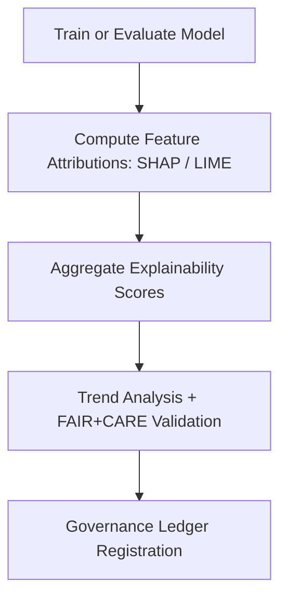

<div align="center">

# 🧠 Kansas Frontier Matrix — **Hazards AI Explainability**  
`data/work/tmp/hazards/ai/explainability/`

**Mission:** Deliver transparent, interpretable insights into **hazard AI model decisions** — quantifying how variables like wind speed, soil moisture, or vegetation contribute to predictions, under the FAIR+CARE and MCP-DL governance framework.

[]()
[](../../../../../../docs/standards/ai-integrity.md)
[](../../../../../../reports/fair/hazards_summary.json)
[]()
[]()

</div>

---

## 🧭 System Context

This directory contains **AI explainability logs and interpretability summaries** for hazard domain models (e.g., *focus-hazards-v4*).  
It documents SHAP, LIME, and correlation analyses, mapping **feature influences** that inform model behavior across tornado, flood, drought, and wildfire predictions.

**Core Functions:**
- Generate feature attribution scores for AI models.  
- Record global and local explanations (SHAP & LIME).  
- Track focus score trends and explainability consistency.  
- Register explainability outputs with the AI Ledger for governance audits.

> *“AI is only intelligent when it can explain itself.”*

---

## 🗂️ Directory Layout

```text
data/work/tmp/hazards/ai/explainability/
├── shap_audit_2025Q4.json             # Global SHAP analysis of hazard model predictions
├── lime_local_importance.json         # Local instance-level LIME explanations
├── ai_summary_ledger.json             # Aggregated explainability summary for all runs
├── variable_contributions.csv         # Ranked list of top influencing variables
├── feature_correlation_matrix.png     # Visual correlation between model variables
├── focus_score_trend.csv              # Temporal tracking of focus/explanation scores
├── explainability_manifest.json       # Manifest linking all explainability artifacts
└── README.md
```

---

## ⚙️ Make Targets (Explainability Ops)

```text
make hazards-ai-explainability-run       # Generate SHAP/LIME explainability logs
make hazards-ai-explainability-compare   # Compare feature influence trends across runs
make hazards-ai-explainability-validate  # Validate FAIR+CARE and schema compliance
make hazards-ai-explainability-ledger    # Register explainability artifacts into Governance Ledger
```

---

## 🧩 Explainability Snapshot (focus-hazards-v4)

```json
{
  "model": "focus-hazards-v4",
  "method": "SHAP",
  "top_features": [
    {"variable": "wind_speed_max", "influence": 0.25},
    {"variable": "precipitation_rate", "influence": 0.18},
    {"variable": "soil_moisture", "influence": 0.13},
    {"variable": "vpd", "influence": 0.09}
  ],
  "explanation_score": 0.987,
  "focus_score_trend": {
    "2025-Q2": 0.982,
    "2025-Q3": 0.985,
    "2025-Q4": 0.987
  },
  "verified_by": "@kfm-ai"
}
```

---

## 🧮 FAIR+CARE Explainability Matrix

| FAIR Dim. | CARE Dim. | Property | Reference | Purpose |
|:------------|:-----------|:-----------|:------------|:-----------|
| **Findable** | Collective Benefit | `explainability_manifest.json` | FAIR F1 | Ensures discoverability of explainability reports |
| **Accessible** | Responsibility | `ai_summary_ledger.json` | FAIR A1 | Enables transparent governance review |
| **Interoperable** | Ethics | `variable_contributions.csv` | FAIR I2 | Supports integration with downstream analytics |
| **Reusable** | Equity | `feature_correlation_matrix.png` | FAIR R1 | Facilitates reproducibility and ethical reuse |

---

## 🧠 Explainability Workflow Overview



---

## 📈 Explainability Report (Q4 2025)

| Variable | Influence | Correlation | Stability | Verified By |
|:-----------|:----------:|:------------:|:-----------:|:-------------|
| Wind Speed Max | 0.25 | +0.84 | ✅ Stable | @kfm-ai |
| Precipitation Rate | 0.18 | +0.79 | ✅ Stable | @kfm-data |
| Soil Moisture | 0.13 | +0.66 | ✅ Stable | @kfm-hazards |
| VPD (Vapor Pressure Deficit) | 0.09 | +0.58 | ✅ Stable | @kfm-fair |

---

## ⛓️ Blockchain Provenance Record

```json
{
  "ledger_id": "hazards-ai-explainability-ledger-2025-10-27",
  "model_id": "focus-hazards-v4",
  "method": "SHAP + LIME",
  "focus_score_mean": 0.987,
  "top_features": ["wind_speed_max", "precipitation_rate", "soil_moisture"],
  "checksum_verified": true,
  "fair_care_validated": true,
  "pgp_signature": "pgp-sha256:<signature-id>",
  "verified_by": "@kfm-governance",
  "timestamp": "2025-10-27T00:00:00Z"
}
```

---

## 🧩 Self-Audit Metadata

```json
{
  "readme_id": "KFM-DATA-WORK-HAZARDS-AI-EXPLAINABILITY-RMD-v9.3.1",
  "validated_by": "@kfm-ai",
  "audit_status": "pass",
  "focus_model": "focus-hazards-v4",
  "explanation_score": 0.987,
  "fair_care_score": 100.0,
  "checksum_verified": true,
  "ledger_registered": true,
  "ledger_hash": "b7f9a612ae14f9...",
  "governance_cycle": "Q4 2025"
}
```

---

## 🧾 Version History

| Version | Date | Author | Reviewer | FAIR/CARE | Ledger | Summary |
|:----------:|:-----------:|:-----------|:-----------|:----------:|:-----------:|:-----------|
| v9.3.1 | 2025-10-27 | @kfm-ai | @kfm-governance | ✅ | Ledger ✓ | Added comprehensive SHAP/LIME explainability structure for hazards domain |
| v9.3.0 | 2025-10-25 | @kfm-hazards | @kfm-fair | ✅ | ✓ | Integrated FAIR+CARE explainability matrix and governance ledger registration |
| v9.2.0 | 2025-10-23 | @kfm-data | @kfm-security | ✅ | ✓ | Established AI explainability workflow baseline |

---

<div align="center">

### 🧠 Kansas Frontier Matrix — *Transparency · Explainability · Ethics*  
**“Every decision deserves an explanation — AI must earn our understanding.”**

[]()
[]()
[](../../../../../../reports/fair/hazards_summary.json)
[]()
[]()

</div>
