<div align="center">

# 🧩 Kansas Frontier Matrix — **Hazards AI Model Registry**  
`data/work/tmp/hazards/ai/models/`

**Mission:** Manage and document all **AI model configurations, metadata, and governance lineage** for hazard prediction and analysis — providing reproducibility, ethical governance, and performance transparency.

[](../../../../../../docs/standards/ai-integrity.md)
[](../../../../../../reports/fair/hazards_summary.json)
[]()
[]()
[]()

</div>

---

## 🧭 System Context

The **Hazards AI Model Registry** serves as the authoritative repository for hazard domain models — capturing architecture, hyperparameters, training provenance, and validation lineage.  
All registered models are checksum-verified, FAIR+CARE aligned, and recorded in the **AI Governance Ledger** for accountability and reproducibility.

**Core Functions:**
- Store model cards, configuration files, and lineage traces.  
- Record energy, carbon, and fairness metrics per model.  
- Maintain cross-links between `/benchmarks/`, `/drift/`, and `/explainability/`.  
- Enable version-controlled AI model governance and reproducibility.

> *“Every model must know where it came from, what it learned, and who verified it.”*

---

## 🗂️ Directory Layout

```text
data/work/tmp/hazards/ai/models/
├── focus-hazards-v4.config.json        # Model configuration and hyperparameters
├── model_card_focus-hazards-v4.json    # MCP-compliant model documentation
├── hyperparameters.json                # Universal hyperparameter definitions
├── lineage_trace.json                  # Provenance and training lineage trace
├── performance_metrics.json            # Model evaluation results and audit metrics
├── registry_manifest.json              # Manifest linking all registered models
└── README.md
```

---

## ⚙️ Make Targets (Model Ops)

```text
make hazards-ai-model-register     # Register new hazard AI models in registry_manifest.json
make hazards-ai-model-validate     # Validate model metadata and configuration files
make hazards-ai-model-ledger       # Sync model info with Governance Ledger
make hazards-ai-model-audit        # Generate governance compliance report
```

---

## 🧩 Model Card Example (focus-hazards-v4)

```json
{
  "model_id": "focus-hazards-v4",
  "description": "Explainable AI model for multi-hazard analysis across Kansas.",
  "architecture": "Gradient Boosted Trees + Spatial Attention Layer",
  "version": "4.0.0",
  "training_data": "data/work/tmp/hazards/staging/",
  "training_period": "1980–2025",
  "metrics": {
    "mae": 0.85,
    "r2": 0.94,
    "focus_score_mean": 0.987
  },
  "energy_wh": 24.2,
  "carbon_gco2e": 31.7,
  "ai_integrity": "verified",
  "ledger_hash": "b7f9a612ae14f9...",
  "verified_by": "@kfm-ai"
}
```

---

## 🧮 FAIR+CARE Model Governance Matrix

| FAIR Dim. | CARE Dim. | Property | Reference | Purpose |
|:------------|:-----------|:-----------|:------------|:-----------|
| **Findable** | Collective Benefit | `registry_manifest.json` | FAIR F1 | Ensures discoverable record of all hazard AI models |
| **Accessible** | Responsibility | `model_card_focus-hazards-v4.json` | FAIR A1 | Provides transparent documentation |
| **Interoperable** | Ethics | `lineage_trace.json` | FAIR I2 | Connects models to training data and benchmarks |
| **Reusable** | Equity | `hyperparameters.json` | FAIR R1 | Enables retraining and reproducibility verification |

---

## 🧠 Governance Workflow Overview

```mermaid
flowchart TD
A[Model Training & Validation] --> B[Generate Model Card + Config]
B --> C[Checksum + FAIR/CARE Verification]
C --> D[Registry Manifest Update]
D --> E[Governance Ledger Registration]
E --> F[Linkage: Explainability · Drift · Benchmarks]
```



---

## 📈 Model Audit Summary (Q4 2025)

| Model | Version | Focus Score | Drift | FAIR+CARE | Ledger | Verified By |
|:----------|:-----------:|:-----------:|:-----------:|:-----------:|:-----------:|:-----------:|
| focus-hazards-v4 | 4.0.0 | 0.987 | 0.004 | ✅ | ✅ | @kfm-ai |
| focus-hazards-v3 | 3.0.0 | 0.981 | 0.006 | ✅ | ✅ | @kfm-fair |
| focus-hazards-v2 | 2.0.0 | 0.972 | 0.008 | ✅ | ✅ | @kfm-governance |

---

## ⛓️ Blockchain Provenance Record

```json
{
  "ledger_id": "hazards-ai-models-ledger-2025-10-27",
  "registered_models": ["focus-hazards-v4", "focus-hazards-v3", "focus-hazards-v2"],
  "checksum_verified": true,
  "fair_care_validated": true,
  "ai_integrity_audited": true,
  "pgp_signature": "pgp-sha256:<signature-id>",
  "verified_by": "@kfm-governance",
  "timestamp": "2025-10-27T00:00:00Z"
}
```

---

## 🧩 Self-Audit Metadata

```json
{
  "readme_id": "KFM-DATA-WORK-HAZARDS-AI-MODELS-RMD-v9.3.1",
  "validated_by": "@kfm-ai",
  "audit_status": "pass",
  "models_registered": 3,
  "checksum_integrity": "verified",
  "fair_care_score": 100.0,
  "ledger_registered": true,
  "ledger_hash": "b7f9a612ae14f9...",
  "governance_cycle": "Q4 2025"
}
```

---

## 🧾 Version History

| Version | Date | Author | Reviewer | FAIR/CARE | Ledger | Summary |
|:----------:|:-----------:|:-----------|:-----------|:----------:|:-----------:|:-----------|
| v9.3.1 | 2025-10-27 | @kfm-ai | @kfm-governance | ✅ | Ledger ✓ | Added model registry manifest, lineage trace, and FAIR+CARE metadata structure |
| v9.3.0 | 2025-10-25 | @kfm-data | @kfm-fair | ✅ | ✓ | Integrated model card schema and energy/carbon tracking |
| v9.2.0 | 2025-10-23 | @kfm-hazards | @kfm-security | ✅ | ✓ | Established baseline AI model registry and governance linkage |

---

<div align="center">

### 🧩 Kansas Frontier Matrix — *Models · Transparency · Provenance*  
**“An ethical model is one that can explain its lineage — and prove its governance.”**

[](../../../../../../docs/standards/ai-integrity.md)
[](../../../../../../reports/fair/hazards_summary.json)
[]()
[]()
[]()

</div>
