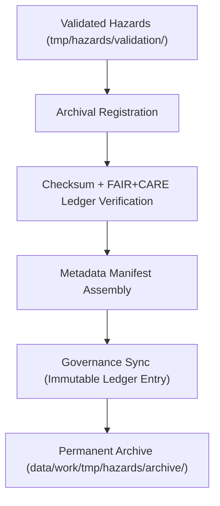

<div align="center">

# 🗄️ **Kansas Frontier Matrix — Hazard Archive Workspace**  
`data/work/tmp/hazards/archive/README.md`

**Purpose:**  
Permanent FAIR+CARE-governed archive for **validated, versioned, and governance-certified hazard datasets**, including:

- Flood, tornado, drought, wildfire, and multi-hazard composites  
- AI explainability & validation audit logs  
- Schema & FAIR+CARE compliance reports  
- Ledger-bound provenance & checksum records  

All files in this workspace are **immutable**, **version-controlled**, and **telemetry-verified** for long-term safety, transparency, and reproducibility.

[]()  
[]()  
[]()  
[]()  

</div>

---

## 1. 📘 Overview

The **Hazards Archive Workspace** is KFM’s **permanent hazard data vault**, responsible for:

- Long-term preservation of hazard datasets  
- Maintaining checksums & provenance for replayability  
- Housing FAIR+CARE ethics-compliant hazard intelligence  
- Archiving AI explainability and audit metadata  
- Providing governance-ready evidence for public risk transparency  

### v11.0.0 Enhancements

- Upgraded metadata to **KFM-MDP v11** format  
- Fully aligned with **Hazards Domain v11 ontology** (HazardExt)  
- Strengthened retention & immutability rules  
- Aligned telemetry & governance schemas for 2025Q4 cycle  

---

## 2. 🗂️ Directory Layout (Mobile-Safe)

```text
data/work/tmp/hazards/archive/
├── README.md                     ← this file
├── flood_extents_2025_v11.0.0.geojson
├── tornado_tracks_2025_v11.0.0.geojson
├── drought_risk_2025_v11.0.0.parquet
├── hazard_composite_2025_v11.0.0.csv
├── validation_audit_2025Q4.json
├── ai_explainability_report_2025Q4.json
└── metadata.json                 # Domain-level provenance summary
```

- All archived artifacts **must** include version suffixes (`_v11.0.0`)  
- All archived files **must** be listed in `metadata.json` and checksum manifests  

---

## 3. ⚙️ Archival Workflow



### Step Breakdown

1. **Validation Pass**  
   Only datasets that passed schema, FAIR+CARE, and AI QA checks proceed here.  
2. **Checksum Verification**  
   SHA-256 checks matched against TMP/processed manifests.  
3. **FAIR+CARE Certification**  
   Ethics, sovereignty, and sensitivity checks validated.  
4. **Metadata Manifest Build**  
   Domain metadata compiled into `metadata.json`.  
5. **Governance Sync**  
   Immutable archival event logged in `data_provenance_ledger.json`.  
6. **Permanent Storage**  
   Files retained indefinitely, version-pinned, and reproducible.

---

## 4. 🧩 Example Archive Metadata Entry

```json
{
  "id": "hazards_archive_v11.0.0_2025Q4",
  "datasets_archived": [
    "flood_extents_2025_v11.0.0.geojson",
    "tornado_tracks_2025_v11.0.0.geojson",
    "drought_risk_2025_v11.0.0.parquet",
    "hazard_composite_2025_v11.0.0.csv"
  ],
  "checksum_verified": true,
  "fairstatus": "certified",
  "ai_explainability_logged": true,
  "telemetry": {
    "energy_wh": 1.1,
    "carbon_gco2e": 1.4,
    "coverage_pct": 100
  },
  "archived_by": "@kfm-hazards",
  "created": "2025-11-20T23:59:00Z",
  "governance_ref": "data/reports/audit/data_provenance_ledger.json"
}
```

This is a **prov:Entity** representing an immutable archival event.

---

## 5. 🧠 FAIR+CARE Governance Matrix

| Principle | Implementation | Oversight |
|----------|----------------|-----------|
| **Findable** | Versioned artifacts indexed with checksum & schema IDs | `@kfm-data` |
| **Accessible** | Governed CC-BY 4.0 access for research & review | `@kfm-accessibility` |
| **Interoperable** | ISO 19115 · STAC/DCAT aligned metadata | `@kfm-architecture` |
| **Reusable** | Complete reproduction: lineage + checksums | `@kfm-design` |
| **Collective Benefit** | Supports resilience, safety, hazard transparency | `@faircare-council` |
| **Authority to Control** | FAIR+CARE Council signs archival events | `@kfm-governance` |
| **Responsibility** | Engineers ensure ethical metadata integrity | `@kfm-security` |
| **Ethics** | Culturally-sensitive hazard locations masked or aggregated | `@kfm-ethics` |

---

## 6. 📦 Key Archive Artifacts

| Artifact | Description | Format |
|---------|-------------|--------|
| `flood_extents_*` | Historical flood polygons | GeoJSON |
| `tornado_tracks_*` | Tornado paths, attributes, EF-scale | GeoJSON/Parquet |
| `drought_risk_*` | H3/tract drought metrics | Parquet |
| `hazard_composite_*` | Multi-hazard severity composites | CSV |
| `validation_audit_*` | FAIR+CARE + ISO compliance records | JSON |
| `ai_explainability_report_*` | AI model transparency & reasoning | JSON |
| `metadata.json` | Archive-wide provenance + checksum table | JSON |

---

## 7. ♻️ Retention & Sustainability

Hazard archival assets follow **permanent retention** with ethics-driven governance:

| Type | Retention | Policy |
|------|----------:|--------|
| Archived Data | Permanent | Immutable governance storage |
| Validation Reports | Permanent | Required for regulatory audits |
| Explainability Logs | Permanent | Ethical transparency requirement |
| Metadata | Permanent | Ledger-linked provenance continuity |

Telemetry source for archive actions:  
`../../../../releases/v11.0.0/focus-telemetry.json`

---

## 8. 🧾 Internal Citation

```text
Kansas Frontier Matrix (2025). Hazard Archive Workspace (v11.0.0).
Permanent FAIR+CARE-certified archive for hazard datasets, validation reports, and AI explainability logs.
Provides immutable provenance, sustainability telemetry, and ethical governance across the hazards domain.
```

---

## 9. 🕰️ Version History

| Version | Date | Author | Summary |
|--------:|------|--------|---------|
| v11.0.0 | 2025-11-20 | `@kfm-hazards` | Upgraded to v11; governance, ontology, telemetry fields added |
| v10.0.0 | 2025-11-09 | `@kfm-hazards` | Initial archive workspace (telemetry v2 + audit integration) |

<div align="center">

**Kansas Frontier Matrix — Hazard Archive Workspace**  
🗄️ FAIR+CARE Certified · Immutable Governance Archive · Diamond⁹ Ω / Crown∞Ω  

[Back to Hazards TMP](../README.md) · [Hazards Domain Architecture](../../../../ARCHITECTURE.md) · [Governance Charter](../../../../docs/standards/governance/DATA-GOVERNANCE.md)

</div>
