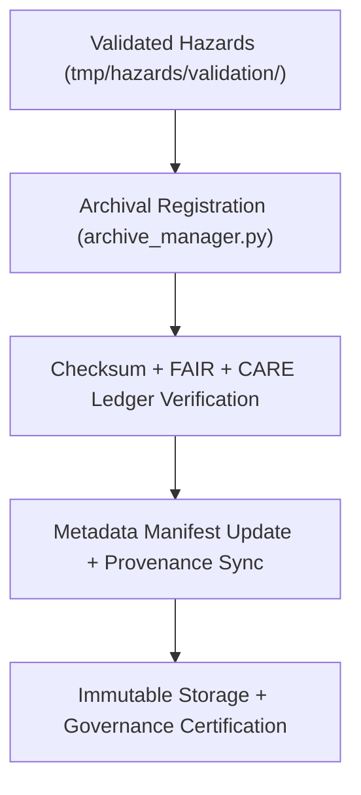

<div align="center">

# 🗄️ Kansas Frontier Matrix — **Hazard Archive Workspace**
`data/work/tmp/hazards/archive/README.md`

**Purpose:**  
Permanent **FAIR+CARE-governed** archive for validated hazard datasets, reports, and transformation logs within KFM.  
Preserves versioned, reproducible hazard data for governance review, scientific reference, and compliance auditing.

[](../../../../docs/architecture/README.md)
[](../../../../docs/standards/faircare-validation.md)
[]()
[](../../../../LICENSE)

</div>

---

## 📘 Overview

The **Hazard Archive Workspace** is the historical repository for **FAIR+CARE-certified** hazard datasets, ensuring long-term preservation, reproducibility, and traceability across ETL and governance pipelines.  
It contains finalized and superseded datasets, validation summaries, AI audit reports, and manifests — all checksum-verified and ledger-logged.

### Core Responsibilities
- Preserve versioned hazard datasets and metadata for reproducibility.  
- Archive AI explainability and validation reports.  
- Maintain checksum lineage and FAIR+CARE certification records.  
- Provide immutable, governance-audited access to retired hazard data.  

---

## 🗂️ Directory Layout

```plaintext
data/work/tmp/hazards/archive/
├── README.md
├── flood_extents_2025_v9.5.0.geojson
├── tornado_tracks_2025_v9.5.0.geojson
├── drought_risk_2025_v9.5.0.parquet
├── hazard_composite_2025_v9.5.0.csv
├── validation_audit_2025Q4.json
├── ai_explainability_report_2025Q4.json
└── metadata.json
```

---

## ⚙️ Archival Workflow



### Steps
1. **Validation Review** — Only datasets passing FAIR+CARE and checksum audits are archived.  
2. **Governance Sync** — Register metadata to ledger + checksum manifest.  
3. **Checksum Verify** — Ensure hash continuity across archived datasets.  
4. **Immutable Retention** — Store permanently with versioned FAIR+CARE certification.

---

## 🧩 Example Archive Metadata Record

```json
{
  "id": "hazards_archive_v9.5.0_2025Q4",
  "datasets_archived": [
    "flood_extents_2025_v9.5.0.geojson",
    "tornado_tracks_2025_v9.5.0.geojson",
    "drought_risk_2025_v9.5.0.parquet"
  ],
  "checksum_verified": true,
  "governance_registered": true,
  "fairstatus": "certified",
  "ai_explainability_recorded": true,
  "archived_by": "@kfm-governance",
  "created": "2025-11-06T23:59:00Z",
  "governance_ref": "data/reports/audit/data_provenance_ledger.json"
}
```

---

## 🧠 FAIR+CARE Governance Matrix

| Principle | Implementation | Oversight |
|-----------|----------------|-----------|
| **Findable** | Archived sets indexed by ID, checksum, version. | `@kfm-data` |
| **Accessible** | Open FAIR+CARE-compliant files + manifests. | `@kfm-accessibility` |
| **Interoperable** | ISO 19115 + STAC/DCAT aligned metadata. | `@kfm-architecture` |
| **Reusable** | Immutable versions retained for audit + research. | `@kfm-design` |
| **Collective Benefit** | Preserves ethical, open-access hazard data. | `@faircare-council` |
| **Authority to Control** | Governance Council certifies archival integrity. | `@kfm-governance` |
| **Responsibility** | Maintainers ensure checksum lineage + metadata quality. | `@kfm-security` |
| **Ethics** | Includes ethical metadata reviews + AI explainability. | `@kfm-ethics` |

**Audit refs:**  
`data/reports/audit/data_provenance_ledger.json` · `data/reports/fair/data_care_assessment.json`

---

## ⚙️ Key Archival Artifacts

| Artifact                          | Description                                   | Format |
|-----------------------------------|-----------------------------------------------|--------|
| `*_v9.*.geojson`                  | Historical spatial hazard layers.             | GeoJSON |
| `*_v9.*.parquet`                  | Tabular hazard analytics and index data.      | Parquet |
| `validation_audit_*.json`         | FAIR+CARE + schema compliance reports.        | JSON   |
| `ai_explainability_report_*.json` | AI reasoning transparency records.            | JSON   |
| `metadata.json`                   | Provenance metadata + governance linkage.     | JSON   |

**Automation:** `hazards_archive_sync.yml`

---

## ♻️ Retention & Sustainability

| Type                     | Retention | Policy                                                     |
|-------------------------|----------:|------------------------------------------------------------|
| Archived Data           | Permanent | Immutable; preserved for governance & verification.        |
| Validation Reports      | Permanent | Retained for FAIR+CARE certification lineage.              |
| AI Explainability Logs  | Permanent | Preserved for ethics traceability.                         |
| Metadata Records        | Permanent | Ledger-linked for provenance continuity.                   |

**Telemetry:** `../../../../releases/v9.7.0/focus-telemetry.json`

---

## 🧾 Internal Citation

```text
Kansas Frontier Matrix (2025). Hazard Archive Workspace (v9.7.0).
Permanent FAIR+CARE-certified archive for validated hazard datasets and AI explainability records—ensuring immutable provenance, checksum verification, and ethical governance compliance under MCP-DL v6.3.
```

---

<div align="center">

**Kansas Frontier Matrix**  
*Data Preservation × FAIR+CARE Ethics × Provenance Continuity*  
© 2025 Kansas Frontier Matrix — CC-BY 4.0 · Diamond⁹ Ω / Crown∞Ω Ultimate Certified  

[Back to Hazards TMP](../README.md) · [Governance Charter](../../../../docs/standards/governance/DATA-GOVERNANCE.md)

</div>