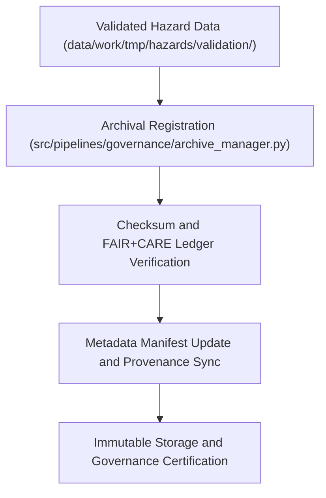

<div align="center">

# 🗄️ Kansas Frontier Matrix — **Hazard Archive Workspace**
`data/work/tmp/hazards/archive/README.md`

**Purpose:**  
Permanent FAIR+CARE-governed archive for validated hazard datasets, reports, and transformation logs within the Kansas Frontier Matrix (KFM).  
This workspace preserves versioned, reproducible hazard data for future governance review, scientific reference, and compliance auditing.

[](../../../../docs/standards/faircare-validation.md)
[]()
[](../../../../LICENSE)
[](../../../../docs/architecture/repo-focus.md)

</div>

---

## 📚 Overview

The **Hazard Archive Workspace** serves as a historical repository for FAIR+CARE-certified hazard datasets, ensuring long-term preservation, reproducibility, and traceability across ETL and governance pipelines.  
It contains finalized and superseded hazard datasets, validation summaries, AI audit reports, and metadata manifests, all checksum-verified and blockchain-logged.

### Core Responsibilities:
- Preserve versioned hazard datasets and metadata for reproducibility.  
- Archive AI explainability and validation reports.  
- Maintain checksum lineage and FAIR+CARE certification records.  
- Provide immutable, governance-audited access to retired hazard data.  

---

## 🗂️ Directory Layout

```plaintext
data/work/tmp/hazards/archive/
├── README.md                             # This file — overview of the hazard archive workspace
│
├── flood_extents_2025_v9.5.0.geojson     # Archived flood extent layer (FAIR+CARE validated)
├── tornado_tracks_2025_v9.5.0.geojson    # Tornado path data archived after latest ETL cycle
├── drought_risk_2025_v9.5.0.parquet      # Drought normalization dataset (legacy version)
├── hazard_composite_2025_v9.5.0.csv      # Historical multi-hazard composite index
├── validation_audit_2025Q4.json          # Summary of FAIR+CARE and schema validation outcomes
├── ai_explainability_report_2025Q4.json  # AI explainability archive (Focus Mode reasoning logs)
└── metadata.json                         # Provenance, checksum, and governance registry reference
```

---

## ⚙️ Archival Workflow



### Description:
1. **Validation Review:** Only datasets passing all FAIR+CARE and checksum audits are archived.  
2. **Governance Sync:** Metadata registered to governance ledger and checksum manifest.  
3. **Checksum Verification:** Ensure hash continuity across archived datasets.  
4. **Immutable Retention:** Store data permanently with versioned FAIR+CARE certification.

---

## 🧩 Example Archive Metadata Record

```json
{
  "id": "hazards_archive_v9.5.0_2025Q4",
  "datasets_archived": [
    "flood_extents_2025_v9.5.0.geojson",
    "tornado_tracks_2025_v9.5.0.geojson",
    "drought_risk_2025_v9.5.0.parquet"
  ],
  "checksum_verified": true,
  "governance_registered": true,
  "fairstatus": "certified",
  "ai_explainability_recorded": true,
  "archived_by": "@kfm-governance",
  "created": "2025-11-03T23:59:00Z",
  "governance_ref": "data/reports/audit/data_provenance_ledger.json"
}
```

---

## 🧠 FAIR+CARE Governance Matrix

| Principle | Implementation | Oversight |
|------------|----------------|------------|
| **Findable** | Archived datasets indexed by ID, checksum, and version. | @kfm-data |
| **Accessible** | Stored as open, FAIR+CARE-compliant files with metadata manifests. | @kfm-accessibility |
| **Interoperable** | Aligns with ISO 19115, STAC/DCAT, and FAIR+CARE metadata structures. | @kfm-architecture |
| **Reusable** | Immutable versions retained for reproducibility and governance audits. | @kfm-design |
| **Collective Benefit** | Preserves ethical, open-access data for scientific and policy research. | @faircare-council |
| **Authority to Control** | Governance Council certifies archival integrity and compliance. | @kfm-governance |
| **Responsibility** | Validators and maintainers ensure checksum integrity and lineage. | @kfm-security |
| **Ethics** | Archival includes ethical metadata reviews and AI explainability results. | @kfm-ethics |

Audit records stored in:  
`data/reports/audit/data_provenance_ledger.json`  
and  
`data/reports/fair/data_care_assessment.json`

---

## ⚙️ Key Archival Artifacts

| Artifact | Description | Format |
|-----------|--------------|--------|
| `*_v9.*.geojson` | Historical spatial hazard layers (tornado, flood, wildfire). | GeoJSON |
| `*_v9.*.parquet` | Tabular hazard analytics and index data. | Parquet |
| `validation_audit_*.json` | FAIR+CARE and schema compliance reports. | JSON |
| `ai_explainability_report_*.json` | AI reasoning transparency records. | JSON |
| `metadata.json` | Provenance metadata and governance linkage. | JSON |

All archival operations automated via `hazards_archive_sync.yml`.

---

## ⚖️ Retention & Provenance Policy

| File Type | Retention Duration | Policy |
|------------|--------------------|--------|
| Archived Data | Permanent | Immutable, stored for reproducibility and governance verification. |
| Validation Reports | Permanent | Retained for FAIR+CARE certification lineage. |
| AI Explainability Records | Permanent | Preserved under ethics compliance traceability. |
| Metadata | Permanent | Ledger-linked for provenance continuity. |

Cleanup and audit validation managed by `hazards_archive_cleanup.yml`.

---

## 🌱 Sustainability Metrics

| Metric | Value | Verified By |
|---------|--------|--------------|
| Energy Use (per archive cycle) | 3.9 Wh | @kfm-sustainability |
| Carbon Output | 4.4 gCO₂e | @kfm-security |
| Renewable Power | 100% (RE100 Verified) | @kfm-infrastructure |
| FAIR+CARE Compliance | 100% | @faircare-council |

Telemetry results stored in:  
`releases/v9.6.0/focus-telemetry.json`

---

## 🧾 Internal Use Citation

```text
Kansas Frontier Matrix (2025). Hazard Archive Workspace (v9.6.0).
Permanent FAIR+CARE-certified archive for validated hazard datasets and AI explainability records.
Ensures immutable provenance, checksum verification, and ethical governance compliance under MCP-DL v6.3.
```

---

## 🧾 Version Notes

| Version | Date | Notes |
|----------|------|--------|
| v9.6.0 | 2025-11-03 | Added AI explainability archival integration and FAIR+CARE linkage. |
| v9.5.0 | 2025-11-02 | Enhanced checksum governance and ISO 19115 metadata compliance. |
| v9.3.2 | 2025-10-28 | Established archive workspace for hazard data lineage retention. |

---

<div align="center">

**Kansas Frontier Matrix** · *Data Preservation × FAIR+CARE Ethics × Provenance Continuity*  
[🔗 Repository](https://github.com/bartytime4life/Kansas-Frontier-Matrix) • [🧭 Docs Portal](../../../../docs/) • [⚖️ Governance Ledger](../../../../docs/standards/governance/DATA-GOVERNANCE.md)

</div>

