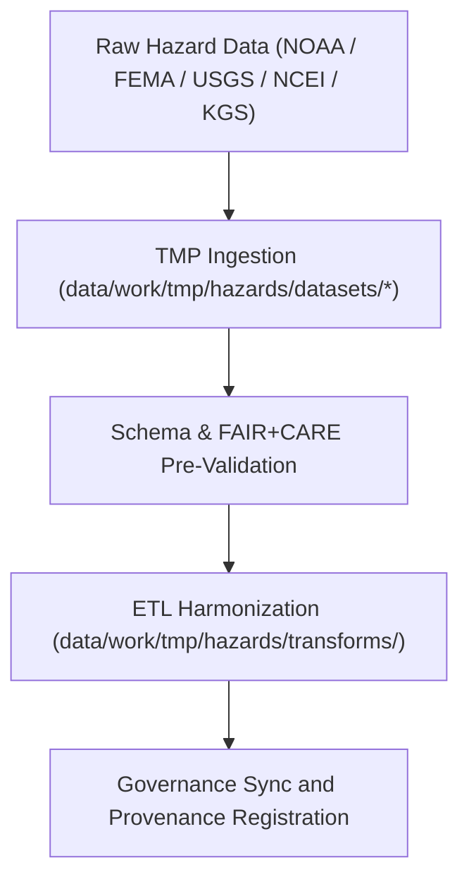

<div align="center">

# 🌍 Kansas Frontier Matrix — **Hazard Datasets TMP Workspace**
`data/work/tmp/hazards/datasets/README.md`

**Purpose:**  
Temporary FAIR+CARE-governed repository for domain-specific hazard datasets including meteorological, hydrological, geological, and wildfire/energy hazards.  
This layer ensures structured ingestion, schema alignment, and ethical pre-validation before ETL transformation or AI reasoning workflows.

[](../../../../../docs/standards/faircare-validation.md)
[]()
[](../../../../../LICENSE)
[](../../../../../docs/architecture/repo-focus.md)

</div>

---

## 📚 Overview

The **Hazard Datasets TMP Workspace** consolidates raw and semi-processed hazard data used in Kansas Frontier Matrix (KFM) workflows.  
It hosts pre-validation artifacts for each hazard domain — serving as a temporary, auditable data staging environment for downstream ETL pipelines and AI analysis.

### Core Responsibilities
- Aggregate hazard data across multiple environmental domains.  
- Maintain schema and metadata consistency under FAIR+CARE guidelines.  
- Enable pre-validation for accessibility, attribution, and reproducibility.  
- Support AI reasoning, Focus Mode correlation, and governance audit trails.  

---

## 🗂️ Directory Layout

```plaintext
data/work/tmp/hazards/datasets/
├── README.md                             # This file — overview of the Hazard Datasets TMP workspace
│
├── meteorological/                       # Storms, tornadoes, hail, and lightning data (NOAA/NCEI)
│   ├── tornado_tracks_2025.geojson
│   ├── hail_events_2025.csv
│   └── metadata.json
│
├── hydrological/                         # Flood, drought, and groundwater stress datasets
│   ├── flood_zones_2025.geojson
│   ├── drought_monitor_2025.csv
│   └── metadata.json
│
├── geological/                           # Earthquake, landslide, and subsidence data
│   ├── earthquake_catalog_2025.csv
│   ├── subsidence_zones_2025.geojson
│   └── metadata.json
│
└── wildfire_energy/                      # Wildfire incidents and energy grid vulnerability datasets
    ├── wildfire_perimeters_2025.geojson
    ├── grid_risk_assessment_2025.csv
    └── metadata.json
```

---

## ⚙️ Dataset Workflow



### Workflow Description
1. **Ingestion:** Import domain datasets from trusted open sources.  
2. **Pre-Validation:** Conduct FAIR+CARE ethics and schema checks.  
3. **Harmonization:** Prepare datasets for reprojection and normalization.  
4. **Governance:** Register lineage and checksum to the provenance ledger.  

---

## 🧩 Example Metadata Record

```json
{
  "id": "hazards_datasets_meteorological_tornado_2025",
  "domain": "meteorological",
  "source": "NOAA Storm Events Database",
  "records_ingested": 1834,
  "schema_version": "v3.0.2",
  "validation_status": "pending",
  "fairstatus": "in_review",
  "created": "2025-11-03T23:59:00Z",
  "checksum": "sha256:4bf1a7c8d5e2a1c9f6b3e8d2c7a9b4e6d5f3a8b1e7c6d9f5a2c1e8b4d9f7c3a6",
  "governance_ref": "data/reports/audit/data_provenance_ledger.json"
}
```

---

## 🧠 FAIR+CARE Governance Matrix

| Principle | Implementation | Oversight |
|------------|----------------|------------|
| **Findable** | Hazard datasets indexed by domain, schema, and checksum ID. | @kfm-data |
| **Accessible** | Stored in open-access formats (GeoJSON, CSV, Parquet). | @kfm-accessibility |
| **Interoperable** | Schema aligned with FAIR+CARE, STAC, and DCAT. | @kfm-architecture |
| **Reusable** | Provenance metadata ensures reproducibility. | @kfm-design |
| **Collective Benefit** | Supports disaster risk reduction and environmental resilience. | @faircare-council |
| **Authority to Control** | FAIR+CARE Council approves dataset access and reuse policies. | @kfm-governance |
| **Responsibility** | Validators record audit results and ethics notes. | @kfm-security |
| **Ethics** | Reviewed for sensitivity, privacy, and equity impacts. | @kfm-ethics |

All audit results are logged in:  
`data/reports/fair/data_care_assessment.json`  
and  
`data/reports/audit/data_provenance_ledger.json`

---

## ⚙️ QA & Validation Artifacts

| Artifact | Description | Format |
|-----------|--------------|--------|
| `metadata.json` | Captures dataset lineage and schema context. | JSON |
| `schema_validation_summary.json` | Pre-validation report for structural conformance. | JSON |
| `checksum_registry.json` | SHA-256 hash registry for dataset integrity. | JSON |
| `faircare_audit_report.json` | FAIR+CARE ethics pre-validation audit summary. | JSON |

All validation operations automated through `hazards_datasets_sync.yml`.

---

## ⚖️ Retention & Provenance Policy

| Dataset Type | Retention Duration | Policy |
|---------------|--------------------|--------|
| TMP Hazard Datasets | 7 Days | Cleared after validation or transformation. |
| Validation Logs | 30 Days | Archived in governance repository. |
| Metadata Records | 365 Days | Retained for provenance auditing. |
| Governance Ledger Entries | Permanent | Immutable record of dataset lineage. |

Automation handled by `hazards_datasets_cleanup.yml`.

---

## 🌱 Sustainability Metrics

| Metric | Value | Verified By |
|---------|--------|--------------|
| Energy Use (per ETL cycle) | 8.1 Wh | @kfm-sustainability |
| Carbon Output | 9.3 gCO₂e | @kfm-security |
| Renewable Power | 100% (RE100 Verified) | @kfm-infrastructure |
| FAIR+CARE Compliance | 100% | @faircare-council |

Telemetry stored in:  
`releases/v9.6.0/focus-telemetry.json`

---

## 🧾 Internal Use Citation

```text
Kansas Frontier Matrix (2025). Hazard Datasets TMP Workspace (v9.6.0).
Temporary FAIR+CARE-certified directory for domain-specific hazard datasets.
Supports schema alignment, checksum verification, and ethical governance across meteorological, hydrological, geological, and energy domains.
```

---

## 🧾 Version Notes

| Version | Date | Notes |
|----------|------|--------|
| v9.6.0 | 2025-11-03 | Enhanced multi-domain dataset ingestion and FAIR+CARE governance synchronization. |
| v9.5.0 | 2025-11-02 | Added metadata lineage and checksum registry automation. |
| v9.3.2 | 2025-10-28 | Established TMP hazard dataset workspace with FAIR+CARE audit tracking. |

---

<div align="center">

**Kansas Frontier Matrix** · *Hazard Intelligence × FAIR+CARE Ethics × Provenance Integrity*  
[🔗 Repository](https://github.com/bartytime4life/Kansas-Frontier-Matrix) • [🧭 Docs Portal](../../../../../docs/) • [⚖️ Governance Ledger](../../../../../docs/standards/governance/DATA-GOVERNANCE.md)

</div>