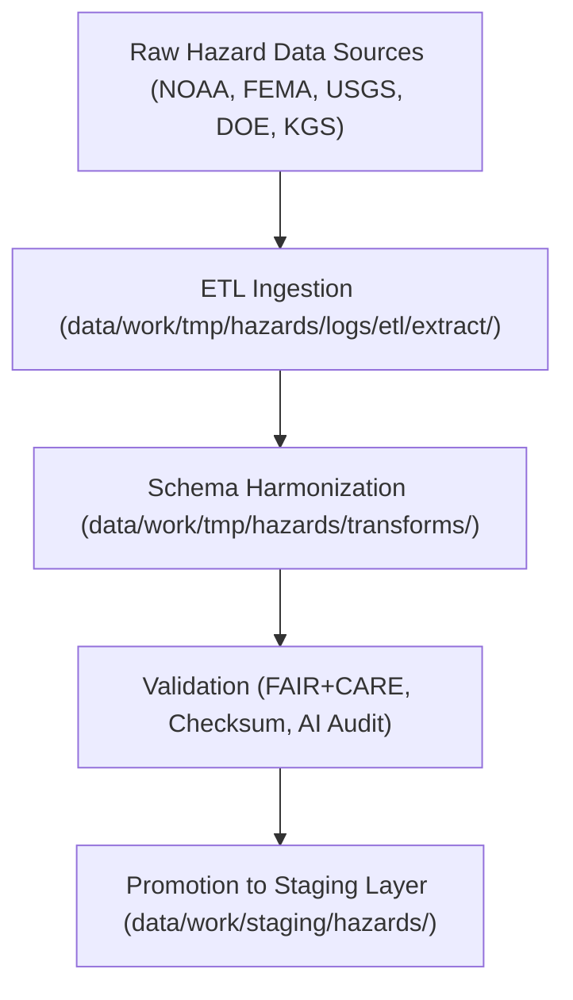

<div align="center">

# 🌍 Kansas Frontier Matrix — **Hazard Datasets TMP Layer**
`data/work/tmp/hazards/datasets/README.md`

**Purpose:**  
Temporary repository for **hazard dataset ingestion, preprocessing, and normalization** across meteorological, hydrological, geological, and wildfire-energy domains within the Kansas Frontier Matrix (KFM).  
Provides FAIR+CARE-aligned, schema-validated, and AI-audited datasets used during ETL and validation cycles in the TMP workspace.

[](../../../../../docs/standards/faircare-validation.md)
[](../../../../../LICENSE)
[](../../../../../docs/architecture/repo-focus.md)

</div>

---

## 📚 Overview

The `data/work/tmp/hazards/datasets/` directory serves as a **temporary collection hub for all raw and preprocessed hazard datasets** used within KFM's ETL pipelines.  
These datasets are extracted, validated, and harmonized before transformation and staging, maintaining full provenance and FAIR+CARE governance compliance.

### Core Responsibilities
- Host all hazard input datasets (NOAA, FEMA, USGS, DOE, and KGS).  
- Maintain temporary but traceable versions of hazard-related data files.  
- Provide consistent structure and metadata for validation workflows.  
- Integrate checksum, provenance, and FAIR+CARE validation records.  

All datasets here are ephemeral and automatically purged once validated and promoted to staging or processed layers.

---

## 🗂️ Directory Layout

```plaintext
data/work/tmp/hazards/datasets/
├── README.md                              # This file — documentation of hazard datasets TMP layer
│
├── meteorological/                        # Tornadoes, storms, hail, and severe weather datasets
│   ├── tornado_tracks_2025.geojson
│   ├── hail_reports_2025.csv
│   └── metadata.json
│
├── hydrological/                          # Flood, drought, and hydrologic monitoring datasets
│   ├── flood_zones_2025.geojson
│   ├── drought_monitor_2025.csv
│   └── metadata.json
│
├── geological/                            # Earthquakes, landslides, subsidence hazard datasets
│   ├── earthquakes_2025.csv
│   ├── landslides_inventory.geojson
│   └── metadata.json
│
└── wildfire_energy/                       # Wildfire risk, energy grid exposure, and resilience datasets
    ├── wildfire_perimeters_2025.geojson
    ├── grid_exposure_zones.parquet
    └── metadata.json
```

---

## ⚙️ Dataset Processing Workflow



### Workflow Description
1. **Ingestion:** Raw data downloaded from verified public sources and cataloged.  
2. **Schema Harmonization:** Standardized under KFM data contract and ISO schema alignment.  
3. **Validation:** FAIR+CARE audit ensures ethical transparency and interoperability.  
4. **Promotion:** Datasets that pass validation move to staging for certification.

---

## 🧩 Example Metadata Record

```json
{
  "id": "hazards_dataset_tmp_flood_zones_2025_v9.5.0",
  "domain": "hydrological",
  "source": "FEMA NFHL Flood Zones",
  "records": 28476,
  "format": "GeoJSON",
  "schema_version": "v3.0.1",
  "checksum": "sha256:b12f47ea3fba47f52a9f19d9a12b7c948f7dcb64...",
  "fairstatus": "compliant",
  "validated_by": "@kfm-hazards",
  "governance_ref": "reports/audit/ai_hazards_ledger.json",
  "created": "2025-11-02T19:05:00Z"
}
```

---

## 🧠 FAIR+CARE Compliance Matrix

| Principle | Implementation |
|------------|----------------|
| **Findable** | Datasets indexed by domain, source, and checksum ID. |
| **Accessible** | Stored in open formats (CSV, GeoJSON, Parquet). |
| **Interoperable** | Aligned with STAC, DCAT, ISO 19115, and CIDOC CRM. |
| **Reusable** | Each dataset includes metadata, provenance, and checksum data. |
| **Collective Benefit** | Supports research on climate resilience and public safety. |
| **Authority to Control** | FAIR+CARE Council manages ethical dataset approval. |
| **Responsibility** | Dataset maintainers ensure accuracy and schema compliance. |
| **Ethics** | All datasets reviewed for public-domain and ethical data sourcing. |

All governance audits logged in:  
`reports/audit/ai_hazards_ledger.json` • `reports/fair/hazards_summary.json`

---

## ⚙️ Dataset QA & Provenance Artifacts

| File | Description | Format |
|------|--------------|--------|
| `*_2025.geojson` | Spatial hazard boundaries (storms, floods, fire zones). | GeoJSON |
| `*_2025.csv` | Tabular event datasets (hail, droughts, earthquakes). | CSV |
| `*_2025.parquet` | Grid or energy exposure datasets. | Parquet |
| `metadata.json` | Provenance and FAIR+CARE audit metadata for each dataset. | JSON |

Dataset synchronization managed via `hazards_datasets_sync.yml`.

---

## 🧾 Retention Policy

| Data Type | Retention Duration | Policy |
|------------|--------------------|--------|
| TMP Datasets | 14 days | Purged after successful staging promotion. |
| Metadata | 365 days | Retained for governance audit review. |
| FAIR+CARE Logs | 180 days | Archived for ethics and reproducibility checks. |
| Provenance | Permanent | Stored in governance ledger for continuity. |

Cleanup handled by `hazards_datasets_cleanup.yml`.

---

## 🧾 Internal Use Citation

```text
Kansas Frontier Matrix (2025). Hazard Datasets TMP Layer (v9.5.0).
Temporary FAIR+CARE-compliant dataset repository for hazard ETL workflows, integrating NOAA, FEMA, USGS, DOE, and KGS sources.
Maintained under ISO 19115, STAC, and MCP-DL v6.3 governance for reproducible data science.
```

---

## 🧾 Version Notes

| Version | Date | Notes |
|----------|------|--------|
| v9.5.0 | 2025-11-02 | Added telemetry schema v2, ontology alignment, and full FAIR+CARE dataset tracking. |
| v9.3.2 | 2025-10-28 | Integrated energy resilience and wildfire dataset submodules. |
| v9.3.0 | 2025-10-26 | Established hazard dataset TMP structure across all domains. |

---

<div align="center">

**Kansas Frontier Matrix** · *Hazard Data Integrity × FAIR+CARE Governance × Provenance Assurance*  
[🔗 Repository](https://github.com/bartytime4life/Kansas-Frontier-Matrix) • [🧭 Docs Portal](../../../../../docs/) • [⚖️ Governance Ledger](../../../../../docs/standards/governance/)

</div>