<div align="center">

# 🌋 Kansas Frontier Matrix — **Hazards TMP Datasets**
`data/work/tmp/hazards/datasets/README.md`

**Purpose:**  
Repository for **temporary hazard-related input datasets** used in ETL, AI reasoning, and FAIR+CARE validation within the Kansas Frontier Matrix (KFM).  
This workspace contains **raw-to-transformed data derivatives** across meteorological, hydrological, geological, and infrastructure hazard domains.

[](../../../../../docs/standards/faircare-validation.md)
[](../../../../../LICENSE)
[](../../../../../docs/architecture/repo-focus.md)

</div>

---

## 📚 Overview

The `data/work/tmp/hazards/datasets/` directory hosts all **temporary hazard-related source data** imported from NOAA, FEMA, USGS, KGS, and related open repositories.  
These datasets are cleaned, validated, and prepared for harmonization in `data/work/tmp/hazards/transforms/`.

### Key Functions
- Store short-lived hazard data inputs prior to normalization and AI processing.  
- Manage spatial and tabular hazard records under FAIR+CARE metadata contracts.  
- Validate schema alignment with ISO 19115 and CIDOC-CRM Hazard Extension ontology.  
- Maintain provenance, versioning, and checksum verification for reproducibility.  

---

## 🗂️ Directory Layout

```plaintext
data/work/tmp/hazards/datasets/
├── README.md                              # This file — overview of hazards TMP datasets
│
├── meteorological/                        # Tornado, hail, and storm event datasets
│   ├── noaa_storm_events_2025.csv
│   ├── spc_tornado_paths_2025.geojson
│   └── metadata.json
│
├── hydrological/                          # Flood, drought, and groundwater stress data
│   ├── fema_flood_zones_2025.geojson
│   ├── usgs_streamflow_observations.parquet
│   └── metadata.json
│
├── geological/                            # Earthquake, landslide, and subsidence datasets
│   ├── kansas_earthquakes_1977_2025.csv
│   ├── usgs_landslides.geojson
│   └── metadata.json
│
├── wildfire_energy/                       # Wildfire and grid vulnerability datasets
│   ├── fire_risk_zones_2025.geojson
│   ├── energy_grid_vulnerability.csv
│   └── metadata.json
│
└── metadata.json                          # Master provenance and dataset-level metadata
```

---

## ⚙️ Ingestion & Validation Workflow

```mermaid
flowchart TD
    A["Source Repositories - NOAA, FEMA, USGS, KGS, DASC"] --> B["ETL Ingestion (Extract & Harmonize Fields)"]
    B --> C["Schema Validation - ISO 19115 & FAIR+CARE Audit"]
    C --> D["Ontology Mapping - CIDOC CRM Hazard Extension"]
    D --> E["Checksum Verification & Metadata Logging"]
    E --> F["Promotion → Transforms Layer (data/work/tmp/hazards/transforms/)"]
```



### Workflow Description
1. **Extraction:** Data retrieved from authoritative open datasets (NOAA, FEMA, USGS, etc.).  
2. **Normalization:** Harmonize schemas and geospatial projections (EPSG:4326).  
3. **Validation:** Apply FAIR+CARE audits and checksum consistency checks.  
4. **Ontology Mapping:** Align hazard types with CIDOC CRM extensions.  
5. **Promotion:** Export cleaned data to the transformation layer for reprojection and AI analysis.

---

## 🧩 Example Metadata Record

```json
{
  "id": "hazards_dataset_noaa_storm_events_v9.5.0",
  "source": "NOAA NCEI Storm Events Database",
  "domain": "meteorological",
  "records": 12560,
  "crs": "EPSG:4326",
  "schema_contract": "docs/contracts/data-contract-v3.json",
  "checksum": "sha256:4e38b22f1b6a112d409fbbb29e5aadc234be0c90...",
  "validated": true,
  "fairstatus": "compliant",
  "governance_ref": "reports/audit/ai_hazards_ledger.json",
  "created": "2025-11-02T17:10:00Z"
}
```

---

## 🧠 FAIR+CARE Compliance & Governance Integration

| Principle | Implementation |
|------------|----------------|
| **Findable** | Indexed by dataset ID, schema, and domain in governance ledger. |
| **Accessible** | Stored in open CSV, GeoJSON, and Parquet formats. |
| **Interoperable** | Schema aligned with ISO 19115 and CIDOC-CRM HazardExt ontology. |
| **Reusable** | Provenance, checksum, and metadata documented in FAIR+CARE registry. |
| **Collective Benefit** | Enables transparent disaster awareness and preparedness research. |
| **Authority to Control** | FAIR+CARE Council governs data updates and retention. |
| **Responsibility** | Validators maintain metadata logs for all ETL imports. |
| **Ethics** | No PII; culturally sensitive data reviewed for ethical representation. |

Audit and validation results logged in:  
`reports/fair/hazards_datasets_summary.json` • `reports/audit/ai_hazards_ledger.json`

---

## ⚙️ QA & Provenance Artifacts

| File | Description | Format |
|------|--------------|--------|
| `metadata.json` | Global provenance and dataset descriptors. | JSON |
| `faircare_report.json` | FAIR+CARE validation outcome per dataset. | JSON |
| `checksums.json` | SHA-256 hash registry of all datasets. | JSON |
| `governance_sync.log` | Governance and audit linkage report. | Text |

All dataset validation and ingestion actions are automated via `hazards_dataset_sync.yml`.

---

## 🧾 Retention Policy

| Dataset Category | Retention Duration | Policy |
|------------------|--------------------|--------|
| Meteorological | 14 days | Promoted post-validation to transforms. |
| Hydrological | 14 days | Retained for staging after QA. |
| Geological | 30 days | Archived under controlled retention cycle. |
| Wildfire & Energy | 14 days | Retained until AI explainability pass. |
| Metadata & Logs | 365 days | Archived for provenance continuity. |

Cleanup managed by `hazards_datasets_cleanup.yml`.

---

## 🧾 Internal Use Citation

```text
Kansas Frontier Matrix (2025). Hazards TMP Datasets (v9.5.0).
Temporary ingestion layer for hazard datasets from NOAA, FEMA, USGS, and KGS.
Provides FAIR+CARE-compliant schema validation, ontology alignment, and provenance logging.
Restricted to internal ETL and governance workflows.
```

---

## 🧾 Version Notes

| Version | Date | Notes |
|----------|------|--------|
| v9.5.0 | 2025-11-02 | Integrated CIDOC CRM ontology alignment, telemetry schema v2, and expanded dataset validation coverage. |
| v9.3.2 | 2025-10-28 | Added NOAA, FEMA, and USGS ingestion schemas; updated FAIR+CARE audit workflow. |
| v9.3.0 | 2025-10-26 | Established TMP hazards dataset structure and checksum registry. |

---

<div align="center">

**Kansas Frontier Matrix** · *Hazard Intelligence × FAIR+CARE Ethics × Provenance Traceability*  
[🔗 Repository](https://github.com/bartytime4life/Kansas-Frontier-Matrix) • [🧭 Docs Portal](../../../../../docs/) • [⚖️ Governance Ledger](../../../../../docs/standards/governance/)

</div>

