<div align="center">

# 🌍 Kansas Frontier Matrix — **Hazard Datasets TMP Workspace**
`data/work/tmp/hazards/datasets/README.md`

**Purpose:**  
Temporary **FAIR+CARE-governed** repository for domain-specific hazard datasets including meteorological, hydrological, geological, and wildfire/energy hazards.  
Supports ingestion, schema alignment, and ethical pre-validation before ETL transformation or AI reasoning workflows.

[](../../../../../docs/architecture/README.md)
[](../../../../../docs/standards/faircare-validation.md)
[]()
[](../../../../../LICENSE)

</div>

---

## 📘 Overview

The **Hazard Datasets TMP Workspace** consolidates raw and semi-processed hazard data used in KFM workflows.  
It acts as a short-term, auditable repository for domain data awaiting validation, harmonization, or AI analysis.

### Core Responsibilities
- Aggregate hazard data across multiple environmental domains.  
- Enforce schema + metadata consistency under FAIR+CARE standards.  
- Enable pre-validation for accessibility and ethics.  
- Support AI correlation and governance auditing workflows.  

---

## 🗂️ Directory Layout

```plaintext
data/work/tmp/hazards/datasets/
├── README.md
├── meteorological/
│   ├── tornado_tracks_2025.geojson
│   ├── hail_events_2025.csv
│   └── metadata.json
├── hydrological/
│   ├── flood_zones_2025.geojson
│   ├── drought_monitor_2025.csv
│   └── metadata.json
├── geological/
│   ├── earthquake_catalog_2025.csv
│   ├── subsidence_zones_2025.geojson
│   └── metadata.json
└── wildfire_energy/
    ├── wildfire_perimeters_2025.geojson
    ├── grid_risk_assessment_2025.csv
    └── metadata.json
```

---

## ⚙️ Dataset Workflow

```mermaid
flowchart TD
    A["Raw Hazards (NOAA · FEMA · USGS · NCEI · KGS)"] --> B["TMP Ingestion (datasets/*)"]
    B --> C["Schema + FAIR + CARE Pre-Validation"]
    C --> D["ETL Harmonization (tmp/hazards/transforms/)"]
    D --> E["Governance Sync + Provenance Registration"]
```



### Steps
1. **Ingestion:** Import datasets from trusted open hazard sources.  
2. **Pre-Validation:** Run FAIR+CARE ethics and schema checks.  
3. **Harmonization:** Prepare for reprojection and schema normalization.  
4. **Governance:** Register lineage and checksums to provenance ledger.  

---

## 🧩 Example Metadata Record

```json
{
  "id": "hazards_datasets_meteorological_tornado_2025_v9.7.0",
  "domain": "meteorological",
  "source": "NOAA Storm Events Database",
  "records_ingested": 1834,
  "schema_version": "v3.0.2",
  "validation_status": "pending",
  "fairstatus": "in_review",
  "created": "2025-11-06T23:59:00Z",
  "checksum_sha256": "sha256:4bf1a7c8d5e2a1c9f6b3e8d2c7a9b4e6d5f3a8b1e7c6d9f5a2c1e8b4d9f7c3a6",
  "governance_ref": "data/reports/audit/data_provenance_ledger.json"
}
```

---

## 🧠 FAIR+CARE Governance Matrix

| Principle | Implementation | Oversight |
|-----------|----------------|-----------|
| **Findable** | Indexed by domain, schema, and checksum ID. | `@kfm-data` |
| **Accessible** | GeoJSON/CSV/Parquet stored under FAIR+CARE. | `@kfm-accessibility` |
| **Interoperable** | Schema aligned with FAIR+CARE + STAC/DCAT. | `@kfm-architecture` |
| **Reusable** | Provenance metadata ensures reproducibility. | `@kfm-design` |
| **Collective Benefit** | Supports resilience and disaster transparency. | `@faircare-council` |
| **Authority to Control** | FAIR+CARE Council validates data access policy. | `@kfm-governance` |
| **Responsibility** | Validators log schema and audit outcomes. | `@kfm-security` |
| **Ethics** | Reviewed for sensitivity, privacy, and equity. | `@kfm-ethics` |

**Audits:** `data/reports/fair/data_care_assessment.json` · `data/reports/audit/data_provenance_ledger.json`

---

## ⚙️ QA & Validation Artifacts

| Artifact | Description | Format |
|-----------|--------------|--------|
| `metadata.json` | Captures dataset lineage + schema context. | JSON |
| `schema_validation_summary.json` | Pre-validation schema report. | JSON |
| `checksum_registry.json` | Hash integrity registry. | JSON |
| `faircare_audit_report.json` | FAIR+CARE ethics audit. | JSON |

**Automation:** `hazards_datasets_sync.yml`

---

## ♻️ Retention & Sustainability

| Dataset Type | Retention | Policy |
|--------------|----------:|--------|
| TMP Datasets | 7 Days | Purged after validation or transform. |
| Validation Logs | 30 Days | Archived under governance review. |
| Metadata | 365 Days | Retained for audit lineage. |
| Ledger Entries | Permanent | Immutable provenance record. |

**Telemetry:** `../../../../../releases/v9.7.0/focus-telemetry.json`

---

## 🌱 Sustainability Metrics

| Metric | Value | Verified By |
|:--|:--:|:--|
| Energy Use (ETL cycle) | 8.1 Wh | `@kfm-sustainability` |
| Carbon Output | 9.3 gCO₂e | `@kfm-security` |
| Renewable Power | 100% | `@kfm-infrastructure` |
| FAIR+CARE Compliance | 100% | `@faircare-council` |

---

## 🧾 Citation

```text
Kansas Frontier Matrix (2025). Hazard Datasets TMP Workspace (v9.7.0).
Temporary FAIR+CARE-certified workspace for hazard datasets spanning meteorological, hydrological, geological, and energy domains.
Ensures schema consistency, checksum verification, and ethical governance under MCP-DL v6.3.
```

---

<div align="center">

**Kansas Frontier Matrix**  
*Hazard Intelligence × FAIR+CARE Ethics × Provenance Integrity*  
© 2025 Kansas Frontier Matrix — MIT · Diamond⁹ Ω / Crown∞Ω Ultimate Certified  

[Back to Hazards TMP](../README.md) · [Governance Charter](../../../../../docs/standards/governance/DATA-GOVERNANCE.md)

</div>