<div align="center">

# 🌍 **Kansas Frontier Matrix — Hazard Datasets TMP Workspace**  
`data/work/tmp/hazards/datasets/README.md`

**Purpose:**  
Temporary FAIR+CARE-governed workspace for **hazard domain dataset ingestion and harmonization**:

- 🌩️ Meteorological hazards (tornado, hail, wind, severe storms)  
- 🌊 Hydrological hazards (flood extents, river stages, drought indices)  
- 🌋 Geological hazards (earthquakes, subsidence, landslides)  
- 🔥 Wildfire & energy-related hazard layers  

This workspace supports:

- Schema-aligned ingestion from NOAA, FEMA, USGS, NCEI, KGS, and other sources  
- AI-assisted **pre-validation** and integrity checks  
- Telemetry v2 tracking for energy, carbon, and coverage per ingestion cycle  
- Governance-ready metadata to feed downstream transforms and staging  

[](../../../../../docs/architecture/README.md)  
[](../../../../../docs/standards/faircare/FAIRCARE-GUIDE.md)  
[]()  
[](../../../../../LICENSE)

</div>

---

## 1. 📘 Overview

The **Hazard Datasets TMP Workspace** is the **first stop** for hazard data entering KFM’s processing pipeline.  
It provides an auditable environment where each dataset is:

- **Ingested** from authoritative sources (NOAA, FEMA, USGS, NCEI, KGS, etc.)  
- **Pre-validated** for schema, ethics, and basic data quality  
- **Harmonized** to KFM’s hazard data contracts and ontologies  
- **Linked** to telemetry, checksums, and governance records  

Only datasets that pass pre-validation here are promoted to `data/work/tmp/hazards/transforms/` for further processing.

---

## 2. 🗂️ Directory Layout (Mobile-Safe)

```text
data/work/tmp/hazards/datasets/
├── README.md                           ← this file
├── meteorological/
│   ├── tornado_tracks_2025.geojson
│   ├── hail_events_2025.csv
│   └── metadata.json
├── hydrological/
│   ├── flood_zones_2025.geojson
│   ├── drought_monitor_2025.csv
│   └── metadata.json
├── geological/
│   ├── earthquake_catalog_2025.csv
│   ├── subsidence_zones_2025.geojson
│   └── metadata.json
└── wildfire_energy/
    ├── wildfire_perimeters_2025.geojson
    ├── grid_risk_assessment_2025.csv
    └── metadata.json
```

Each subdirectory represents a **hazard subdomain** and contains raw-ingested or lightly normalized datasets plus a `metadata.json` file describing schema, source, and validation state.

---

## 3. ⚙️ Dataset Ingestion & Pre-Validation Workflow

```mermaid
flowchart TD
    RAW["Raw Hazards (NOAA · FEMA · USGS · NCEI · KGS)"]
      --> INGEST["TMP Ingestion (datasets/ by domain)"]
    INGEST --> PREVAL["Schema + FAIR+CARE Pre-Validation"]
    PREVAL --> HARM["Harmonization (CRS · Schema · Units)"]
    HARM --> LEDGER["Checksum + Telemetry + Provenance Logging"]
    LEDGER --> TRANSFORMS["→ data/work/tmp/hazards/transforms/"]
```



### Step Summary

1. **Ingestion**  
   - Pull hazard datasets (e.g., NFHL, NWM, NCEI storm events, wildfire polygons).  
   - Store in domain-appropriate subdirectories.  

2. **Pre-Validation (FAIR+CARE + Schema)**  
   - Validate structure against `data-contract-v3`.  
   - Check required fields (event IDs, times, locations, intensities).  
   - Screen for sensitive attributes needing aggregation or masking.  

3. **Harmonization**  
   - Reproject geometries to **EPSG:4326** if needed.  
   - Standardize attribute names and hazard type codes.  

4. **Governance & Telemetry Logging**  
   - Compute SHA-256 hashes and log in `checksum_registry.json`.  
   - Record energy use, carbon, and coverage in telemetry per ingestion run.  
   - Register ingestion events in `data_provenance_ledger.json`.  

---

## 4. 🧩 Example Dataset Metadata Record

```json
{
  "id": "hazards_datasets_hydrological_floods_2025_v11.0.0",
  "domain": "hazards",
  "subdomain": "hydrological",
  "source": "FEMA National Flood Hazard Layer (NFHL)",
  "records_ingested": 2745,
  "schema_version": "v3.2.0",
  "validation_status": "in_review",
  "ai_validation_model": "focus-hazard-ingest-v3",
  "fairstatus": "in_review",
  "telemetry": {
    "energy_wh": 1.4,
    "carbon_gco2e": 1.7,
    "coverage_pct": 99.8,
    "runtime_sec": 33
  },
  "checksum_sha256": "sha256:6b9e4c2d1a5f8b3e7d2a9f4b6c3e8a9f2d5c7a8b1e9c6f3a4d2b7e1a5f9c4d3b",
  "created": "2025-11-20T23:59:00Z",
  "governance_ref": "data/reports/audit/data_provenance_ledger.json"
}
```

This record is a **prov:Entity** describing a single ingestion event and is used to:

- Link to upstream sources (FEMA NFHL)  
- Drive automated QA and promotion decisions  
- Support auditing, replay, and downstream mapping  

---

## 5. 🧠 FAIR+CARE Governance Matrix — Hazard Datasets TMP

| Principle              | Implementation                                                     | Oversight             |
|------------------------|--------------------------------------------------------------------|-----------------------|
| **Findable**           | Datasets indexed by domain, subdomain, source, schema, checksum.  | `@kfm-data`          |
| **Accessible**         | Internal-only access; governed release to public catalogs.         | `@kfm-accessibility` |
| **Interoperable**      | Aligned with CIDOC CRM HazardExt, ISO 19115, STAC/DCAT.           | `@kfm-architecture`  |
| **Reusable**           | Complete provenance, schema, FAIR+CARE status per dataset.        | `@kfm-design`        |
| **Collective Benefit** | Supports hazard transparency and resilience planning.              | `@faircare-council`  |
| **Authority to Control** | Council sets thresholds for public release & aggregation levels.| `@kfm-gov`           |
| **Responsibility**     | ETL teams maintain schema, audit, and checksum integrity.         | `@kfm-security`      |
| **Ethics**             | Sensitive fields (e.g., impacted populations) flagged & managed.  | `@kfm-ethics`        |

Audit References:

- `data/reports/fair/data_care_assessment.json`  
- `data/reports/audit/data_provenance_ledger.json`  

---

## 6. 🧪 QA & Validation Artifacts

Each domain subdirectory includes:

- `metadata.json` — Captures:
  - Source description  
  - Schema version & mapping  
  - Ingestion telemetry  
  - Pre-validation status  

Aggregated validation artifacts (usually under `data/work/tmp/hazards/validation/`) include:

- `schema_validation_summary.json`  
- `faircare_audit_report.json`  
- `checksum_registry.json`  

These are referenced from `metadata.json` and used to determine promotion readiness.

---

## 7. ♻️ Retention & Sustainability

Because this is a **temporary workspace**, hazard datasets follow TMP retention rules:

| Type                 | Retention | Policy                                           |
|----------------------|----------:|--------------------------------------------------|
| TMP Hazard Datasets  | 7 days    | Purged after promotion or upon expiry           |
| Validation Logs      | 30 days   | Archived into governance repositories           |
| Metadata & Checksums | ≥ 365 days| Retained in governance ledger for provenance    |

Telemetry for ingestion & pre-validation is recorded in:  
`../../../../../releases/v11.0.0/focus-telemetry.json`

Example ingestion cycle metrics:

| Metric                   | Value  | Verified By           |
|--------------------------|-------:|-----------------------|
| Energy Use (per cycle)   | 8.0 Wh | `@kfm-sustainability` |
| Carbon Output (gCO₂e)    | 9.0    | `@kfm-security`       |
| Renewable Power Share    | 100%   | `@kfm-infrastructure` |
| FAIR+CARE Compliance     | 100%   | `@faircare-council`   |

---

## 8. 🧾 Internal Citation

```text
Kansas Frontier Matrix (2025). Hazard Datasets TMP Workspace (v11.0.0).
FAIR+CARE-governed temporary workspace for hazard dataset ingestion and harmonization
across meteorological, hydrological, geological, and energy domains, integrating
telemetry v2 sustainability metrics, ontology alignment, and provenance logging under
MCP-DL v11 and KFM-PDC v11.
```

---

<div align="center">

**Kansas Frontier Matrix — Hazard Datasets TMP Workspace**  
🌍 FAIR+CARE Certified · Ingestion & Harmonization Hub · Diamond⁹ Ω / Crown⁹ Ω  

[Back to Hazards TMP](../README.md) · [Data Architecture](../../../../ARCHITECTURE.md) · [Governance Charter](../../../../../docs/standards/governance/DATA-GOVERNANCE.md)

</div>
```
