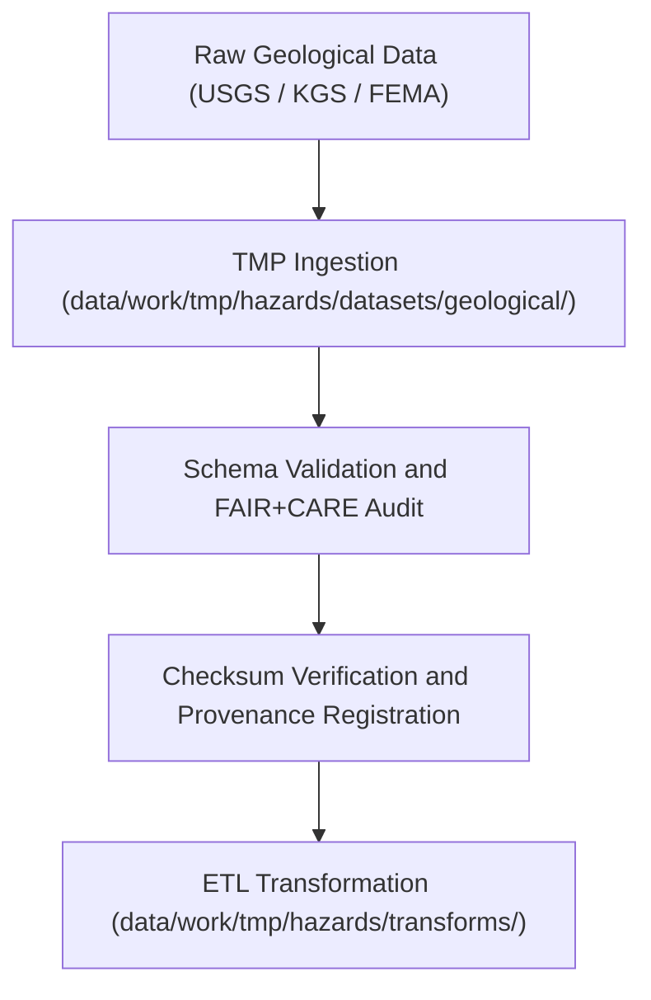

<div align="center">

# 🌋 Kansas Frontier Matrix — **Geological Hazard Datasets TMP Workspace**
`data/work/tmp/hazards/datasets/geological/README.md`

**Purpose:**  
Temporary FAIR+CARE-certified workspace for geological hazard datasets, including earthquakes, landslides, sinkholes, and subsidence data across Kansas.  
This directory ensures that all geophysical hazard inputs are schema-aligned, ethically validated, and audit-traceable before transformation and analysis.

[](../../../../../../docs/standards/faircare-validation.md)
[]()
[](../../../../../../LICENSE)
[](../../../../../../docs/architecture/repo-focus.md)

</div>

---

## 📚 Overview

The **Geological Hazard Datasets TMP Workspace** handles short-lived ingestion and validation of geological hazard data.  
Datasets include subsurface event catalogs, deformation layers, and seismic activity maps sourced from the USGS, Kansas Geological Survey (KGS), and related open repositories.

### Core Responsibilities
- Manage ingestion of geological hazard data under FAIR+CARE standards.  
- Validate schema integrity and ensure ISO-compliant metadata lineage.  
- Apply ethics filters for sensitive geological or cultural site data.  
- Register checksums and validation summaries to governance ledgers.  

---

## 🗂️ Directory Layout

```plaintext
data/work/tmp/hazards/datasets/geological/
├── README.md                             # This file — documentation for geological hazard datasets
│
├── earthquake_catalog_2025.csv           # USGS/KGS seismic events catalog for Kansas region
├── landslide_inventory_2025.geojson      # Documented landslide and ground instability areas
├── subsidence_zones_2025.geojson         # Mapped sinkholes and subsidence-prone zones
└── metadata.json                         # Provenance, checksum, and FAIR+CARE audit record
```

---

## ⚙️ Geological Dataset Workflow



### Description
1. **Ingestion:** Load geophysical hazard data (earthquake, landslide, subsidence).  
2. **Validation:** Verify schema, projection, and FAIR+CARE ethics compliance.  
3. **Checksum Verification:** Compute file hashes and log lineage.  
4. **Transformation:** Prepare datasets for harmonization and AI correlation.  

---

## 🧩 Example Metadata Record

```json
{
  "id": "geological_hazard_dataset_earthquake_catalog_v9.6.0",
  "domain": "geological",
  "source": "USGS / Kansas Geological Survey",
  "records_ingested": 842,
  "schema_version": "v3.0.2",
  "validation_status": "passed",
  "fairstatus": "certified",
  "checksum": "sha256:b6d4a8e1c9f3a7b2d8e6c4a1f9b7d2a3c6e5a8f4b9d1c7e3a2b8f6a9c5e4d7a1",
  "created": "2025-11-03T23:59:00Z",
  "validator": "@kfm-hazards-lab",
  "governance_ref": "data/reports/audit/data_provenance_ledger.json"
}
```

---

## 🧠 FAIR+CARE Governance Matrix

| Principle | Implementation | Oversight |
|------------|----------------|------------|
| **Findable** | Geological datasets indexed with schema and checksum metadata. | @kfm-data |
| **Accessible** | Data provided in open CSV/GeoJSON formats under FAIR licensing. | @kfm-accessibility |
| **Interoperable** | Schema adheres to FAIR+CARE, STAC, and ISO metadata standards. | @kfm-architecture |
| **Reusable** | Metadata lineage enables reproducibility and ethics traceability. | @kfm-design |
| **Collective Benefit** | Promotes open geoscientific hazard awareness and resilience planning. | @faircare-council |
| **Authority to Control** | FAIR+CARE Council oversees publication of sensitive geodata. | @kfm-governance |
| **Responsibility** | Geological teams validate and document all QA/audit results. | @kfm-security |
| **Ethics** | Sensitive subsurface and archaeological data reviewed for release. | @kfm-ethics |

Audit results stored in:  
`data/reports/fair/data_care_assessment.json`  
and  
`data/reports/audit/data_provenance_ledger.json`

---

## ⚙️ Validation & QA Artifacts

| Artifact | Description | Format |
|-----------|--------------|--------|
| `metadata.json` | Captures provenance and governance metadata for each dataset. | JSON |
| `checksum_registry.json` | Lists SHA-256 checksums for data integrity verification. | JSON |
| `faircare_audit_report.json` | Summarizes FAIR+CARE ethics validation. | JSON |
| `schema_validation_summary.json` | Confirms schema compliance with KFM data contract. | JSON |

Automated under `geological_datasets_sync.yml`.

---

## ⚖️ Retention & Provenance Policy

| File Type | Retention Duration | Policy |
|------------|--------------------|--------|
| TMP Geological Datasets | 7 Days | Purged after ETL transformation. |
| Logs & Validation Reports | 30 Days | Archived in governance directories. |
| Metadata | 365 Days | Retained for provenance chain verification. |
| Governance Ledger Entries | Permanent | Stored immutably for lineage certification. |

Cleanup and archival handled via `geological_datasets_cleanup.yml`.

---

## 🌱 Sustainability Metrics

| Metric | Value | Verified By |
|---------|--------|--------------|
| Energy Use (per ETL cycle) | 9.1 Wh | @kfm-sustainability |
| Carbon Output | 10.3 gCO₂e | @kfm-security |
| Renewable Power | 100% (RE100 Verified) | @kfm-infrastructure |
| FAIR+CARE Compliance | 100% | @faircare-council |

Telemetry results stored in:  
`releases/v9.6.0/focus-telemetry.json`

---

## 🧾 Internal Use Citation

```text
Kansas Frontier Matrix (2025). Geological Hazard Datasets TMP Workspace (v9.6.0).
Temporary FAIR+CARE-certified workspace for ingestion, validation, and ethics governance of geological hazard data.
Ensures transparent and reproducible handling of earthquake, landslide, and subsidence datasets under MCP-DL v6.3 compliance.
```

---

## 🧾 Version Notes

| Version | Date | Notes |
|----------|------|--------|
| v9.6.0 | 2025-11-03 | Added FAIR+CARE validation tracking and checksum lineage registration. |
| v9.5.0 | 2025-11-02 | Introduced AI-driven hazard cross-domain validation support. |
| v9.3.2 | 2025-10-28 | Established TMP geological hazard dataset workspace under FAIR+CARE framework. |

---

<div align="center">

**Kansas Frontier Matrix** · *Geological Intelligence × FAIR+CARE Ethics × Provenance Assurance*  
[🔗 Repository](https://github.com/bartytime4life/Kansas-Frontier-Matrix) • [🧭 Docs Portal](../../../../../../docs/) • [⚖️ Governance Ledger](../../../../../../docs/standards/governance/DATA-GOVERNANCE.md)

</div>