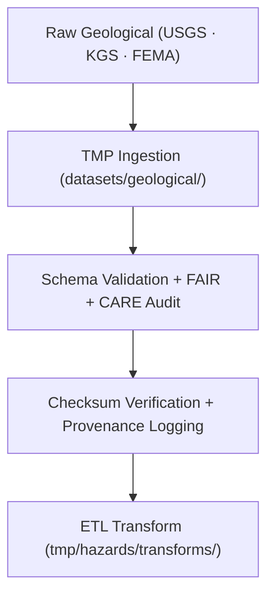

<div align="center">

# 🌋 Kansas Frontier Matrix — **Geological Hazard Datasets TMP Workspace**
`data/work/tmp/hazards/datasets/geological/README.md`

**Purpose:**  
Temporary **FAIR+CARE-certified** workspace for geological hazard datasets — earthquakes, landslides, sinkholes, and subsidence across Kansas.  
Ensures all geophysical inputs are schema-aligned, ethically validated, and audit-traceable before transformation and analysis.

[](../../../../../../docs/architecture/README.md)
[](../../../../../../docs/standards/faircare-validation.md)
[]()
[](../../../../../../LICENSE)

</div>

---

## 📘 Overview

The **Geological Hazard Datasets TMP Workspace** manages short-lived ingestion and validation for geophysical hazards.  
Datasets include subsurface event catalogs, deformation layers, and seismic activity maps from **USGS**, **KGS**, and related repositories.

### Core Responsibilities
- Ingest geological hazard data under FAIR+CARE standards.  
- Validate schema integrity + ISO-compliant lineage.  
- Apply ethics filters for sensitive geological/cultural sites.  
- Register checksums and validation summaries in governance ledgers.  

---

## 🗂️ Directory Layout

```plaintext
data/work/tmp/hazards/datasets/geological/
├── README.md
├── earthquake_catalog_2025.csv
├── landslide_inventory_2025.geojson
├── subsidence_zones_2025.geojson
└── metadata.json
```

---

## ⚙️ Geological Dataset Workflow



### Steps
1. **Ingest** — Load earthquake/landslide/subsidence data.  
2. **Validate** — Confirm schema, projection, and ethics compliance.  
3. **Checksums** — Compute hashes; log lineage.  
4. **Transform** — Prepare for harmonization + AI correlation.  

---

## 🧩 Example Metadata Record

```json
{
  "id": "geological_hazard_dataset_earthquake_catalog_v9.7.0",
  "domain": "geological",
  "source": "USGS / Kansas Geological Survey",
  "records_ingested": 842,
  "schema_version": "v3.1.1",
  "validation_status": "passed",
  "fairstatus": "certified",
  "checksum_sha256": "sha256:b6d4a8e1c9f3a7b2d8e6c4a1f9b7d2a3c6e5a8f4b9d1c7e3a2b8f6a9c5e4d7a1",
  "created": "2025-11-06T23:59:00Z",
  "validator": "@kfm-hazards-lab",
  "governance_ref": "data/reports/audit/data_provenance_ledger.json"
}
```

---

## 🧠 FAIR+CARE Governance Matrix

| Principle | Implementation | Oversight |
|-----------|----------------|-----------|
| **Findable** | Indexed by schema + checksum metadata. | `@kfm-data` |
| **Accessible** | Open CSV/GeoJSON; FAIR licensing. | `@kfm-accessibility` |
| **Interoperable** | FAIR+CARE + STAC/DCAT + ISO aligned. | `@kfm-architecture` |
| **Reusable** | Provenance lineage ensures reproducibility. | `@kfm-design` |
| **Collective Benefit** | Open geoscience for resilience planning. | `@faircare-council` |
| **Authority to Control** | Council oversees sensitive geodata release. | `@kfm-governance` |
| **Responsibility** | Geological teams document QA/audit results. | `@kfm-security` |
| **Ethics** | Sensitive subsurface/archaeological context reviewed. | `@kfm-ethics` |

**Audits:**  
`data/reports/fair/data_care_assessment.json` · `data/reports/audit/data_provenance_ledger.json`

---

## ⚙️ Validation & QA Artifacts

| Artifact                       | Description                                | Format |
|--------------------------------|--------------------------------------------|--------|
| `metadata.json`                | Provenance + governance metadata           | JSON   |
| `checksum_registry.json`       | SHA-256 integrity registry                 | JSON   |
| `faircare_audit_report.json`   | FAIR+CARE ethics validation summary        | JSON   |
| `schema_validation_summary.json` | Data contract conformance                | JSON   |

**Automation:** `geological_datasets_sync.yml`

---

## ♻️ Retention & Sustainability

| Type                    | Retention | Policy                                    |
|------------------------|----------:|-------------------------------------------|
| TMP Geological Data    | 7 Days    | Purged after ETL transform.               |
| Logs & Validation      | 30 Days   | Archived under governance directories.    |
| Metadata               | 365 Days  | Retained for provenance chain.            |
| Ledger Entries         | Permanent | Immutable under governance.               |

**Telemetry:** `../../../../../../releases/v9.7.0/focus-telemetry.json`

---

## 🧾 Citation

```text
Kansas Frontier Matrix (2025). Geological Hazard Datasets TMP Workspace (v9.7.0).
Temporary FAIR+CARE-governed workspace for geological hazard ingestion, validation, and ethics oversight—ensuring transparent, reproducible handling of earthquake, landslide, and subsidence data.
```

---

<div align="center">

**Kansas Frontier Matrix**  
*Geological Intelligence × FAIR+CARE Ethics × Provenance Assurance*  
© 2025 Kansas Frontier Matrix — MIT · Diamond⁹ Ω / Crown∞Ω Ultimate Certified  

[Back to Hazard Datasets](../README.md) · [Governance Charter](../../../../../../docs/standards/governance/DATA-GOVERNANCE.md)

</div>