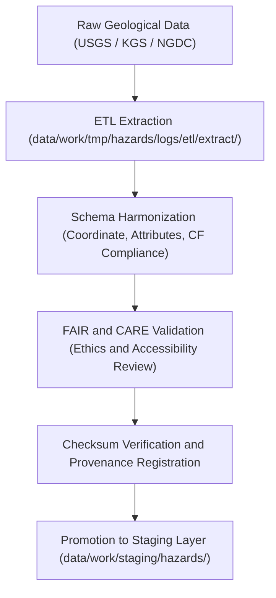

<div align="center">

# 🌋 Kansas Frontier Matrix — **Geological Hazard Datasets TMP Layer**
`data/work/tmp/hazards/datasets/geological/README.md`

**Purpose:**  
Temporary FAIR+CARE-compliant repository for **geological hazard datasets**, including earthquakes, landslides, and subsidence monitoring, within the Kansas Frontier Matrix (KFM).  
This layer provides schema-normalized, checksum-verified, and ethically governed data to support geohazard modeling, validation, and archival workflows.

[](../../../../../../docs/standards/faircare-validation.md)
[](../../../../../../LICENSE)
[](../../../../../../docs/architecture/repo-focus.md)

</div>

---

## 📚 Overview

The `data/work/tmp/hazards/datasets/geological/` directory serves as a **transient workspace** for pre-validation, schema harmonization, and FAIR+CARE auditing of geological hazard data.  
Datasets include earthquake catalogs, subsidence monitoring data, and landslide inventories sourced from **USGS, Kansas Geological Survey (KGS), and NGDC** repositories.

### Core Responsibilities
- Host geological hazard datasets extracted from authoritative public sources.  
- Harmonize schemas, formats, and coordinate systems for ETL compatibility.  
- Provide metadata, checksum validation, and FAIR+CARE audit readiness.  
- Support downstream AI modeling and hazard risk analysis workflows.  

---

## 🗂️ Directory Layout

```plaintext
data/work/tmp/hazards/datasets/geological/
├── README.md                             # This file — documentation for geological hazard datasets TMP layer
│
├── earthquakes_2025.csv                  # USGS earthquake event catalog for Kansas
├── landslides_inventory.geojson          # Kansas statewide landslide inventory dataset
├── subsidence_zones_2025.parquet         # Identified and predicted ground subsidence regions
└── metadata.json                         # Provenance, checksum, and FAIR+CARE audit metadata
```

---

## ⚙️ Geological Data Workflow



### Workflow Description
1. **Extraction:** Import data from USGS Earthquake Hazards Program, KGS, and related sources.  
2. **Transformation:** Normalize attributes (magnitude, depth, intensity, location) for schema consistency.  
3. **Validation:** Apply FAIR+CARE audits and ethical data sourcing verification.  
4. **Checksum Registration:** Compute SHA-256 integrity hashes and log to governance ledger.  
5. **Promotion:** Datasets certified for staging layer ingestion and AI analysis.

---

## 🧩 Example Metadata Record

```json
{
  "id": "geological_hazards_dataset_v9.5.0_2025Q4",
  "domain": "geological",
  "datasets": ["earthquakes_2025.csv", "landslides_inventory.geojson", "subsidence_zones_2025.parquet"],
  "records_processed": 102341,
  "checksum_verified": true,
  "fairstatus": "compliant",
  "schema_version": "v3.0.1",
  "validator": "@kfm-geohazards",
  "checksum": "sha256:91cdaf4374f6e7a019ae8e3f22a4129f9a7c02e7...",
  "telemetry_ref": "releases/v9.5.0/focus-telemetry.json",
  "governance_ref": "reports/audit/ai_hazards_ledger.json",
  "created": "2025-11-02T19:20:00Z"
}
```

---

## 🧠 FAIR+CARE Governance Integration

| Principle | Implementation |
|------------|----------------|
| **Findable** | Indexed by dataset, schema version, and checksum in ledger. |
| **Accessible** | Stored as open formats (CSV, GeoJSON, Parquet). |
| **Interoperable** | Aligns with ISO 19115, STAC 1.0, and CIDOC CRM-HazardExt ontology. |
| **Reusable** | Provides detailed provenance, schema, and checksum metadata. |
| **Collective Benefit** | Enhances open geoscience collaboration and hazard awareness. |
| **Authority to Control** | FAIR+CARE Council approves schema and dataset promotion. |
| **Responsibility** | Geohazard maintainers document schema updates and QA logs. |
| **Ethics** | Sensitive location data generalized to preserve safety and privacy. |

Audit and lineage results stored in:  
`reports/audit/ai_hazards_ledger.json` • `reports/fair/hazards_geological_summary.json`

---

## ⚙️ Dataset QA & Provenance Artifacts

| File | Description | Format |
|------|--------------|--------|
| `earthquakes_2025.csv` | Earthquake event catalog with metadata and magnitudes. | CSV |
| `landslides_inventory.geojson` | Spatial records of landslides and slope instability zones. | GeoJSON |
| `subsidence_zones_2025.parquet` | Gridded model output for predicted ground subsidence. | Parquet |
| `metadata.json` | FAIR+CARE, checksum, and provenance tracking record. | JSON |

QA and synchronization automated through `hazards_geological_sync.yml`.

---

## 🧾 Retention Policy

| Data Type | Retention Duration | Policy |
|------------|--------------------|--------|
| TMP Geological Datasets | 14 days | Purged after validation and staging transfer. |
| Metadata | 365 days | Archived for FAIR+CARE audit reference. |
| Provenance & Ledger Records | Permanent | Retained for reproducibility and governance. |

Retention governed by `hazards_geological_cleanup.yml`.

---

## 🧾 Internal Use Citation

```text
Kansas Frontier Matrix (2025). Geological Hazard Datasets TMP Layer (v9.5.0).
Temporary FAIR+CARE-certified dataset repository for earthquakes, landslides, and subsidence data in Kansas.
Aligned with ISO 19115, STAC 1.0, and CIDOC CRM for ethical and transparent hazard data processing.
```

---

## 🧾 Version Notes

| Version | Date | Notes |
|----------|------|--------|
| v9.5.0 | 2025-11-02 | Added subsidence dataset integration, FAIR+CARE metadata schema v2, and ledger linkage. |
| v9.3.2 | 2025-10-28 | Expanded landslide coverage and governance audit traceability. |
| v9.3.0 | 2025-10-26 | Established geological dataset TMP structure for hazard processing. |

---

<div align="center">

**Kansas Frontier Matrix** · *Geological Integrity × FAIR+CARE Ethics × Provenance Transparency*  
[🔗 Repository](https://github.com/bartytime4life/Kansas-Frontier-Matrix) • [🧭 Docs Portal](../../../../../../docs/) • [⚖️ Governance Ledger](../../../../../../docs/standards/governance/)

</div>