<div align="center">

# 🌋 **Kansas Frontier Matrix — Geological Hazard Datasets TMP Workspace**  
`data/work/tmp/hazards/datasets/geological/README.md`

**Purpose:**  
Temporary FAIR+CARE-governed workspace for **geological hazard datasets** — earthquakes, landslides, sinkholes, and subsidence affecting Kansas.  

This workspace:

- Ingests geophysical hazard datasets from **USGS**, **KGS**, and related sources  
- Applies schema, CRS, and metadata normalization  
- Executes **pre-validation, ethics checks, and checksum registration**  
- Logs telemetry v2 (energy, carbon, coverage, runtime) for all ingestion cycles  
- Prepares inputs for downstream transforms, staging, and analytics  

[](../../../../../../docs/architecture/README.md)  
[](../../../../../../docs/standards/faircare/FAIRCARE-GUIDE.md)  
[]()  
[](../../../../../../LICENSE)

</div>

---

## 1. 📘 Overview

The **Geological Hazard Datasets TMP Workspace** focuses on **short-lived ingestion and pre-validation** for geophysical hazard data, including:

- Earthquake catalogs (hypocenters, magnitudes, depths)  
- Landslide inventories & susceptibility layers  
- Subsidence zones and deformation surfaces  
- Any other geological hazard-relevant datasets  

It ensures that:

- Geophysical inputs are **schema-aligned** and **ethically assessed**  
- Telemetry (energy, carbon, runtime) is captured for each ingestion/validation cycle  
- Datasets are ready for further transformation in `data/work/tmp/hazards/transforms/`  

---

## 2. 🗂️ Directory Layout (Mobile-Safe)

```text
data/work/tmp/hazards/datasets/geological/
├── README.md                         ← this file
├── earthquake_catalog_2025.csv       # USGS/KGS seismic events
├── landslide_inventory_2025.geojson  # Known/derived landslide locations
├── subsidence_zones_2025.geojson     # Ground subsidence hazard areas
└── metadata.json                     # Geological TMP dataset metadata
```

- Additional files may be added (e.g., `fault_traces_*.geojson`, `liquefaction_zones_*.geojson`) and MUST be documented in `metadata.json` and covered by validation.

---

## 3. ⚙️ Geological Dataset Workflow

```mermaid
flowchart TD
    RAW["Raw Geological (USGS · KGS · FEMA)"]
      --> INGEST["TMP Ingestion (datasets/geological/)"]
    INGEST --> PREVAL["Schema Validation + FAIR+CARE Audit"]
    PREVAL --> LOG["Checksum + Telemetry Logging"]
    LOG --> TRANSFORM["→ data/work/tmp/hazards/transforms/"]
```



### Step Summary

1. **Ingest**  
   - Load geological hazard datasets (USGS earthquake catalogs, KGS records, subsidence & landslide layers).  
   - Store under `data/work/tmp/hazards/datasets/geological/`.  

2. **Schema & FAIR+CARE Validation**  
   - Validate schema against `data-contract-v3` and ISO 19115.  
   - Check required fields:
     - Event ID, location (lat/lon), magnitude, depth, event time  
     - Geometry validity for polygons/lines (no self-intersections)  
   - Run FAIR+CARE checks for sensitive locations (e.g., culturally significant or protected sites).  

3. **Checksum & Telemetry Logging**  
   - Compute SHA-256 checksums; record in `checksum_registry` (via `metadata.json` link).  
   - Log energy, carbon, and coverage for each ingestion/validation cycle.  

4. **Promotion to Transforms**  
   - Expose validated datasets to `data/work/tmp/hazards/transforms/` for reprojection, harmonization, and AI correlation analysis.  

---

## 4. 🧩 Example Geological Dataset Metadata Record

```json
{
  "id": "geological_hazard_dataset_earthquake_catalog_v11.0.0",
    "domain": "hazards",
    "subdomain": "geological",
    "source": [
      "USGS ComCat",
      "Kansas Geological Survey"
    ],
    "records_ingested": 842,
    "schema_version": "v3.2.0",
    "validation_status": "passed",
    "fairstatus": "certified",
    "telemetry": {
      "energy_wh": 0.6,
      "carbon_gco2e": 0.8,
      "coverage_pct": 100,
      "runtime_sec": 21
    },
    "checksum_sha256": "sha256:b6d4a8e1c9f3a7b2d8e6c4a1f9b7d2a3c6e5a8f4b9d1c7e3a2b8f6a9c5e4d7a1",
    "created": "2025-11-20T23:59:00Z",
    "governance_ref": "data/reports/audit/data_provenance_ledger.json"
}
```

This record is a **prov:Entity** and binds geological datasets to:

- Ingestion activities & associated pipelines  
- Source agencies and data contracts  
- FAIR+CARE and ISO-compliant validation outputs  

---

## 5. 🧠 FAIR+CARE Governance Matrix — Geological Hazard Datasets

| Principle              | Implementation                                                     | Oversight             |
|------------------------|--------------------------------------------------------------------|-----------------------|
| **Findable**           | Datasets indexed by hazard type, source, schema, checksum.        | `@kfm-data`          |
| **Accessible**         | Internal-only, governed by archival & release policies.            | `@kfm-accessibility` |
| **Interoperable**      | ISO 19115, STAC/DCAT, CIDOC CRM HazardExt alignment.              | `@kfm-architecture`  |
| **Reusable**           | Full lineage, telemetry, schema, and FAIR+CARE status recorded.   | `@kfm-design`        |
| **Collective Benefit** | Supports understanding of geological risk and resilience planning.| `@faircare-council`  |
| **Authority to Control** | Council approves use in public products & models.               | `@kfm-governance`    |
| **Responsibility**     | Domain stewards maintain ingestion QA and documentation.           | `@kfm-security`      |
| **Ethics**             | Sensitive subsurface & cultural sites anonymized/aggregated.      | `@kfm-ethics`        |

Governance & Audit References:

- `data/reports/fair/data_care_assessment.json`  
- `data/reports/audit/data_provenance_ledger.json`  

---

## 6. 🧪 Validation & QA Artifacts

`metadata.json` in this directory includes:

- Input source details (USGS, KGS, etc.)  
- Schema version & mapping details  
- Pre-validation status & QA notes  
- Checksum references  

Associated QA artifacts (referenced from `metadata.json` and other TMP directories):

- `schema_validation_summary.json` — contract & structural checks  
- `faircare_audit_report.json` — ethics & sensitivity review  
- `checksum_registry.json` — SHA-256 hash registry  

These are generated and maintained by automation:

- `geological_datasets_sync_v2.yml`  

---

## 7. ♻️ Retention & Sustainability

As a **TMP workspace**, geological hazard datasets follow short-term retention with strong governance:

| Type                       | Retention | Policy                                             |
|----------------------------|----------:|----------------------------------------------------|
| TMP Geological Datasets    | 7 days    | Purged after promotion or expiry                   |
| Validation Logs            | 30 days   | Archived in governance/audit storage               |
| Metadata & Checksums       | ≥ 365 days| Retained for long-term provenance & QA             |

Telemetry is logged to:  
`../../../../../../releases/v11.0.0/focus-telemetry.json`

Example ingestion cycle metrics:

| Metric                    | Value  | Verified By           |
|---------------------------|-------:|-----------------------|
| Energy Use (per cycle)    | 5.5 Wh | `@kfm-sustainability` |
| Carbon Output (gCO₂e)     | 6.7    | `@kfm-security`       |
| Renewable Power Share     | 100%   | `@kfm-infrastructure` |
| FAIR+CARE Pre-Compliance  | 100%   | `@faircare-council`   |

---

## 8. 🧾 Citation

```text
Kansas Frontier Matrix (2025). Geological Hazard Datasets TMP Workspace (v11.0.0).
Transient FAIR+CARE-governed environment for ingesting, validating, and harmonizing
geological hazard datasets (earthquakes, landslides, subsidence), with telemetry v2
metrics and full provenance under MCP-DL v11 and KFM-PDC v11.
```

---

<div align="center">

**Kansas Frontier Matrix — Geological Hazard Datasets TMP Workspace**  
🌋 FAIR+CARE Certified · Ingestion & QA Hub · Diamond⁹ Ω / Crown⁹ Ω  

[Back to Hazard Datasets](../README.md) · [Data Architecture](../../../../ARCHITECTURE.md) · [Governance Charter](../../../../../../docs/standards/governance/DATA-GOVERNANCE.md)

</div>
