<div align="center">

# 🌎 Kansas Frontier Matrix — **Geological Hazards TMP Datasets**
`data/work/tmp/hazards/datasets/geological/README.md`

**Purpose:**  
Transient ingestion and harmonization workspace for **earthquake, landslide, and subsidence datasets** utilized in the Kansas Frontier Matrix (KFM).  
Supports **ETL, FAIR+CARE validation, and AI-driven seismic risk analysis** while ensuring full provenance and ontology alignment.

[](../../../../../../docs/standards/faircare-validation.md)
[](../../../../../../LICENSE)
[](../../../../../../docs/architecture/repo-focus.md)

</div>

---

## 📚 Overview

The `geological/` TMP directory stores all **geophysical hazard datasets** for Kansas, with an emphasis on **earthquakes, fault systems, karst features, and ground subsidence**.  
These datasets are used in Focus Mode analytics, hazard correlation mapping, and AI-driven geospatial inference modeling.

### Core Dataset Domains
- **Seismicity:** Earthquake events, magnitudes, and focal depths.  
- **Geotechnical:** Fault zones, lithology, and shear stress data.  
- **Subsidence:** Karst collapse zones, oil and gas extraction regions, and land deformation grids.  
- **Landslides:** USGS national landslide inventory intersected with Kansas DEM derivatives.  

---

## 🗂️ Directory Layout

```plaintext
data/work/tmp/hazards/datasets/geological/
├── README.md                                 # This file — geological hazard dataset overview
│
├── kansas_earthquakes_1977_2025.csv          # Historical earthquake records (magnitude, depth, location)
├── usgs_landslides.geojson                   # Mapped landslide polygons and susceptibility scores
├── subsidence_zones_2025.geojson             # Ground subsidence data (KGS & InSAR-derived)
├── fault_lines_kansas.geojson                # Mapped fault traces and structural geology layers
├── karst_collapse_points.geojson             # Sinkholes and karst collapse features
└── metadata.json                             # Provenance, FAIR+CARE, and validation metadata
```

---

## ⚙️ Ingestion & Processing Workflow

```mermaid
flowchart TD
    A["Source Data - USGS, KGS, DASC, InSAR"] --> B["ETL Ingestion and Schema Mapping"]
    B --> C["FAIR+CARE Validation and Ethics Audit"]
    C --> D["Checksum Verification and Metadata Logging"]
    D --> E["Ontology Alignment - CIDOC CRM Hazard Extension"]
    E --> F["Promotion → Transforms Layer (data/work/tmp/hazards/transforms/)"]
```



### Workflow Description
1. **Extract:** Gather seismic, landslide, and subsidence data from USGS, KGS, and InSAR portals.  
2. **Normalize:** Align coordinates (EPSG:4326) and standardize field definitions.  
3. **Validate:** Run schema and FAIR+CARE compliance checks for completeness and ethics.  
4. **Map Ontology:** Associate hazards with CIDOC CRM classes (`E5_Event`, `E18_Physical_Thing`, etc.).  
5. **Promote:** Export validated data to transforms layer for reprojection or modeling workflows.

---

## 🧩 Example Metadata Record

```json
{
  "id": "geological_hazards_earthquakes_v9.5.0",
  "source": "USGS Earthquake Catalog + Kansas Geological Survey",
  "domain": "geological",
  "records": 3124,
  "variables": ["magnitude", "depth_km", "event_date", "latitude", "longitude"],
  "crs": "EPSG:4326",
  "schema_contract": "docs/contracts/data-contract-v3.json",
  "checksum": "sha256:c71b99f4a6a57b4d71ab7fa439d622cb8d1749fa...",
  "validated": true,
  "fairstatus": "compliant",
  "governance_ref": "reports/audit/ai_hazards_ledger.json",
  "created": "2025-11-02T17:30:00Z"
}
```

---

## 🧠 FAIR+CARE Governance Integration

| Principle | Implementation |
|------------|----------------|
| **Findable** | Indexed in KFM’s ledger by dataset ID and source origin. |
| **Accessible** | Open formats (CSV, GeoJSON) following FAIR licensing practices. |
| **Interoperable** | Aligned with ISO 19115, CIDOC CRM, and DCAT schemas. |
| **Reusable** | Versioned, checksum-verified, and ontology-linked. |
| **Collective Benefit** | Supports seismic resilience planning and geotechnical monitoring. |
| **Authority to Control** | FAIR+CARE Council validates publication and retention policy. |
| **Responsibility** | Validators record transformations and governance approval logs. |
| **Ethics** | Data screened for security-sensitive geological sites and anonymized. |

Governance audits and FAIR+CARE results documented in:  
`reports/audit/ai_hazards_ledger.json` • `reports/fair/geological_hazards_summary.json`

---

## ⚙️ Validation & Provenance Artifacts

| File | Description | Format |
|------|--------------|--------|
| `metadata.json` | Provenance metadata and FAIR+CARE compliance record. | JSON |
| `checksum_registry.json` | Dataset integrity hash tracking for governance. | JSON |
| `ontology_mapping.json` | Mappings between geology datasets and HazardExt ontology. | JSON |
| `etl_trace.log` | Detailed ETL and ingestion event trace. | Text |

ETL and validation automation managed via `geological_dataset_sync.yml`.

---

## 🧾 Retention Policy

| Dataset Type | Retention Duration | Policy |
|---------------|--------------------|--------|
| Seismic Events | 30 days | Promoted to transforms post-validation. |
| Landslide Data | 30 days | Retained for AI terrain model explainability. |
| Subsidence Data | 14 days | Cleared post-Governance verification. |
| Karst Features | 14 days | Retained until schema harmonization complete. |
| Metadata & Logs | 365 days | Archived permanently for provenance traceability. |

Cleanup controlled by `geological_dataset_cleanup.yml`.

---

## 🧾 Internal Use Citation

```text
Kansas Frontier Matrix (2025). Geological Hazards TMP Datasets (v9.5.0).
Temporary repository for geological hazard datasets (earthquakes, faults, landslides, and subsidence) from USGS, KGS, and DASC.
FAIR+CARE-compliant, ISO 19115 aligned, and ontology-mapped to CIDOC CRM Hazard Extension.
Restricted to internal ETL, AI QA, and governance operations.
```

---

## 🧾 Version Notes

| Version | Date | Notes |
|----------|------|--------|
| v9.5.0 | 2025-11-02 | Added InSAR subsidence integration, ontology mapping, and telemetry schema v2. |
| v9.3.2 | 2025-10-28 | Introduced FAIR+CARE validation for landslides and seismic datasets. |
| v9.3.0 | 2025-10-26 | Established geological hazard TMP dataset ingestion structure. |

---

<div align="center">

**Kansas Frontier Matrix** · *Geoscience Intelligence × FAIR+CARE Governance × Provenance Transparency*  
[🔗 Repository](https://github.com/bartytime4life/Kansas-Frontier-Matrix) • [🧭 Docs Portal](../../../../../../docs/) • [⚖️ Governance Ledger](../../../../../../docs/standards/governance/)

</div>

