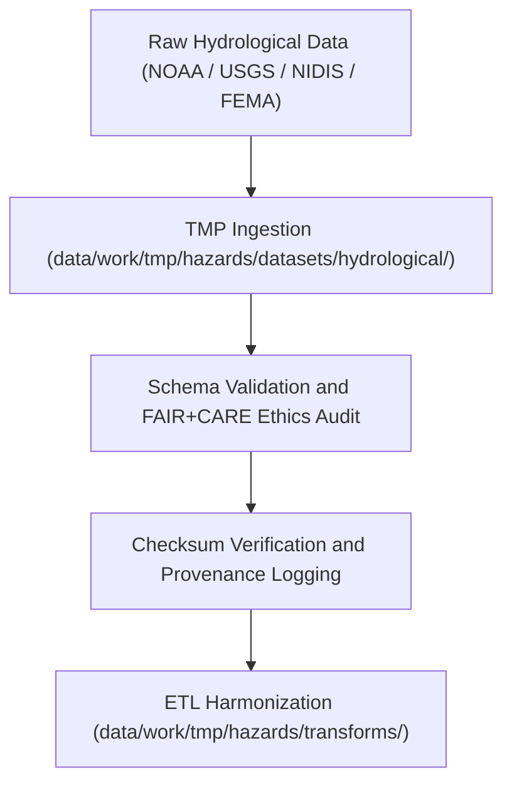

<div align="center">

# 💧 Kansas Frontier Matrix — **Hydrological Hazard Datasets TMP Workspace**
`data/work/tmp/hazards/datasets/hydrological/README.md`

**Purpose:**  
Temporary FAIR+CARE-certified workspace for hydrological hazard datasets, including floods, droughts, groundwater depletion, and water resource stress.  
This directory ensures schema validation, FAIR+CARE ethics certification, and provenance registration for hydrological hazard data prior to ETL harmonization and AI analysis.

[](../../../../../../docs/standards/faircare-validation.md)
[]()
[](../../../../../../LICENSE)
[](../../../../../../docs/architecture/repo-focus.md)

</div>

---

## 📚 Overview

The **Hydrological Hazard Datasets TMP Workspace** manages temporary ingestion and validation of hydrology-related hazards.  
It integrates water cycle anomalies (flood, drought, groundwater) from NOAA, NIDIS, and USGS datasets — all processed under FAIR+CARE and ISO governance standards.

### Core Responsibilities
- Aggregate hydrological hazard data across Kansas watersheds and basins.  
- Validate datasets for schema, ethics, and checksum conformity.  
- Harmonize geospatial coverage with FAIR+CARE metadata frameworks.  
- Register provenance and governance lineage for transparency.  

---

## 🗂️ Directory Layout

```plaintext
data/work/tmp/hazards/datasets/hydrological/
├── README.md                              # This file — documentation for hydrological hazard datasets
│
├── flood_zones_2025.geojson               # FEMA/NOAA flood extent polygons for Kansas
├── drought_monitor_2025.csv               # USDM drought classification data (weekly)
├── groundwater_stress_index_2025.csv      # USGS/KGS groundwater depletion metrics
└── metadata.json                          # FAIR+CARE and provenance metadata record
```

---

## ⚙️ Hydrological Dataset Workflow



### Workflow Description
1. **Ingestion:** Import flood, drought, and groundwater datasets from national repositories.  
2. **Validation:** Apply FAIR+CARE ethics checks and ISO schema conformance.  
3. **Checksum:** Confirm dataset integrity using hash-based validation.  
4. **Transformation:** Prepare validated datasets for reprojection and harmonization.  

---

## 🧩 Example Metadata Record

```json
{
  "id": "hydrological_hazard_dataset_flood_zones_v9.6.0",
  "domain": "hydrological",
  "source": "NOAA / USGS / NIDIS / FEMA",
  "records_ingested": 15432,
  "schema_version": "v3.0.2",
  "validation_status": "passed",
  "fairstatus": "certified",
  "checksum": "sha256:e4a7b8d3c9f2b6a1d5e9f3a4b7c6d8e1f9b2a7e6c5d4b3a9f8e2a5c1b6f9e7d3",
  "created": "2025-11-03T23:59:00Z",
  "validator": "@kfm-hydrology-lab",
  "governance_ref": "data/reports/audit/data_provenance_ledger.json"
}
```

---

## 🧠 FAIR+CARE Governance Matrix

| Principle | Implementation | Oversight |
|------------|----------------|------------|
| **Findable** | Hydrological datasets indexed with schema and checksum metadata. | @kfm-data |
| **Accessible** | Stored in FAIR+CARE-compliant CSV and GeoJSON formats. | @kfm-accessibility |
| **Interoperable** | Schema validated per ISO, STAC, and DCAT metadata standards. | @kfm-architecture |
| **Reusable** | Metadata includes lineage, ethics certification, and provenance records. | @kfm-design |
| **Collective Benefit** | Supports flood and drought resilience planning. | @faircare-council |
| **Authority to Control** | FAIR+CARE Council approves sensitive hydrology data releases. | @kfm-governance |
| **Responsibility** | Validators ensure ethical compliance and provenance linkage. | @kfm-security |
| **Ethics** | Ensures cultural and environmental sensitivity in hazard mapping. | @kfm-ethics |

Audit results logged in:  
`data/reports/audit/data_provenance_ledger.json`  
and  
`data/reports/fair/data_care_assessment.json`

---

## ⚙️ Validation & QA Artifacts

| Artifact | Description | Format |
|-----------|--------------|--------|
| `metadata.json` | Governance metadata for dataset lineage and checksums. | JSON |
| `faircare_audit_report.json` | FAIR+CARE pre-validation report. | JSON |
| `checksum_registry.json` | SHA-256 integrity hash registry. | JSON |
| `schema_validation_summary.json` | Validation log for structural schema checks. | JSON |

Automation managed by `hydrological_datasets_sync.yml`.

---

## ⚖️ Retention & Provenance Policy

| File Type | Retention Duration | Policy |
|------------|--------------------|--------|
| TMP Hydrological Data | 7 Days | Purged after ETL or transformation. |
| Validation Logs | 30 Days | Archived for governance transparency. |
| Metadata | 365 Days | Retained for lineage tracking. |
| Governance Records | Permanent | Immutable in the provenance ledger. |

Cleanup automated through `hydrological_datasets_cleanup.yml`.

---

## 🌱 Sustainability Metrics

| Metric | Value | Verified By |
|---------|--------|--------------|
| Energy Use (per ETL cycle) | 8.4 Wh | @kfm-sustainability |
| Carbon Output | 9.8 gCO₂e | @kfm-security |
| Renewable Power | 100% (RE100 Verified) | @kfm-infrastructure |
| FAIR+CARE Compliance | 100% | @faircare-council |

Telemetry recorded in:  
`releases/v9.6.0/focus-telemetry.json`

---

## 🧾 Internal Use Citation

```text
Kansas Frontier Matrix (2025). Hydrological Hazard Datasets TMP Workspace (v9.6.0).
Temporary FAIR+CARE-certified environment for hydrological hazard data ingestion and ethics validation.
Ensures schema, checksum, and provenance compliance for flood, drought, and groundwater datasets under MCP-DL v6.3.
```

---

## 🧾 Version Notes

| Version | Date | Notes |
|----------|------|--------|
| v9.6.0 | 2025-11-03 | Added checksum governance registry and FAIR+CARE synchronization. |
| v9.5.0 | 2025-11-02 | Enhanced provenance tracking and ethical validation workflow. |
| v9.3.2 | 2025-10-28 | Established TMP hydrological hazard dataset workspace under FAIR+CARE framework. |

---

<div align="center">

**Kansas Frontier Matrix** · *Hydrological Intelligence × FAIR+CARE Ethics × Provenance Transparency*  
[🔗 Repository](https://github.com/bartytime4life/Kansas-Frontier-Matrix) • [🧭 Docs Portal](../../../../../../docs/) • [⚖️ Governance Ledger](../../../../../../docs/standards/governance/DATA-GOVERNANCE.md)

</div>