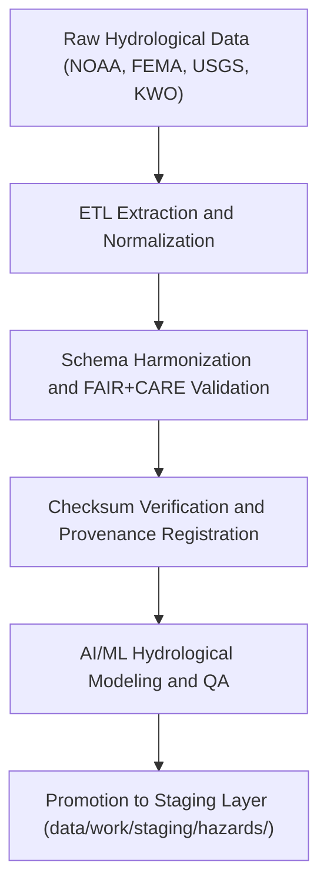

<div align="center">

# 💧 Kansas Frontier Matrix — **Hydrological Hazard Datasets TMP Layer**
`data/work/tmp/hazards/datasets/hydrological/README.md`

**Purpose:**  
Temporary FAIR+CARE-compliant workspace for **floods, droughts, surface water, and groundwater datasets** within the Kansas Frontier Matrix (KFM).  
Provides harmonized, validated, and ethically governed hydrological hazard data supporting flood-risk modeling, drought monitoring, and water management analytics.

[](../../../../../../docs/standards/faircare-validation.md)
[](../../../../../../LICENSE)
[](../../../../../../docs/architecture/repo-focus.md)

</div>

---

## 📚 Overview

The `data/work/tmp/hazards/datasets/hydrological/` directory acts as a **temporary staging and QA environment for hydrological hazard data**.  
Datasets include flood extents, drought indices, soil moisture, streamflow, and groundwater levels sourced from **NOAA, FEMA, USGS, and Kansas Water Office (KWO)** repositories.

### Core Functions
- Host and normalize hydrological datasets for ETL ingestion.  
- Maintain FAIR+CARE metadata, provenance, and checksum registries.  
- Harmonize data under KFM’s ISO 19115 and DCAT schema standards.  
- Facilitate AI modeling for flood, drought, and hydrologic hazard prediction.  

All files here are ephemeral and promoted to staging once validation is complete.

---

## 🗂️ Directory Layout

```plaintext
data/work/tmp/hazards/datasets/hydrological/
├── README.md                            # This file — documentation for hydrological hazard TMP datasets
│
├── flood_extents_2025.geojson           # FEMA and USGS floodplain and inundation zones
├── drought_monitor_2025.csv             # NOAA/NIDIS drought indices for Kansas
├── groundwater_trends_2025.parquet      # USGS groundwater observation trends
├── soil_moisture_anomalies_2025.parquet # Soil moisture deficit and anomaly records
└── metadata.json                        # FAIR+CARE, checksum, and provenance record
```

---

## ⚙️ Hydrological Data Workflow



### Workflow Description
1. **Extraction:** Collect data from NOAA, FEMA NFHL, and USGS water monitoring systems.  
2. **Harmonization:** Reproject and align data fields under standardized schema.  
3. **Validation:** Conduct FAIR+CARE audits and checksum verification.  
4. **AI/ML Modeling:** Generate predictive hydrologic outputs for hazard forecasting.  
5. **Promotion:** Publish validated outputs to staging for certification and archival.

---

## 🧩 Example Metadata Record

```json
{
  "id": "hydrological_hazards_dataset_v9.5.0_2025Q4",
  "domain": "hydrological",
  "datasets": [
    "flood_extents_2025.geojson",
    "drought_monitor_2025.csv",
    "groundwater_trends_2025.parquet"
  ],
  "records_processed": 158276,
  "checksum_verified": true,
  "fairstatus": "certified",
  "schema_version": "v3.0.1",
  "validator": "@kfm-hydrohazards",
  "checksum": "sha256:0f7a27ad19f6c09a91c84cdbd4f31fba03b88f94...",
  "telemetry_ref": "releases/v9.5.0/focus-telemetry.json",
  "governance_ref": "reports/audit/ai_hazards_ledger.json",
  "created": "2025-11-02T19:25:00Z"
}
```

---

## 🧠 FAIR+CARE Governance Integration

| Principle | Implementation |
|------------|----------------|
| **Findable** | Datasets indexed by source, domain, and checksum in governance ledger. |
| **Accessible** | Stored as open CSV, GeoJSON, and Parquet under FAIR+CARE licensing. |
| **Interoperable** | Schema aligned with STAC 1.0, ISO 19115, and CIDOC CRM-HazardExt. |
| **Reusable** | Includes provenance metadata and checksum integrity verification. |
| **Collective Benefit** | Supports transparency in water and flood risk data governance. |
| **Authority to Control** | FAIR+CARE Council validates hydrological dataset ethics and publication. |
| **Responsibility** | Validators document all normalization and governance checks. |
| **Ethics** | Sensitive hydrological data anonymized to protect private well information. |

Governance and lineage results recorded in:  
`reports/audit/ai_hazards_ledger.json` • `reports/fair/hazards_hydrological_summary.json`

---

## ⚙️ Dataset QA & Provenance Artifacts

| File | Description | Format |
|------|--------------|--------|
| `flood_extents_2025.geojson` | FEMA/USGS floodplain and inundation boundaries. | GeoJSON |
| `drought_monitor_2025.csv` | NIDIS drought severity and persistence index data. | CSV |
| `groundwater_trends_2025.parquet` | Groundwater observation and trend datasets. | Parquet |
| `soil_moisture_anomalies_2025.parquet` | Soil moisture deficit data from NOAA/SMAP models. | Parquet |
| `metadata.json` | FAIR+CARE audit and provenance record for TMP datasets. | JSON |

Synchronization and QA handled by `hazards_hydrological_sync.yml`.

---

## 🧾 Retention Policy

| Data Type | Retention Duration | Policy |
|------------|--------------------|--------|
| TMP Hydrological Datasets | 14 days | Purged after staging validation. |
| Metadata | 365 days | Archived for governance and FAIR+CARE compliance. |
| Provenance Records | Permanent | Retained for audit and reproducibility. |

Cleanup governed by `hazards_hydrological_cleanup.yml`.

---

## 🧾 Internal Use Citation

```text
Kansas Frontier Matrix (2025). Hydrological Hazard Datasets TMP Layer (v9.5.0).
Temporary FAIR+CARE-certified repository for floods, droughts, and groundwater datasets in Kansas.
Maintains ethical governance, checksum traceability, and ISO-aligned metadata for reproducible hydrological hazard analysis.
```

---

## 🧾 Version Notes

| Version | Date | Notes |
|----------|------|--------|
| v9.5.0 | 2025-11-02 | Added soil moisture datasets, telemetry schema v2, and provenance linkage improvements. |
| v9.3.2 | 2025-10-28 | Expanded FAIR+CARE compliance tracking and checksum registry integration. |
| v9.3.0 | 2025-10-26 | Established TMP structure for hydrological hazard data pipelines. |

---

<div align="center">

**Kansas Frontier Matrix** · *Water Intelligence × FAIR+CARE Ethics × Provenance Continuity*  
[🔗 Repository](https://github.com/bartytime4life/Kansas-Frontier-Matrix) • [🧭 Docs Portal](../../../../../../docs/) • [⚖️ Governance Ledger](../../../../../../docs/standards/governance/)

</div>