<div align="center">

# 💧 **Kansas Frontier Matrix — Hydrological Hazard Datasets TMP Workspace**  
`data/work/tmp/hazards/datasets/hydrological/README.md`

**Purpose:**  
Temporary FAIR+CARE-governed workspace for hydrological hazard dataset ingestion:

- Floodplain extents & flood risk layers  
- Drought severity and anomaly indices  
- Groundwater stress & depletion metrics  
- Streamflow/riverine hazard indicators  
- Water resource pressure layers (NIDIS, USGS, NOAA)

This TMP environment ensures:

- Valid schema + metadata alignment  
- Ethics & sovereignty compliance  
- Telemetry v2 sustainability logging  
- Fully traceable ingestion → validation pathway  

[]()  
[]()  
[]()  
[]()  

</div>

---

## 1. 📘 Overview

The Hydrological Hazard Datasets TMP Workspace is the **first stop** for water-related hazard data entering KFM.  
It performs:

- Schema validation  
- FAIR+CARE ethics screening  
- Basic QA checks (geometry, units, ranges)  
- Telemetry & checksum registration  
- Early detection of sensitive or sovereignty-governed water insights  

This workspace guarantees reproducibility and ethical stewardship of:

- Flood hazard layers (FEMA NFHL, NOAA)  
- Drought indicators (NIDIS, USDM)  
- Groundwater stress indices (USGS, KGS)  
- Riverine hazard datasets (streamflow anomalies, flood recurrence)  

---

## 2. 🗂️ Directory Layout (Mobile-Safe)

```text
data/work/tmp/hazards/datasets/hydrological/
├── README.md                          ← this file
├── flood_zones_2025.geojson
├── drought_monitor_2025.csv
├── groundwater_stress_index_2025.csv
└── metadata.json                      # Dataset-level ingest metadata
```

Each file MUST be:

- Checksum-verified  
- Schema-aligned  
- FAIR+CARE pre-audited  
- Telemetry-logged  
- Recorded in `metadata.json`  

---

## 3. ⚙️ Hydrological TMP Workflow

```mermaid
flowchart TD
    RAW["Raw Hydrological (NOAA · USGS · NIDIS · FEMA)"]
        --> INGEST["TMP Ingestion (datasets/hydrological/)"]
    INGEST --> PREVAL["Schema + FAIR+CARE Pre-Validation"]
    PREVAL --> LOG["Checksum + Telemetry Logging"]
    LOG --> TRANSFORM["→ data/work/tmp/hazards/transforms/ (Harmonization)"]
```



### Step Summary

1. **Ingestion**  
   Raw hydrology hazard data are copied, normalized, and described in `metadata.json`.

2. **Schema + FAIR+CARE Validation**  
   Contract checks:
   - Required variables  
   - Units & ranges  
   - Spatial validity  
   - Privacy/cultural sensitivity audits  

3. **Checksum + Telemetry Logging**  
   Electrical & carbon footprint recorded per ingestion run.

4. **Promotion to Transforms**  
   Outputs move to harmonization phase.

---

## 4. 🧩 Example Metadata Record (v11)

```json
{
  "id": "hydro_hazard_dataset_flood_zones_v11.0.0",
  "domain": "hazards",
  "subdomain": "hydrological",
  "source": ["NOAA", "USGS", "NIDIS", "FEMA"],
  "records_ingested": 15432,
  "schema_version": "v3.2.0",
  "validation_status": "passed",
  "fairstatus": "certified",
  "telemetry": {
    "energy_wh": 0.92,
    "carbon_gco2e": 1.18,
    "coverage_pct": 99.9,
    "runtime_sec": 28
  },
  "checksum_sha256": "sha256:e4a7b8d3c9f2b6a1d5e9f3a4b7c6d8e1f9b2a7e6c5d4b3a9f8e2a5c1b6f9e7d3",
  "created": "2025-11-20T23:59:00Z",
  "validator": "@kfm-hydrology-lab",
  "governance_ref": "data/reports/audit/data_provenance_ledger.json"
}
```

---

## 5. 🧠 FAIR+CARE Governance Matrix — Hydrological TMP

| Principle | Implementation | Oversight |
|----------|----------------|-----------|
| **Findable** | Indexed by domain, hazard type, checksum, version | `@kfm-data` |
| **Accessible** | FAIR+CARE-governed internal access | `@kfm-accessibility` |
| **Interoperable** | STAC/DCAT, ISO 19115, CIDOC-CRM HazardExt aligned | `@kfm-architecture` |
| **Reusable** | Checksums + telemetry + provenance preserved | `@kfm-design` |
| **Collective Benefit** | Supports water resilience, community planning | `@faircare-council` |
| **Authority to Control** | Governance Council authorizes public release | `@kfm-governance` |
| **Responsibility** | Validators maintain schema & ethics logs | `@kfm-security` |
| **Ethics** | Water-rights & cultural site masking applied | `@kfm-ethics` |

Audit References:

- `data/reports/fair/data_care_assessment.json`  
- `data/reports/audit/data_provenance_ledger.json`

---

## 6. 🧪 Validation & QA Artifacts

Located in this or related TMP subdirectories:

| Artifact | Description | Format |
|---------|-------------|--------|
| `metadata.json` | Ingestion provenance + telemetry + checksum | JSON |
| `schema_validation_summary.json` | Schema contract compliance | JSON |
| `faircare_audit_report.json` | Ethics review outcome | JSON |
| `checksum_registry.json` | File integrity registry | JSON |

Automation:

- `hydrological_datasets_sync_v2.yml`

---

## 7. ♻️ Retention & Sustainability

TMP hydrological datasets follow the v11 retention policy:

| Type | Retention | Policy |
|------|----------:|--------|
| Hydrology TMP Data | 7 days | Deleted after promotion or expiry |
| Validation Logs | 30 days | Archived for audit tracing |
| Metadata | 365 days | Retained under ledger governance |
| Ledger Entries | Permanent | Immutable |

Telemetry Source:  
`../../../../../../releases/v11.0.0/focus-telemetry.json`

**Typical ingestion run:**  
- **Energy:** ~8.0 Wh  
- **Carbon:** ~9.1 gCO₂e  
- **Renewable Power:** 100%  
- **FAIR+CARE compliance:** 100%  

---

## 8. 🧾 Citation

```text
Kansas Frontier Matrix (2025). Hydrological Hazard Datasets TMP Workspace (v11.0.0).
Temporary FAIR+CARE workspace for ingesting, validating, and harmonizing hydrological
hazard datasets (flood, drought, groundwater stress), with retention, telemetry,
and governance-backed provenance aligned with MCP-DL v11 and KFM-PDC v11.
```

---

<div align="center">

**Kansas Frontier Matrix — Hydrological Hazard Datasets TMP Workspace**  
💧 FAIR+CARE Certified · Hazard Ingestion & QA Layer · Diamond⁹ Ω / Crown∞Ω  

[Back to Hazard Datasets](../README.md) · [Hydrology Domain Architecture](../../../../ARCHITECTURE.md) · [Governance Charter](../../../../../../docs/standards/governance/DATA-GOVERNANCE.md)

</div>
