<div align="center">

# 💧 **Kansas Frontier Matrix — Hydrological Hazard Datasets TMP Workspace**  
`data/work/tmp/hazards/datasets/hydrological/README.md`

**Purpose:**  
Temporary FAIR+CARE-governed workspace for **hydrological hazard dataset ingestion and pre-validation**, including:

- Floodplain extents & flood risk layers  
- Drought severity and anomaly indices  
- Groundwater stress and depletion metrics  
- Streamflow/riverine hazard indicators  
- Water resource pressure & availability layers (NIDIS, USGS, NOAA, FEMA)

This TMP workspace enforces:

- Schema + metadata alignment  
- FAIR+CARE + sovereignty compliance  
- Telemetry v2 sustainability logging  
- Full provenance × checksum × lineage traceability  

[]()  
[]()  
[]()  
[]()  

</div>

---

## 1. 📘 Overview

The Hydrological Hazard Datasets TMP Workspace is the **entry point** for water-focused hazard data across KFM.  
It performs:

- 🧩 **Schema contract enforcement**  
- 🛡️ **Ethics + sovereignty validation**  
- 📊 **Basic QA checks** (geometry, units, ranges, completeness)  
- 🔐 **Checksum generation & validation**  
- 🌱 **Telemetry v2 reporting** (energy, carbon, runtime, coverage)  
- 📜 **Provenance registration for reproducibility**

All approved outputs flow into:

```
data/work/tmp/hazards/transforms/
```

for reprojection, harmonization, CF alignment, and AI-driven hazard modeling.

---

## 2. 🗂️ Directory Layout (Mobile-Safe)

```text
data/work/tmp/hazards/datasets/hydrological/
├── README.md                          ← this file
├── flood_zones_2025.geojson
├── drought_monitor_2025.csv
├── groundwater_stress_index_2025.csv
└── metadata.json                      # Dataset-level ingest metadata
```

Every file must be:

- Checksum-verified  
- Schema-compliant  
- FAIR+CARE-screened  
- Represented in `metadata.json`  

---

## 3. ⚙️ Hydrological TMP Workflow

```mermaid
flowchart TD
    RAW["Raw Hydrological (NOAA · USGS · NIDIS · FEMA)"]
        --> INGEST["TMP Ingestion (datasets/hydrological/)"]
    INGEST --> PREVAL["Schema + FAIR+CARE Pre-Validation"]
    PREVAL --> LOG["Checksum + Telemetry Logging"]
    LOG --> TRANSFORM["→ data/work/tmp/hazards/transforms/ (Harmonization)"]
```



### Steps Explained

1. **Ingestion**  
   Raw hydrological hazard datasets are collected & normalized.

2. **Schema + FAIR+CARE Validation**  
   Contract checks + ethics screening + sovereignty masking.

3. **Checksum + Telemetry Logging**  
   SHA-256 integrity + sustainability metrics recorded per ingestion cycle.

4. **Promotion → Transforms**  
   Only validated files move to harmonization workflows.

---

## 4. 🧩 Example Metadata Record (v11)

```json
{
  "id": "hydro_hazard_dataset_flood_zones_v11.0.0",
  "domain": "hazards",
  "subdomain": "hydrological",
  "source": ["NOAA", "USGS", "NIDIS", "FEMA"],
  "records_ingested": 15432,
  "schema_version": "v3.2.0",
  "validation_status": "passed",
  "fairstatus": "certified",
  "telemetry": {
    "energy_wh": 0.92,
    "carbon_gco2e": 1.18,
    "coverage_pct": 99.9,
    "runtime_sec": 28
  },
  "checksum_sha256": "sha256:e4a7b8d3c9f2b6a1d5e9f3a4b7c6d8e1f9b2a7e6c5d4b3a9f8e2a5c1b6f9e7d3",
  "created": "2025-11-20T23:59:00Z",
  "validator": "@kfm-hydrology-lab",
  "governance_ref": "data/reports/audit/data_provenance_ledger.json"
}
```

---

## 5. 🧠 FAIR+CARE Governance Matrix

| Principle | Implementation | Oversight |
|----------|----------------|-----------|
| **Findable** | Indexed by domain, hazard type, checksum, version | `@kfm-data` |
| **Accessible** | Internal FAIR+CARE-gated accessibility | `@kfm-accessibility` |
| **Interoperable** | STAC/DCAT, ISO 19115, HazardExt ontology alignment | `@kfm-architecture` |
| **Reusable** | Telemetry + checksum + provenance preserved | `@kfm-design` |
| **Collective Benefit** | Supports statewide resilience & water governance | `@faircare-council` |
| **Authority to Control** | Release governed by Council + sovereignty rules | `@kfm-governance` |
| **Responsibility** | Validators maintain schema integrity & ethics logs | `@kfm-security` |
| **Ethics** | Water-rights + cultural site masking per policy | `@kfm-ethics` |

---

## 6. 🧪 Validation & QA Artifacts

| Artifact | Description | Format |
|---------|-------------|--------|
| `metadata.json` | Ingestion provenance + telemetry + checksum | JSON |
| `schema_validation_summary.json` | Contract compliance | JSON |
| `faircare_audit_report.json` | Ethics & sensitivity pre-validation | JSON |
| `checksum_registry.json` | SHA-256 integrity registry | JSON |

Automation:  
`hydrological_datasets_sync_v2.yml`

---

## 7. ♻️ Retention & Sustainability

| Type | Retention | Policy |
|------|----------:|--------|
| TMP Hydrology Data | 7 days | Purged after promotion |
| Validation Logs | 30 days | Archived for audit |
| Metadata | 365 days | Governance retention |
| Ledger Entries | Permanent | Immutable chain record |

Telemetry Source:  
`../../../../../../releases/v11.0.0/focus-telemetry.json`

Example ingestion metrics:

| Metric | Value | Verified By |
|--------|------:|-------------|
| Energy | 8.0 Wh | `@kfm-sustainability` |
| Carbon | 9.1 gCO₂e | `@kfm-security` |
| Renewable | 100% | `@kfm-infrastructure` |
| Ethics Compliance | 100% | `@faircare-council` |

---

## 8. 🧾 Citation

```text
Kansas Frontier Matrix (2025). Hydrological Hazard Datasets TMP Workspace (v11.0.0).
Temporary FAIR+CARE workspace for ingesting, validating, and harmonizing hydrological
hazard datasets (floods, droughts, groundwater stress), with telemetry,
ontology alignment, and governance-backed provenance under MCP-DL v11 and KFM-PDC v11.
```

---

## 🕰️ Version History

| Version | Date       | Author           | Summary                                                                 |
|--------:|------------|------------------|-------------------------------------------------------------------------|
| v11.0.0 | 2025-11-20 | `@kfm-hazards`   | Upgraded to v11 preferred formatting; added governance, telemetry v2, FAIR+CARE enhancements, ontology alignment. |
| v10.0.0 | 2025-11-09 | `@kfm-hazards`   | Added TMP ingestion workspace, telemetry v2, schema & FAIR+CARE validators. |
| v9.7.0  | 2025-11-06 | `@kfm-hazards`   | Added schema harmonization rules and early FAIR+CARE checks.            |

---

<div align="center">

**Kansas Frontier Matrix — Hydrological Hazard TMP Workspace**  
💧 FAIR+CARE Certified · Hazard Ingestion & QA Layer · Diamond⁹ Ω / Crown⁹ Ω  

[Back to Hazard Datasets](../README.md) · [Hydrology Domain Architecture](../../../../ARCHITECTURE.md) · [Governance Charter](../../../../../../docs/standards/governance/DATA-GOVERNANCE.md)

</div>
