<div align="center">

# 💧 Kansas Frontier Matrix — **Hydrological Hazards TMP Datasets**
`data/work/tmp/hazards/datasets/hydrological/README.md`

**Purpose:**  
Temporary ingestion and harmonization workspace for **floods, droughts, groundwater, and hydrological hazard datasets** within the Kansas Frontier Matrix (KFM).  
Supports **ETL, FAIR+CARE validation, AI flood modeling, and provenance governance** across Kansas watersheds.

[](../../../../../../docs/standards/faircare-validation.md)
[](../../../../../../LICENSE)
[](../../../../../../docs/architecture/repo-focus.md)

</div>

---

## 📚 Overview

The `hydrological/` TMP directory stores **hydrologically significant datasets** sourced from USGS, FEMA, NOAA, and Kansas DASC.  
These datasets underpin **floodplain mapping, drought indexing, aquifer analysis,** and **Focus Mode water resilience studies** in the KFM.

### Core Data Categories
- **Flooding:** FEMA Flood Insurance Rate Maps (FIRMs), NWS flood records, and NIDIS flood risk indices.  
- **Drought:** NOAA USDM drought monitor and soil moisture anomalies.  
- **Groundwater:** USGS well depth, aquifer recharge, and groundwater trend datasets.  
- **Watersheds:** Kansas HUC delineations, streamflow networks, and catchment basins.  

---

## 🗂️ Directory Layout

```plaintext
data/work/tmp/hazards/datasets/hydrological/
├── README.md                                # This file — hydrological hazard datasets overview
│
├── fema_flood_zones_2025.geojson            # FEMA FIRM boundaries and flood hazard areas
├── usgs_streamflow_observations.parquet     # Streamflow records (discharge, gauge ID, date)
├── nidis_drought_monitor_2025.csv           # Weekly USDM drought monitor indices
├── kansas_aquifer_levels_2025.csv           # Groundwater observation well data
├── soil_moisture_anomalies_2025.tif         # Rasterized soil moisture deviation grid
└── metadata.json                            # Provenance and FAIR+CARE metadata
```

---

## ⚙️ Ingestion & Processing Workflow

```mermaid
flowchart TD
    A["Source Data - USGS, FEMA, NIDIS, NOAA, DASC"] --> B["ETL Ingestion and Harmonization"]
    B --> C["FAIR+CARE Schema and Ethics Validation"]
    C --> D["Checksum Verification and Provenance Tracking"]
    D --> E["Ontology Alignment - CIDOC CRM HazardExt"]
    E --> F["Promotion → Transforms Layer (data/work/tmp/hazards/transforms/)"]
```



### Workflow Description
1. **Extract:** Acquire flood, drought, and groundwater data for Kansas from authoritative sources.  
2. **Transform:** Normalize CRS to EPSG:4326 and harmonize field naming conventions.  
3. **Validate:** Perform schema and FAIR+CARE compliance audits.  
4. **Verify:** Log checksums, metadata, and provenance details for reproducibility.  
5. **Promote:** Pass cleaned datasets to transformation layer for model integration.

---

## 🧩 Example Metadata Record

```json
{
  "id": "hydrological_hazards_flood_zones_v9.5.0",
  "source": "FEMA Flood Insurance Rate Maps (FIRMs)",
  "domain": "hydrological",
  "records": 2487,
  "variables": ["flood_zone", "base_flood_elevation", "floodway", "geometry"],
  "crs": "EPSG:4326",
  "schema_contract": "docs/contracts/data-contract-v3.json",
  "checksum": "sha256:e82b3ac512c493f189c1c9eeac172b88294b764e...",
  "validated": true,
  "fairstatus": "compliant",
  "governance_ref": "reports/audit/ai_hazards_ledger.json",
  "created": "2025-11-02T17:25:00Z"
}
```

---

## 🧠 FAIR+CARE & ISO Governance Integration

| Principle | Implementation |
|------------|----------------|
| **Findable** | Indexed under hydrological domain with versioned manifest entries. |
| **Accessible** | Stored in open, machine-readable formats (GeoJSON, Parquet, CSV). |
| **Interoperable** | Harmonized to ISO 19115 + CIDOC CRM HazardExt ontology. |
| **Reusable** | Includes checksum validation and FAIR+CARE metadata. |
| **Collective Benefit** | Supports sustainable water management and disaster readiness. |
| **Authority to Control** | FAIR+CARE Council authorizes data publication. |
| **Responsibility** | Validators document audit lineage and hydrology schema adjustments. |
| **Ethics** | Removes well-specific identifiers; ensures data is non-sensitive. |

All governance activities recorded in:  
`reports/audit/ai_hazards_ledger.json` • `reports/fair/hydrological_hazards_summary.json`

---

## ⚙️ QA & Validation Artifacts

| File | Description | Format |
|------|--------------|--------|
| `metadata.json` | Dataset provenance, version, and audit metadata. | JSON |
| `checksum_registry.json` | Integrity verification across data types. | JSON |
| `ontology_mapping.json` | Hydrological feature mappings to HazardExt. | JSON |
| `etl_log.txt` | ETL and ingestion trace logs. | Text |

All validation and ingestion actions automated via `hydrological_dataset_sync.yml`.

---

## 🧾 Retention Policy

| Dataset Type | Retention Duration | Policy |
|---------------|--------------------|--------|
| Flood Data | 14 days | Promoted after FAIR+CARE and schema QA. |
| Drought Data | 14 days | Retained for AI drought model calibration. |
| Groundwater Data | 30 days | Retained for review and audit continuity. |
| Raster & Derived Data | 7 days | Purged after explainability validation. |
| Metadata & Logs | 365 days | Retained for provenance governance. |

Automated cleanup handled by `hydrological_dataset_cleanup.yml`.

---

## 🧾 Internal Use Citation

```text
Kansas Frontier Matrix (2025). Hydrological Hazards TMP Datasets (v9.5.0).
Temporary workspace for ingesting, validating, and harmonizing hydrological hazard data (USGS, FEMA, NOAA, NIDIS, DASC).
FAIR+CARE-certified and aligned with ISO 19115, ISO 14064, and CIDOC CRM HazardExt ontology.
Restricted to internal ETL, AI analysis, and governance workflows.
```

---

## 🧾 Version Notes

| Version | Date | Notes |
|----------|------|--------|
| v9.5.0 | 2025-11-02 | Added aquifer and soil moisture datasets; enhanced ontology alignment; telemetry schema v2 integration. |
| v9.3.2 | 2025-10-28 | Updated FAIR+CARE validation reports and flood hazard schema integration. |
| v9.3.0 | 2025-10-26 | Established hydrological TMP dataset ingestion workspace. |

---

<div align="center">

**Kansas Frontier Matrix** · *Water Resilience × FAIR+CARE Governance × Provenance Integrity*  
[🔗 Repository](https://github.com/bartytime4life/Kansas-Frontier-Matrix) • [🧭 Docs Portal](../../../../../../docs/) • [⚖️ Governance Ledger](../../../../../../docs/standards/governance/)

</div>

