<div align="center">

# 💧 Kansas Frontier Matrix — **Hydrological Hazard Datasets TMP Workspace**
`data/work/tmp/hazards/datasets/hydrological/README.md`

**Purpose:**  
Temporary **FAIR+CARE-certified** workspace for hydrological hazard datasets, including floods, droughts, groundwater depletion, and water resource stress.  
Ensures schema validation, FAIR+CARE ethics certification, and provenance tracking before harmonization and AI-assisted risk analysis.

[](../../../../../../docs/architecture/README.md)
[](../../../../../../docs/standards/faircare-validation.md)
[]()
[](../../../../../../LICENSE)

</div>

---

## 📘 Overview

The **Hydrological Hazard Datasets TMP Workspace** manages short-term ingestion and validation of hydrology-related hazard datasets.  
It integrates flood, drought, and groundwater anomalies from **NOAA**, **NIDIS**, **FEMA**, and **USGS** — all governed by FAIR+CARE and ISO metadata standards.

### Core Responsibilities
- Aggregate hydrological hazard data across Kansas basins and aquifers.  
- Validate data for schema, checksum, and ethics compliance.  
- Harmonize geospatial coverage under FAIR+CARE governance.  
- Register provenance lineage for transparency and reproducibility.  

---

## 🗂️ Directory Layout

```plaintext
data/work/tmp/hazards/datasets/hydrological/
├── README.md
├── flood_zones_2025.geojson
├── drought_monitor_2025.csv
├── groundwater_stress_index_2025.csv
└── metadata.json
```

---

## ⚙️ Workflow

```mermaid
flowchart TD
    A["Raw Hydrological Data (NOAA · USGS · NIDIS · FEMA)"] --> B["TMP Ingestion (datasets/hydrological/)"]
    B --> C["Schema Validation + FAIR+CARE Audit"]
    C --> D["Checksum Verification + Provenance Logging"]
    D --> E["ETL Harmonization (tmp/hazards/transforms/)"]
```



### Steps
1. **Ingestion:** Load flood, drought, and groundwater datasets.  
2. **Validation:** Apply FAIR+CARE ethics and schema checks.  
3. **Checksum:** Verify integrity + hash-based lineage.  
4. **Transformation:** Prepare for reprojection and CF harmonization.  

---

## 🧩 Example Metadata Record

```json
{
  "id": "hydrological_hazard_dataset_flood_zones_v9.7.0",
  "domain": "hydrological",
  "source": "NOAA / USGS / NIDIS / FEMA",
  "records_ingested": 15432,
  "schema_version": "v3.1.0",
  "validation_status": "passed",
  "fairstatus": "certified",
  "checksum_sha256": "sha256:e4a7b8d3c9f2b6a1d5e9f3a4b7c6d8e1f9b2a7e6c5d4b3a9f8e2a5c1b6f9e7d3",
  "created": "2025-11-06T23:59:00Z",
  "validator": "@kfm-hydrology-lab",
  "governance_ref": "data/reports/audit/data_provenance_ledger.json"
}
```

---

## 🧠 FAIR+CARE Governance Matrix

| Principle | Implementation | Oversight |
|-----------|----------------|-----------|
| **Findable** | Indexed by schema + checksum metadata. | `@kfm-data` |
| **Accessible** | CSV/GeoJSON formats under FAIR+CARE standards. | `@kfm-accessibility` |
| **Interoperable** | STAC/DCAT + ISO 19115 aligned schemas. | `@kfm-architecture` |
| **Reusable** | Metadata includes lineage + FAIR+CARE audit results. | `@kfm-design` |
| **Collective Benefit** | Enables drought and flood resilience analytics. | `@faircare-council` |
| **Authority to Control** | Council certifies sensitive hydrology releases. | `@kfm-governance` |
| **Responsibility** | Validators ensure schema and checksum QA. | `@kfm-security` |
| **Ethics** | Reviewed for environmental + cultural sensitivity. | `@kfm-ethics` |

**Audit References:**  
`data/reports/fair/data_care_assessment.json` · `data/reports/audit/data_provenance_ledger.json`

---

## ⚙️ Validation & QA Artifacts

| Artifact | Description | Format |
|-----------|--------------|--------|
| `metadata.json` | Provenance + checksum registry. | JSON |
| `faircare_audit_report.json` | FAIR+CARE ethics pre-validation. | JSON |
| `checksum_registry.json` | SHA-256 dataset integrity registry. | JSON |
| `schema_validation_summary.json` | Validation report for schema compliance. | JSON |

**Automation:** `hydrological_datasets_sync.yml`

---

## ♻️ Retention & Sustainability

| Type | Retention | Policy |
|------|-----------:|--------|
| TMP Datasets | 7 Days | Cleared after harmonization. |
| Validation Logs | 30 Days | Archived under governance review. |
| Metadata | 365 Days | Retained for lineage and audit. |
| Ledger Entries | Permanent | Immutable in provenance chain. |

**Telemetry:** `../../../../../../releases/v9.7.0/focus-telemetry.json`

---

## 🌱 Sustainability Metrics

| Metric | Value | Verified By |
|:--|:--:|:--|
| Energy Use (per ETL cycle) | 8.4 Wh | `@kfm-sustainability` |
| Carbon Output | 9.8 gCO₂e | `@kfm-security` |
| Renewable Power | 100% | `@kfm-infrastructure` |
| FAIR+CARE Ethics Compliance | 100% | `@faircare-council` |

---

## 🧾 Citation

```text
Kansas Frontier Matrix (2025). Hydrological Hazard Datasets TMP Workspace (v9.7.0).
Temporary FAIR+CARE-certified workspace for hydrological hazard data ingestion, validation, and provenance registration—ensuring ethical, traceable, and reproducible water-related hazard intelligence under MCP-DL v6.3.
```

---

<div align="center">

**Kansas Frontier Matrix**  
*Hydrological Intelligence × FAIR+CARE Ethics × Provenance Transparency*  
© 2025 Kansas Frontier Matrix — MIT · Diamond⁹ Ω / Crown∞Ω Ultimate Certified  

[Back to Hazard Datasets](../README.md) · [Governance Charter](../../../../../../docs/standards/governance/DATA-GOVERNANCE.md)

</div>