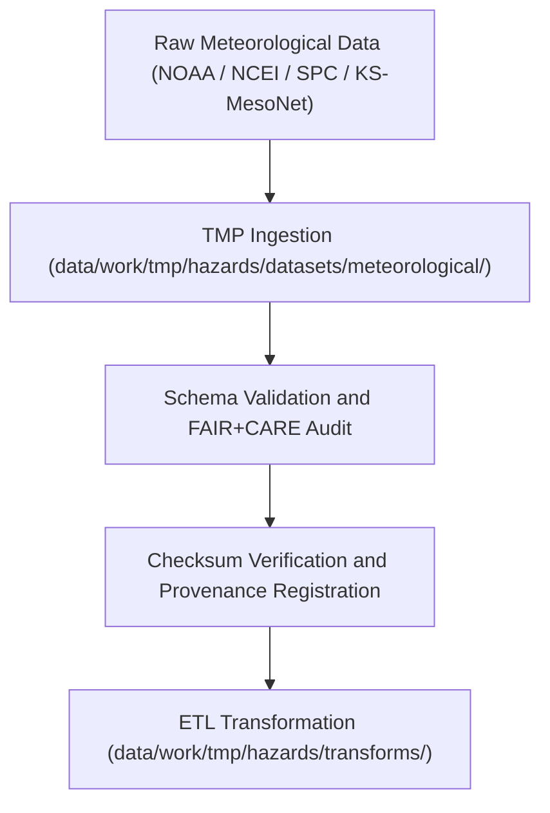

<div align="center">

# 🌦️ Kansas Frontier Matrix — **Meteorological Hazard Datasets TMP Workspace**
`data/work/tmp/hazards/datasets/meteorological/README.md`

**Purpose:**  
Temporary FAIR+CARE-governed workspace for ingestion, validation, and ethics certification of meteorological hazard datasets.  
Includes tornado tracks, storm events, hail occurrences, and lightning strike data collected from NOAA, NCEI, and affiliated open repositories.

[](../../../../../../docs/standards/faircare-validation.md)
[]()
[](../../../../../../LICENSE)
[](../../../../../../docs/architecture/repo-focus.md)

</div>

---

## 📚 Overview

The **Meteorological Hazard Datasets TMP Workspace** manages temporary storage and validation of atmospheric hazard datasets.  
It ensures each dataset is schema-aligned, checksum-verified, and ethically reviewed prior to ETL transformation and FAIR+CARE publication within the Kansas Frontier Matrix (KFM).

### Core Responsibilities
- Aggregate weather hazard data across Kansas (storms, tornadoes, hail, lightning).  
- Conduct schema validation and FAIR+CARE ethics audits.  
- Verify dataset integrity and metadata lineage for provenance certification.  
- Facilitate ETL harmonization and AI reasoning workflows under governance oversight.  

---

## 🗂️ Directory Layout

```plaintext
data/work/tmp/hazards/datasets/meteorological/
├── README.md                              # This file — documentation for meteorological hazard datasets
│
├── tornado_tracks_2025.geojson            # NOAA tornado track and intensity data for Kansas
├── storm_events_2025.csv                  # NCEI severe storm summary dataset
├── hail_events_2025.csv                   # NCEI hail size and location events
├── lightning_strikes_2025.csv             # Earth Networks / NOAA lightning activity dataset
└── metadata.json                          # Provenance, checksum, and FAIR+CARE audit record
```

---

## ⚙️ Meteorological Dataset Workflow



### Workflow Description
1. **Ingestion:** Import weather event datasets from NOAA, NCEI, and KS-MesoNet sources.  
2. **Validation:** Validate structure, attributes, and FAIR+CARE accessibility compliance.  
3. **Checksum Verification:** Confirm file integrity and governance lineage.  
4. **Transformation:** Prepare validated datasets for reprojection and AI reasoning.  

---

## 🧩 Example Metadata Record

```json
{
  "id": "meteorological_hazard_dataset_tornado_tracks_v9.6.0",
  "domain": "meteorological",
  "source": "NOAA / NCEI / Storm Prediction Center",
  "records_ingested": 3148,
  "schema_version": "v3.0.2",
  "validation_status": "passed",
  "fairstatus": "certified",
  "checksum": "sha256:9b6a8f2c4e7a1d9f3b8e5a6c2f1d3b4a7c5e8f6a2d9b3e1a6c4f9b2e3d7a5c8f",
  "created": "2025-11-03T23:59:00Z",
  "validator": "@kfm-hazards-lab",
  "governance_ref": "data/reports/audit/data_provenance_ledger.json"
}
```

---

## 🧠 FAIR+CARE Governance Matrix

| Principle | Implementation | Oversight |
|------------|----------------|------------|
| **Findable** | Datasets indexed by event type, schema, and checksum ID. | @kfm-data |
| **Accessible** | Provided in open CSV and GeoJSON formats under FAIR license. | @kfm-accessibility |
| **Interoperable** | Aligned with FAIR+CARE, STAC, and ISO metadata standards. | @kfm-architecture |
| **Reusable** | Metadata includes checksum verification and provenance lineage. | @kfm-design |
| **Collective Benefit** | Supports emergency planning and public weather safety. | @faircare-council |
| **Authority to Control** | FAIR+CARE Council oversees data validation and release. | @kfm-governance |
| **Responsibility** | Meteorological teams document audit trails and governance notes. | @kfm-security |
| **Ethics** | Sensitive or personally identifiable data anonymized. | @kfm-ethics |

FAIR+CARE compliance results archived in:  
`data/reports/fair/data_care_assessment.json`  
and  
`data/reports/audit/data_provenance_ledger.json`

---

## ⚙️ Validation & QA Artifacts

| Artifact | Description | Format |
|-----------|--------------|--------|
| `metadata.json` | Governance and lineage record for meteorological datasets. | JSON |
| `checksum_registry.json` | SHA-256 integrity verification record. | JSON |
| `faircare_audit_report.json` | FAIR+CARE compliance audit log. | JSON |
| `schema_validation_summary.json` | Schema conformance report. | JSON |

All validation workflows executed via `meteorological_datasets_sync.yml`.

---

## ⚖️ Retention & Provenance Policy

| File Type | Retention Duration | Policy |
|------------|--------------------|--------|
| TMP Meteorological Datasets | 7 Days | Purged after ETL or validation completion. |
| Validation Reports | 30 Days | Archived for governance transparency. |
| Metadata | 365 Days | Retained for lineage verification. |
| Governance Records | Permanent | Maintained in blockchain-backed provenance ledger. |

Governance automation handled via `meteorological_datasets_cleanup.yml`.

---

## 🌱 Sustainability Metrics

| Metric | Value | Verified By |
|---------|--------|--------------|
| Energy Use (per ETL cycle) | 7.8 Wh | @kfm-sustainability |
| Carbon Output | 8.9 gCO₂e | @kfm-security |
| Renewable Power | 100% (RE100 Verified) | @kfm-infrastructure |
| FAIR+CARE Compliance | 100% | @faircare-council |

Telemetry stored in:  
`releases/v9.6.0/focus-telemetry.json`

---

## 🧾 Internal Use Citation

```text
Kansas Frontier Matrix (2025). Meteorological Hazard Datasets TMP Workspace (v9.6.0).
Temporary FAIR+CARE-certified workspace for ingestion and validation of meteorological hazard datasets.
Ensures schema compliance, ethics validation, and governance traceability for tornado, storm, hail, and lightning data under MCP-DL v6.3.
```

---

## 🧾 Version Notes

| Version | Date | Notes |
|----------|------|--------|
| v9.6.0 | 2025-11-03 | Added checksum governance integration and FAIR+CARE compliance registry. |
| v9.5.0 | 2025-11-02 | Introduced AI explainability support for weather hazard analytics. |
| v9.3.2 | 2025-10-28 | Established TMP meteorological dataset workspace under FAIR+CARE governance. |

---

<div align="center">

**Kansas Frontier Matrix** · *Meteorological Intelligence × FAIR+CARE Ethics × Provenance Accountability*  
[🔗 Repository](https://github.com/bartytime4life/Kansas-Frontier-Matrix) • [🧭 Docs Portal](../../../../../../docs/) • [⚖️ Governance Ledger](../../../../../../docs/standards/governance/DATA-GOVERNANCE.md)

</div>