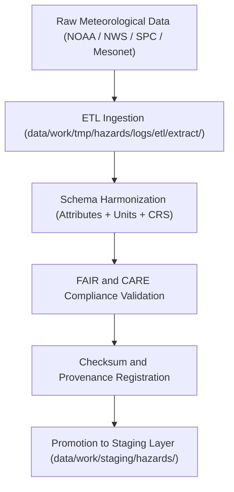

<div align="center">

# 🌪️ Kansas Frontier Matrix — **Meteorological Hazard Datasets TMP Layer**
`data/work/tmp/hazards/datasets/meteorological/README.md`

**Purpose:**  
Temporary FAIR+CARE-governed workspace for **meteorological hazard datasets**, including tornadoes, hail, lightning, and severe storm reports.  
This layer supports ETL ingestion, schema harmonization, and validation under MCP-DL v6.3, ensuring ethical, reproducible hazard data workflows across Kansas.

[](../../../../../../docs/standards/faircare-validation.md)
[](../../../../../../LICENSE)
[](../../../../../../docs/architecture/repo-focus.md)

</div>

---

## 📚 Overview

The `data/work/tmp/hazards/datasets/meteorological/` directory serves as a **temporary staging layer** for all meteorological hazard datasets managed within the Kansas Frontier Matrix (KFM).  
Data sources include **NOAA Storm Prediction Center (SPC), National Weather Service (NWS), and Kansas Mesonet**, providing authoritative event records for tornadoes, hail, and severe thunderstorms.

### Core Responsibilities
- Host meteorological hazard datasets for ETL processing.  
- Harmonize attributes across multiple NOAA and SPC data formats.  
- Maintain checksum integrity and FAIR+CARE validation metadata.  
- Facilitate reproducible AI modeling and hazard risk analysis pipelines.  

All datasets are temporary and automatically purged after staging or archival.

---

## 🗂️ Directory Layout

```plaintext
data/work/tmp/hazards/datasets/meteorological/
├── README.md                              # This file — documentation for meteorological hazard TMP layer
│
├── tornado_tracks_2025.geojson            # Tornado track data from NOAA Storm Prediction Center
├── hail_reports_2025.csv                  # NOAA/NWS hail and severe weather event records
├── lightning_strikes_2025.parquet         # Lightning density and intensity dataset
├── severe_storms_summary_2025.csv         # Consolidated severe storm reports across Kansas
└── metadata.json                          # FAIR+CARE metadata, provenance, and checksum registry
```

---

## ⚙️ Meteorological Data Workflow



### Workflow Description
1. **Extraction:** Import raw meteorological data (CSV, GeoJSON, and API feeds).  
2. **Transformation:** Align datasets to KFM schema and harmonize CRS (EPSG:4326).  
3. **Validation:** Perform FAIR+CARE audit, checksum registration, and schema conformance.  
4. **AI Modeling:** Enable Focus Mode for forecasting and risk analytics.  
5. **Promotion:** Publish validated results to staging under governance certification.

---

## 🧩 Example Metadata Record

```json
{
  "id": "meteorological_hazards_dataset_v9.5.0_2025Q4",
  "domain": "meteorological",
  "datasets": [
    "tornado_tracks_2025.geojson",
    "hail_reports_2025.csv",
    "lightning_strikes_2025.parquet"
  ],
  "records_processed": 684213,
  "checksum_verified": true,
  "fairstatus": "certified",
  "schema_version": "v3.0.1",
  "validator": "@kfm-meteohazards",
  "checksum": "sha256:b02afc72f98172ef8e56a98aaf3a91d228d4f4cb...",
  "telemetry_ref": "releases/v9.5.0/focus-telemetry.json",
  "governance_ref": "reports/audit/ai_hazards_ledger.json",
  "created": "2025-11-02T19:30:00Z"
}
```

---

## 🧠 FAIR+CARE Governance Matrix

| Principle | Implementation |
|------------|----------------|
| **Findable** | Datasets indexed with schema and checksum metadata for reproducibility. |
| **Accessible** | Open data formats stored under FAIR+CARE guidelines. |
| **Interoperable** | Conforms to STAC 1.0, DCAT 3.0, ISO 19115, and CIDOC CRM-HazardExt. |
| **Reusable** | Datasets include version, provenance, and licensing metadata. |
| **Collective Benefit** | Promotes transparent storm and climate hazard research. |
| **Authority to Control** | FAIR+CARE Council certifies data sourcing and accuracy. |
| **Responsibility** | Validators ensure schema compliance and checksum validation. |
| **Ethics** | Excludes private or sensitive geospatial data (e.g., personal property damage). |

Audit and governance records maintained in:  
`reports/audit/ai_hazards_ledger.json` • `reports/fair/hazards_meteorological_summary.json`

---

## ⚙️ Dataset QA & Provenance Artifacts

| File | Description | Format |
|------|--------------|--------|
| `tornado_tracks_2025.geojson` | NOAA/SPC tornado path and intensity data. | GeoJSON |
| `hail_reports_2025.csv` | Severe storm and hail size records across Kansas. | CSV |
| `lightning_strikes_2025.parquet` | Gridded lightning density and frequency dataset. | Parquet |
| `severe_storms_summary_2025.csv` | Consolidated weather event reports (NWS + Mesonet). | CSV |
| `metadata.json` | FAIR+CARE, checksum, and provenance metadata. | JSON |

ETL synchronization automated via `hazards_meteorological_sync.yml`.

---

## 🧾 Retention Policy

| Data Type | Retention Duration | Policy |
|------------|--------------------|--------|
| TMP Meteorological Datasets | 14 days | Purged after validation or staging promotion. |
| Metadata | 365 days | Archived for governance and ethics audits. |
| Provenance Logs | Permanent | Maintained under governance ledger. |

Cleanup automated by `hazards_meteorological_cleanup.yml`.

---

## 🧾 Internal Use Citation

```text
Kansas Frontier Matrix (2025). Meteorological Hazard Datasets TMP Layer (v9.5.0).
Temporary FAIR+CARE-compliant repository for tornado, hail, and severe weather datasets in Kansas.
Integrates schema harmonization, provenance, and ethics governance under MCP-DL v6.3 compliance.
```

---

## 🧾 Version Notes

| Version | Date | Notes |
|----------|------|--------|
| v9.5.0 | 2025-11-02 | Integrated lightning data support, AI telemetry v2, and expanded STAC/DCAT compliance. |
| v9.3.2 | 2025-10-28 | Added severe storm summaries and FAIR+CARE registry linkage. |
| v9.3.0 | 2025-10-26 | Established TMP meteorological dataset structure under FAIR+CARE governance. |

---

<div align="center">

**Kansas Frontier Matrix** · *Storm Intelligence × FAIR+CARE Ethics × Provenance Assurance*  
[🔗 Repository](https://github.com/bartytime4life/Kansas-Frontier-Matrix) • [🧭 Docs Portal](../../../../../../docs/) • [⚖️ Governance Ledger](../../../../../../docs/standards/governance/)

</div>