<div align="center">

# 🌦️ **Kansas Frontier Matrix — Meteorological Hazard Datasets TMP Workspace**  
`data/work/tmp/hazards/datasets/meteorological/README.md`

**Purpose:**  
Temporary FAIR+CARE-certified workspace for **meteorological hazard datasets**, including:

- Tornado tracks  
- Storm events (wind, hail, heavy rain)  
- SPC/NCEI severe storm summaries  
- Lightning strike datasets  
- KS Mesonet atmospheric records  

This workspace ensures:

- Schema + metadata alignment  
- Ethics, CARE, & sovereignty review  
- Telemetry v2 sustainability metrics  
- Checksum-verified, audit-pinned ingestion  
- Provenance integrity prior to harmonization  

[]()  
[]()  
[]()  
[]()  

</div>

---

## 1. 📘 Overview

This workspace handles all **meteorological hazard ingestion** within KFM:

- NOAA/NCEI severe-storm event tables  
- SPC tornado/hail/wind products  
- Lightning strike feeds  
- KS Mesonet observations  
- Radar-derived hazard metrics  

It performs:

- **Schema validation** per `data-contract-v3`  
- **FAIR+CARE ethics + sensitivity checks**  
- **PII-safe & sovereignty-aware review**  
- **Telemetry + checksum verification**  
- **Early AI-assisted QA** for damaged or suspect fields  

Only validated datasets are passed onward to:

```
data/work/tmp/hazards/transforms/
```

---

## 2. 🗂️ Directory Layout (GitHub-Safe)

```text
data/work/tmp/hazards/datasets/meteorological/
├── README.md                            ← this file
├── tornado_tracks_2025.geojson
├── storm_events_2025.csv
├── hail_events_2025.csv
├── lightning_strikes_2025.csv
└── metadata.json                        # Ingestion metadata
```

Every dataset MUST be:

- Checksum-verified  
- Schema-aligned  
- FAIR+CARE-screened  
- Documented in `metadata.json`  

---

## 3. ⚙️ Meteorological Dataset Workflow

```mermaid
flowchart TD
    RAW["Raw Meteorological (NOAA · NCEI · SPC · KS-MesoNet)"]
        --> INGEST["TMP Ingestion (datasets/meteorological/)"]
    INGEST --> PREVAL["Schema + FAIR+CARE Pre-Validation"]
    PREVAL --> LOG["Checksum + Telemetry Logging"]
    LOG --> TRANSFORMS["→ data/work/tmp/hazards/transforms/"]
```



### Steps Summary

1. **TMP Ingestion**  
   Import and normalize meteorological hazard records.

2. **Schema & Ethics Validation**  
   Validate per hazard subclass (tornado, hail, wind, lightning).

3. **Checksum + Telemetry Logging**  
   Apply SHA-256 integrity and sustainability metrics.

4. **Promotion**  
   Eligible files are transferred to the transform workspace.

---

## 4. 🧩 Example Metadata Record (v11)

```json
{
  "id": "met_hazard_dataset_tornado_tracks_v11.0.0",
  "domain": "hazards",
  "subdomain": "meteorological",
  "source": [
    "NOAA NCEI",
    "NOAA SPC",
    "KS Mesonet"
  ],
  "records_ingested": 3148,
  "schema_version": "v3.2.0",
  "validation_status": "passed",
  "fairstatus": "certified",
  "telemetry": {
    "energy_wh": 0.81,
    "carbon_gco2e": 1.05,
    "coverage_pct": 100,
    "runtime_sec": 26
  },
  "checksum_sha256": "sha256:9b6a8f2c4e7a1d9f3b8e5a6c2f1d3b4a7c5e8f6a2d9b3e1a6c4f9b2e3d7a5c8f",
  "created": "2025-11-20T23:59:00Z",
  "validator": "@kfm-hazards-lab",
  "governance_ref": "data/reports/audit/data_provenance_ledger.json"
}
```

This record is a **prov:Entity** in the hazards ingestion graph.

---

## 5. 🧠 FAIR+CARE Governance Matrix — Meteorological TMP

| Principle | Implementation | Oversight |
|----------|----------------|-----------|
| **Findable** | Indexed by hazard type, year, checksum, schema | `@kfm-data` |
| **Accessible** | FAIR+CARE-gated internal access | `@kfm-accessibility` |
| **Interoperable** | ISO 19115 · STAC/DCAT · HazardExt ontology aligned | `@kfm-architecture` |
| **Reusable** | Telemetry+lineage retained for 365+ days | `@kfm-design` |
| **Collective Benefit** | Supports emergency management & resilience planning | `@faircare-council` |
| **Authority to Control** | Release requires Council + sovereignty rules | `@kfm-governance` |
| **Responsibility** | Validation/QA logged via TMP and governance | `@kfm-security` |
| **Ethics** | Removes sensitive/PII, masks cultural sites | `@kfm-ethics` |

---

## 6. 🧪 Validation & QA Artifacts

| Artifact | Description | Format |
|---------|-------------|--------|
| `metadata.json` | Ingestion metadata + checksum + telemetry | JSON |
| `schema_validation_summary.json` | Schema compliance | JSON |
| `faircare_audit_report.json` | Ethics compliance | JSON |
| `checksum_registry.json` | SHA-256 registry | JSON |

Automation workflow:  
`meteorological_datasets_sync_v2.yml`

---

## 7. ♻️ Retention & Sustainability

| Type | Retention | Policy |
|------|----------:|--------|
| TMP Meteorological Data | 7 days | Removed after transform promotion |
| Validation Reports | 30 days | Archived for governance |
| Metadata | 365 days | Governance retention |
| Ledger Entries | Permanent | Immutable provenance |

Telemetry Source:  
`../../../../../../releases/v11.0.0/focus-telemetry.json`

Typical ingestion footprint:

| Metric | Value | Verified By |
|--------|------:|-------------|
| Energy Use | 7.6 Wh | `@kfm-sustainability` |
| Carbon Output | 8.7 gCO₂e | `@kfm-security` |
| Renewable Power Share | 100% | `@kfm-infrastructure` |
| FAIR+CARE Compliance | 100% | `@faircare-council` |

---

## 8. 🧾 Citation

```text
Kansas Frontier Matrix (2025). Meteorological Hazard Datasets TMP Workspace (v11.0.0).
Temporary ingestion and ethics QA environment for meteorological hazards (tornado,
hail, wind, lightning), with telemetry, FAIR+CARE governance, and provenance-backed
lineage under MCP-DL v11 and KFM-PDC v11.
```

---

## 🕰️ Version History

| Version | Date       | Author           | Summary                                                         |
|--------:|------------|------------------|-----------------------------------------------------------------|
| v11.0.0 | 2025-11-20 | `@kfm-hazards`   | Upgraded to v11 preferred style; governance, ontology, telemetry v2 added. |
| v10.0.0 | 2025-11-09 | `@kfm-hazards`   | Initial meteorological TMP ingestion workspace; added schema + FAIR+CARE checks. |
| v9.7.0  | 2025-11-06 | `@kfm-hazards`   | Added early telemetry + event-standard harmonization.           |

---

<div align="center">

**Kansas Frontier Matrix — Meteorological Hazard Datasets TMP Workspace**  
🌦️ FAIR+CARE Certified · Atmospheric Hazard Ingestion & QA Layer · Diamond⁹ Ω / Crown⁹ Ω  

[Back to Hazard Datasets](../README.md) · [Hazards Architecture](../../../../ARCHITECTURE.md) · [Governance Charter](../../../../../../docs/standards/governance/DATA-GOVERNANCE.md)

</div>
