<div align="center">

# 🌦️ Kansas Frontier Matrix — **Meteorological Hazard Datasets TMP Workspace**
`data/work/tmp/hazards/datasets/meteorological/README.md`

**Purpose:**  
Temporary **FAIR+CARE-governed** workspace for ingestion, validation, and ethics certification of meteorological hazard datasets (tornado, storm, hail, lightning).  
Ensures schema alignment, checksum verification, and governance traceability before ETL harmonization and AI reasoning.

[](../../../../../../docs/architecture/README.md)
[](../../../../../../docs/standards/faircare-validation.md)
[]()
[](../../../../../../LICENSE)

</div>

---

## 📘 Overview

The **Meteorological Hazard Datasets TMP Workspace** handles temporary storage and validation for atmospheric hazards.  
It guarantees each dataset is **schema-aligned, checksum-verified, and ethically reviewed** prior to transformation and FAIR+CARE publication.

### Core Responsibilities
- Aggregate Kansas weather hazards (storms, tornadoes, hail, lightning).  
- Conduct schema validation and FAIR+CARE ethics audits.  
- Verify dataset integrity and provenance lineage.  
- Enable ETL harmonization and AI workflows under governance oversight.  

---

## 🗂️ Directory Layout

```plaintext
data/work/tmp/hazards/datasets/meteorological/
├── README.md
├── tornado_tracks_2025.geojson
├── storm_events_2025.csv
├── hail_events_2025.csv
├── lightning_strikes_2025.csv
└── metadata.json
```

---

## ⚙️ Workflow

```mermaid
flowchart TD
    A["Raw Meteorological (NOAA · NCEI · SPC · KS-MesoNet)"] --> B["TMP Ingestion (datasets/meteorological/)"]
    B --> C["Schema Validation + FAIR + CARE Audit"]
    C --> D["Checksum Verification + Provenance Registration"]
    D --> E["ETL Transform (tmp/hazards/transforms/)"]
```



### Steps
1. **Ingest** — Import NOAA/NCEI/KS-MesoNet event datasets.  
2. **Validate** — Check structure, attributes, and FAIR+CARE accessibility.  
3. **Checksums** — Confirm integrity; bind lineage to governance.  
4. **Transform** — Reproject & normalize for AI reasoning.

---

## 🧩 Example Metadata Record

```json
{
  "id": "meteorological_hazard_dataset_tornado_tracks_v9.7.0",
  "domain": "meteorological",
  "source": "NOAA / NCEI / Storm Prediction Center",
  "records_ingested": 3148,
  "schema_version": "v3.1.0",
  "validation_status": "passed",
  "fairstatus": "certified",
  "checksum_sha256": "sha256:9b6a8f2c4e7a1d9f3b8e5a6c2f1d3b4a7c5e8f6a2d9b3e1a6c4f9b2e3d7a5c8f",
  "created": "2025-11-06T23:59:00Z",
  "validator": "@kfm-hazards-lab",
  "governance_ref": "data/reports/audit/data_provenance_ledger.json"
}
```

---

## 🧠 FAIR+CARE Governance Matrix

| Principle | Implementation | Oversight |
|-----------|----------------|-----------|
| **Findable** | Indexed by event type, schema, and checksum ID. | `@kfm-data` |
| **Accessible** | CSV/GeoJSON under FAIR license. | `@kfm-accessibility` |
| **Interoperable** | FAIR+CARE + STAC/DCAT + ISO aligned. | `@kfm-architecture` |
| **Reusable** | Includes checksum + provenance lineage. | `@kfm-design` |
| **Collective Benefit** | Supports emergency planning + public safety. | `@faircare-council` |
| **Authority to Control** | Council validates data release readiness. | `@kfm-governance` |
| **Responsibility** | Teams document audits + governance notes. | `@kfm-security` |
| **Ethics** | PII removed; sensitive attributes minimized. | `@kfm-ethics` |

**Audit refs:**  
`data/reports/fair/data_care_assessment.json` · `data/reports/audit/data_provenance_ledger.json`

---

## ⚙️ Validation & QA Artifacts

| Artifact | Description | Format |
|-----------|--------------|--------|
| `metadata.json` | Governance + lineage registry | JSON |
| `checksum_registry.json` | SHA-256 integrity records | JSON |
| `faircare_audit_report.json` | FAIR+CARE pre-validation audit | JSON |
| `schema_validation_summary.json` | Schema conformance report | JSON |

**Automation:** `meteorological_datasets_sync.yml`

---

## ♻️ Retention & Sustainability

| Type | Retention | Policy |
|------|-----------:|--------|
| TMP Datasets | 7 Days | Purged after validation/transform. |
| Validation Logs | 30 Days | Archived for governance. |
| Metadata | 365 Days | Retained for lineage. |
| Ledger Entries | Permanent | Immutable provenance. |

**Telemetry:** `../../../../../../releases/v9.7.0/focus-telemetry.json`

---

## 🌱 Sustainability Metrics

| Metric | Value | Verified By |
|:--|:--:|:--|
| Energy Use (per ETL cycle) | 7.8 Wh | `@kfm-sustainability` |
| Carbon Output | 8.9 gCO₂e | `@kfm-security` |
| Renewable Power | 100% | `@kfm-infrastructure` |
| FAIR+CARE Compliance | 100% | `@faircare-council` |

---

## 🧾 Citation

```text
Kansas Frontier Matrix (2025). Meteorological Hazard Datasets TMP Workspace (v9.7.0).
FAIR+CARE-governed workspace for atmospheric hazard ingestion and validation—ensuring schema integrity, ethics compliance, and governance traceability before ETL + AI pipelines.
```

---

<div align="center">

**Kansas Frontier Matrix**  
*Meteorological Intelligence × FAIR+CARE Ethics × Provenance Accountability*  
© 2025 Kansas Frontier Matrix — MIT · Diamond⁹ Ω / Crown∞Ω Ultimate Certified  

[Back to Hazard Datasets](../README.md) · [Governance Charter](../../../../../../docs/standards/governance/DATA-GOVERNANCE.md)

</div>