<div align="center">

# 🌪️ Kansas Frontier Matrix — **Meteorological Hazards TMP Datasets**
`data/work/tmp/hazards/datasets/meteorological/README.md`

**Purpose:**  
Transient repository for **severe weather and meteorological hazard datasets** used in Kansas Frontier Matrix (KFM) ETL and AI reasoning pipelines.  
Covers **tornadoes, hail, lightning, wind, and severe storm** datasets from NOAA, NCEI, SPC, and NWS sources.

[](../../../../../../docs/standards/faircare-validation.md)
[](../../../../../../LICENSE)
[](../../../../../../docs/architecture/repo-focus.md)

</div>

---

## 📚 Overview

The `meteorological/` TMP directory contains **weather hazard input datasets** derived from open government and scientific sources.  
These datasets provide the foundational data for **storm analysis**, **AI risk modeling**, and **Focus Mode hazard visualization** within KFM.  

### Supported Dataset Categories
- **Tornado Paths and Attributes:** SPC Tornado Archive and NCEI Storm Events Database.  
- **Severe Thunderstorm Reports:** Hail, wind, and lightning event data.  
- **Climate-Driven Indicators:** Convective indices, precipitation anomalies, and surface conditions.  
- **AI Augmented Features:** Derived from radar imagery and model reanalysis (e.g., HRRR, ERA5).  

---

## 🗂️ Directory Layout

```plaintext
data/work/tmp/hazards/datasets/meteorological/
├── README.md                               # This file — documentation for meteorological hazard datasets
│
├── noaa_storm_events_2025.csv              # NOAA NCEI severe weather events (Kansas region)
├── spc_tornado_paths_2025.geojson          # SPC tornado track data for Kansas (2025)
├── lightning_density_2025.tif              # Lightning frequency raster (NOAA/NLDN-derived)
├── hail_reports_2025.csv                   # SPC hail events and diameters
├── wind_damage_reports_2025.csv            # Wind damage and gust speed reports
└── metadata.json                           # Dataset provenance and FAIR+CARE metadata record
```

---

## ⚙️ Ingestion & Processing Workflow

```mermaid
flowchart TD
    A["Source Data - NOAA, NCEI, SPC, NWS"] --> B["ETL Ingestion and Schema Mapping"]
    B --> C["Quality Control and FAIR+CARE Validation"]
    C --> D["Checksum + Metadata Verification"]
    D --> E["Ontology Alignment - CIDOC CRM Hazard Extension"]
    E --> F["Promotion → Transforms Layer (data/work/tmp/hazards/transforms/)"]
```



### Workflow Description
1. **Extract:** Download and subset meteorological hazard data for Kansas.  
2. **Transform:** Standardize attributes (event type, duration, intensity, coordinates).  
3. **Validate:** Run schema and FAIR+CARE audits for ethical compliance.  
4. **Verify:** Crosscheck data integrity and apply checksum validation.  
5. **Promote:** Forward harmonized datasets to transforms layer for reprojection and modeling.

---

## 🧩 Example Metadata Record

```json
{
  "id": "meteorological_hazards_noaa_storm_events_v9.5.0",
  "source": "NOAA NCEI Storm Events Database",
  "domain": "meteorological",
  "records": 9821,
  "variables": ["event_type", "begin_lat", "begin_lon", "damage_property", "fatalities"],
  "crs": "EPSG:4326",
  "schema_contract": "docs/contracts/data-contract-v3.json",
  "checksum": "sha256:dce2b1a48cfbd89bcb911e2bb77c83bcbfc7f0b8...",
  "validated": true,
  "fairstatus": "compliant",
  "governance_ref": "reports/audit/ai_hazards_ledger.json",
  "created": "2025-11-02T17:20:00Z"
}
```

---

## 🧠 FAIR+CARE Governance Integration

| Principle | Implementation |
|------------|----------------|
| **Findable** | Indexed in STAC and catalog metadata with dataset-level UUIDs. |
| **Accessible** | Open data formats (CSV, GeoJSON, GeoTIFF) and MIT license. |
| **Interoperable** | Metadata aligned with ISO 19115, DCAT 3.0, and CIDOC-CRM HazardExt ontology. |
| **Reusable** | Includes checksums, provenance, and validation records. |
| **Collective Benefit** | Supports emergency planning and climate risk mitigation. |
| **Authority to Control** | FAIR+CARE Council oversees updates and dissemination. |
| **Responsibility** | Validators document transformations and lineage in ledger. |
| **Ethics** | Removes sensitive location data for private properties. |

Audit results stored in:  
`reports/fair/meteorological_hazards_summary.json` • `reports/audit/ai_hazards_ledger.json`

---

## ⚙️ Validation & Provenance Artifacts

| File | Description | Format |
|------|--------------|--------|
| `metadata.json` | Captures dataset provenance and FAIR+CARE audit results. | JSON |
| `checksums.json` | Dataset hash verification and integrity log. | JSON |
| `ontology_mapping.json` | Maps events to HazardExt ontology classes. | JSON |
| `etl_log.txt` | Trace of ETL and ingestion operations. | Text |

Automation via `meteorological_dataset_sync.yml`.

---

## 🧾 Retention Policy

| Dataset Type | Retention Duration | Policy |
|---------------|--------------------|--------|
| Tornado / Storm Reports | 30 days | Promoted post-validation to transforms layer. |
| Lightning / Raster Data | 14 days | Retained for feature engineering and AI QA. |
| AI-Derived Features | 7 days | Purged after model explainability verification. |
| Metadata & Logs | 365 days | Retained for governance and audit purposes. |

Cleanup managed by `meteorological_dataset_cleanup.yml`.

---

## 🧾 Internal Use Citation

```text
Kansas Frontier Matrix (2025). Meteorological Hazards TMP Datasets (v9.5.0).
Temporary workspace for ingesting, validating, and harmonizing meteorological hazard datasets (NOAA, NCEI, SPC, NWS).
FAIR+CARE-certified and aligned with CIDOC-CRM Hazard Extension ontology.
Restricted to internal ETL, validation, and AI modeling workflows.
```

---

## 🧾 Version Notes

| Version | Date | Notes |
|----------|------|--------|
| v9.5.0 | 2025-11-02 | Added lightning raster ingestion, ontology mapping integration, and telemetry schema v2. |
| v9.3.2 | 2025-10-28 | Integrated FAIR+CARE validation hooks and checksum registry. |
| v9.3.0 | 2025-10-26 | Established meteorological hazard TMP dataset ingestion layer. |

---

<div align="center">

**Kansas Frontier Matrix** · *Severe Weather Intelligence × FAIR+CARE Ethics × Provenance Assurance*  
[🔗 Repository](https://github.com/bartytime4life/Kansas-Frontier-Matrix) • [🧭 Docs Portal](../../../../../../docs/) • [⚖️ Governance Ledger](../../../../../../docs/standards/governance/)

</div>

