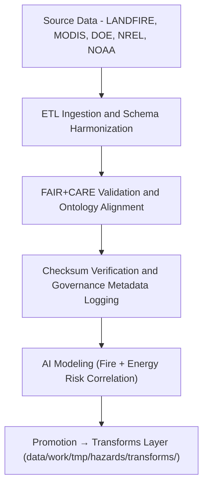

<div align="center">

# 🔥 Kansas Frontier Matrix — **Wildfire & Energy Hazards TMP Datasets**
`data/work/tmp/hazards/datasets/wildfire_energy/README.md`

**Purpose:**  
Temporary ingestion and harmonization workspace for **wildfire risk, energy grid vulnerability, and infrastructure resilience datasets** in the Kansas Frontier Matrix (KFM).  
Supports **AI-driven fire modeling, FAIR+CARE validation, and governance-linked provenance** for sustainable energy and hazard management.

[](../../../../../../docs/standards/faircare-validation.md)
[](../../../../../../LICENSE)
[](../../../../../../docs/architecture/repo-focus.md)

</div>

---

## 📚 Overview

The `wildfire_energy/` TMP directory contains all **temporary datasets related to wildfire occurrence, energy distribution infrastructure, and power grid hazards**.  
These data serve as the foundation for **AI-based fire susceptibility mapping**, **grid stress modeling**, and **climate-energy hazard interaction studies** in KFM.

### Core Dataset Domains
- **Wildfire Risk:** Fire perimeters, burn probability maps, vegetation indices.  
- **Energy Infrastructure:** Electric grid, substations, transmission corridors, outage logs.  
- **Climate-Energy Coupling:** Heatwave correlations, wind energy datasets, drought-fire synergy models.  
- **AI & Simulation Outputs:** Derived hazard correlation rasters and SHAP-explained energy-risk models.  

---

## 🗂️ Directory Layout

```plaintext
data/work/tmp/hazards/datasets/wildfire_energy/
├── README.md                                 # This file — wildfire & energy hazards overview
│
├── fire_risk_zones_2025.geojson              # Wildfire susceptibility zones (MODIS + LANDFIRE)
├── power_grid_vulnerability.csv              # Energy infrastructure exposure and sensitivity analysis
├── burn_probability_annual_2025.tif          # Raster layer of annual burn probability
├── wind_energy_anomalies_2025.csv            # Wind field deviations and power density variations
├── drought_fire_synergy_2025.parquet         # AI-modeled drought-fire compound hazard dataset
└── metadata.json                             # FAIR+CARE provenance and governance metadata
```

---

## ⚙️ Ingestion & Processing Workflow



### Workflow Description
1. **Extract:** Gather fire and energy datasets from LANDFIRE, DOE, and NREL portals.  
2. **Transform:** Standardize geospatial formats and ensure CRS uniformity (EPSG:4326).  
3. **Validate:** Perform FAIR+CARE compliance checks on metadata and ethics scope.  
4. **AI Modeling:** Correlate climate and energy hazard indicators through Explainable AI.  
5. **Promote:** Send processed and validated files to transformation layer for integration.

---

## 🧩 Example Metadata Record

```json
{
  "id": "wildfire_energy_hazards_risk_zones_v9.5.0",
  "source": ["LANDFIRE 2025", "MODIS Active Fire", "DOE Grid Infrastructure"],
  "domain": "wildfire_energy",
  "records": 4860,
  "variables": ["burn_probability", "grid_vulnerability", "vegetation_index", "powerline_density"],
  "crs": "EPSG:4326",
  "schema_contract": "docs/contracts/data-contract-v3.json",
  "checksum": "sha256:e2b16a59afedc8e09a3e2e88c2a8df004e4294de...",
  "validated": true,
  "fairstatus": "compliant",
  "governance_ref": "reports/audit/ai_hazards_ledger.json",
  "created": "2025-11-02T17:35:00Z"
}
```

---

## 🧠 FAIR+CARE & ISO Governance Alignment

| Principle | Implementation |
|------------|----------------|
| **Findable** | Indexed under wildfire-energy hazards in the governance ledger. |
| **Accessible** | Open data formats (GeoJSON, CSV, GeoTIFF, Parquet). |
| **Interoperable** | Schema harmonized with ISO 19115, CIDOC CRM HazardExt ontology, and DCAT 3.0. |
| **Reusable** | Provenance metadata, checksums, and FAIR+CARE audits included. |
| **Collective Benefit** | Promotes energy resilience, hazard awareness, and climate justice. |
| **Authority to Control** | FAIR+CARE Council approves dissemination of energy-related data. |
| **Responsibility** | AI and ETL validators maintain audit traceability and explainability. |
| **Ethics** | Sensitive energy infrastructure anonymized; ethical review logged. |

FAIR+CARE and audit results stored in:  
`reports/fair/wildfire_energy_hazards_summary.json` • `reports/audit/ai_hazards_ledger.json`

---

## ⚙️ QA & Provenance Artifacts

| File | Description | Format |
|------|--------------|--------|
| `metadata.json` | Captures provenance, schema, and audit metadata. | JSON |
| `checksum_registry.json` | Dataset-level checksum validation record. | JSON |
| `ontology_mapping.json` | Maps fire and energy datasets to CIDOC CRM HazardExt classes. | JSON |
| `etl_log.txt` | ETL, validation, and AI workflow trace log. | Text |

Governance synchronization automated via `wildfire_energy_dataset_sync.yml`.

---

## 🧾 Retention Policy

| Dataset Type | Retention Duration | Policy |
|---------------|--------------------|--------|
| Fire & Climate Layers | 14 days | Promoted post-FAIR+CARE validation. |
| Energy Infrastructure | 30 days | Retained for security-audited governance review. |
| AI Modeled Outputs | 7 days | Purged after model explainability sign-off. |
| Metadata & Logs | 365 days | Archived permanently for provenance governance. |

Automated cleanup managed by `wildfire_energy_dataset_cleanup.yml`.

---

## 🧾 Internal Use Citation

```text
Kansas Frontier Matrix (2025). Wildfire & Energy Hazards TMP Datasets (v9.5.0).
Temporary ingestion workspace for wildfire, drought-energy synergy, and grid vulnerability datasets.
Aligned with FAIR+CARE governance, ISO 19115/14064, and CIDOC CRM Hazard Extension ontology.
Restricted to internal ETL, AI validation, and provenance management workflows.
```

---

## 🧾 Version Notes

| Version | Date | Notes |
|----------|------|--------|
| v9.5.0 | 2025-11-02 | Added NREL & DOE data integration, AI synergy model, and telemetry v2 schema. |
| v9.3.2 | 2025-10-28 | Integrated FAIR+CARE validation and provenance synchronization. |
| v9.3.0 | 2025-10-26 | Established wildfire-energy hazard TMP dataset ingestion layer. |

---

<div align="center">

**Kansas Frontier Matrix** · *Wildfire Science × Energy Resilience × FAIR+CARE Governance × AI Explainability*  
[🔗 Repository](https://github.com/bartytime4life/Kansas-Frontier-Matrix) • [🧭 Docs Portal](../../../../../../docs/) • [⚖️ Governance Ledger](../../../../../../docs/standards/governance/)

</div>

