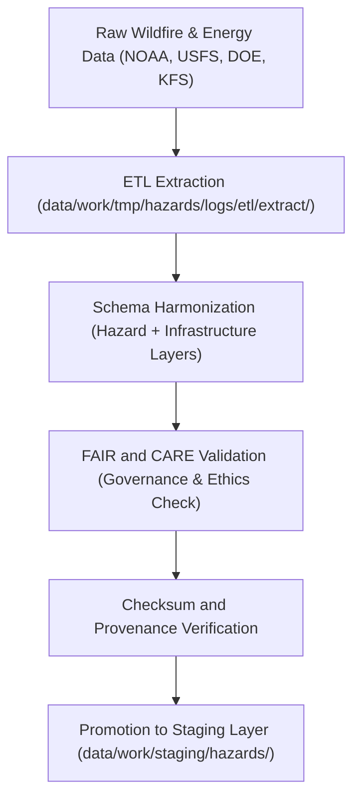

<div align="center">

# 🔥 Kansas Frontier Matrix — **Wildfire & Energy Hazard Datasets TMP Layer**
`data/work/tmp/hazards/datasets/wildfire_energy/README.md`

**Purpose:**  
Temporary FAIR+CARE-certified repository for **wildfire risk, energy infrastructure exposure, and grid resilience datasets** within the Kansas Frontier Matrix (KFM).  
Supports ETL ingestion, schema harmonization, and AI-assisted hazard correlation for sustainable energy and wildfire risk mitigation analysis.

[](../../../../../../docs/standards/faircare-validation.md)
[](../../../../../../LICENSE)
[](../../../../../../docs/architecture/repo-focus.md)

</div>

---

## 📚 Overview

The `data/work/tmp/hazards/datasets/wildfire_energy/` directory acts as a **temporary integration layer** for wildfire hazard and energy infrastructure datasets.  
It merges open geospatial data from **NOAA, USFS, DOE, and Kansas Forest Service (KFS)** to support FAIR+CARE-governed analytics on fire risk, energy grid exposure, and environmental resilience.

### Core Responsibilities
- Host wildfire and energy grid exposure datasets for ETL workflows.  
- Harmonize schema attributes for consistent hazard-energy correlation.  
- Maintain FAIR+CARE-compliant metadata, provenance, and checksum logs.  
- Enable Focus Mode AI reasoning for wildfire risk forecasting and grid resilience assessment.  

All datasets stored here are ephemeral and automatically promoted or purged upon validation.

---

## 🗂️ Directory Layout

```plaintext
data/work/tmp/hazards/datasets/wildfire_energy/
├── README.md                              # This file — documentation for wildfire & energy hazard TMP layer
│
├── wildfire_perimeters_2025.geojson       # Wildfire incident boundaries and intensity data (NOAA/USFS)
├── grid_exposure_zones_2025.parquet       # Energy grid exposure and infrastructure vulnerability dataset
├── powerline_wildfire_overlap_2025.csv    # Spatial intersections of grid infrastructure and fire perimeters
└── metadata.json                          # FAIR+CARE, checksum, and provenance metadata record
```

---

## ⚙️ Wildfire & Energy Data Workflow



### Workflow Description
1. **Extraction:** Collect wildfire perimeters, energy infrastructure data, and power grid layers.  
2. **Harmonization:** Align geometries, schema fields, and spatial CRS (EPSG:4326).  
3. **Validation:** Apply FAIR+CARE ethical and accessibility audits.  
4. **Checksum:** Record file integrity and lineage in provenance ledger.  
5. **Promotion:** Publish validated data for analysis and dashboard integration.

---

## 🧩 Example Metadata Record

```json
{
  "id": "wildfire_energy_hazards_dataset_v9.5.0_2025Q4",
  "domain": "wildfire_energy",
  "datasets": [
    "wildfire_perimeters_2025.geojson",
    "grid_exposure_zones_2025.parquet",
    "powerline_wildfire_overlap_2025.csv"
  ],
  "records_processed": 94216,
  "checksum_verified": true,
  "fairstatus": "certified",
  "schema_version": "v3.0.1",
  "validator": "@kfm-wildfire",
  "checksum": "sha256:6c12bf43c7f18a6ed4a4d521b012c8892a9e94c3...",
  "telemetry_ref": "releases/v9.5.0/focus-telemetry.json",
  "governance_ref": "reports/audit/ai_hazards_ledger.json",
  "created": "2025-11-02T19:35:00Z"
}
```

---

## 🧠 FAIR+CARE Governance Integration

| Principle | Implementation |
|------------|----------------|
| **Findable** | Indexed by dataset ID, domain, and checksum in governance ledger. |
| **Accessible** | Stored in open, machine-readable formats (GeoJSON, CSV, Parquet). |
| **Interoperable** | Schema harmonized under ISO 19115, DCAT, and CIDOC CRM-HazardExt. |
| **Reusable** | Full provenance, schema, and checksum metadata retained. |
| **Collective Benefit** | Enables ethical wildfire-energy resilience research. |
| **Authority to Control** | FAIR+CARE Council approves public release and staging. |
| **Responsibility** | Dataset maintainers record all field mappings and ethics audits. |
| **Ethics** | Protects sensitive energy infrastructure data while maintaining transparency. |

All audit and lineage records stored in:  
`reports/audit/ai_hazards_ledger.json` • `reports/fair/hazards_wildfire_energy_summary.json`

---

## ⚙️ Dataset QA & Provenance Artifacts

| File | Description | Format |
|------|--------------|--------|
| `wildfire_perimeters_2025.geojson` | Wildfire perimeters and burn intensity zones. | GeoJSON |
| `grid_exposure_zones_2025.parquet` | Grid vulnerability and exposure mapping dataset. | Parquet |
| `powerline_wildfire_overlap_2025.csv` | Infrastructure hazard intersection analysis. | CSV |
| `metadata.json` | FAIR+CARE and checksum provenance metadata. | JSON |

Synchronization and QA managed via `hazards_wildfire_energy_sync.yml`.

---

## 🧾 Retention Policy

| Data Type | Retention Duration | Policy |
|------------|--------------------|--------|
| TMP Wildfire/Energy Datasets | 14 days | Cleared after validation or staging promotion. |
| Metadata | 365 days | Archived for audit and FAIR+CARE compliance. |
| Provenance & Governance Records | Permanent | Stored indefinitely for traceability. |

Cleanup managed by `hazards_wildfire_energy_cleanup.yml`.

---

## 🧾 Internal Use Citation

```text
Kansas Frontier Matrix (2025). Wildfire & Energy Hazard Datasets TMP Layer (v9.5.0).
Temporary FAIR+CARE-compliant workspace for wildfire and energy infrastructure hazard data integration.
Maintains ethical provenance, checksum verification, and governance traceability for open hazard intelligence.
```

---

## 🧾 Version Notes

| Version | Date | Notes |
|----------|------|--------|
| v9.5.0 | 2025-11-02 | Added grid-energy overlap dataset, FAIR+CARE schema v2, and AI telemetry linkage. |
| v9.3.2 | 2025-10-28 | Integrated energy resilience datasets and provenance audit workflows. |
| v9.3.0 | 2025-10-26 | Established wildfire & energy TMP dataset layer under FAIR+CARE governance. |

---

<div align="center">

**Kansas Frontier Matrix** · *Resilience Intelligence × FAIR+CARE Ethics × Provenance Assurance*  
[🔗 Repository](https://github.com/bartytime4life/Kansas-Frontier-Matrix) • [🧭 Docs Portal](../../../../../../docs/) • [⚖️ Governance Ledger](../../../../../../docs/standards/governance/)

</div>