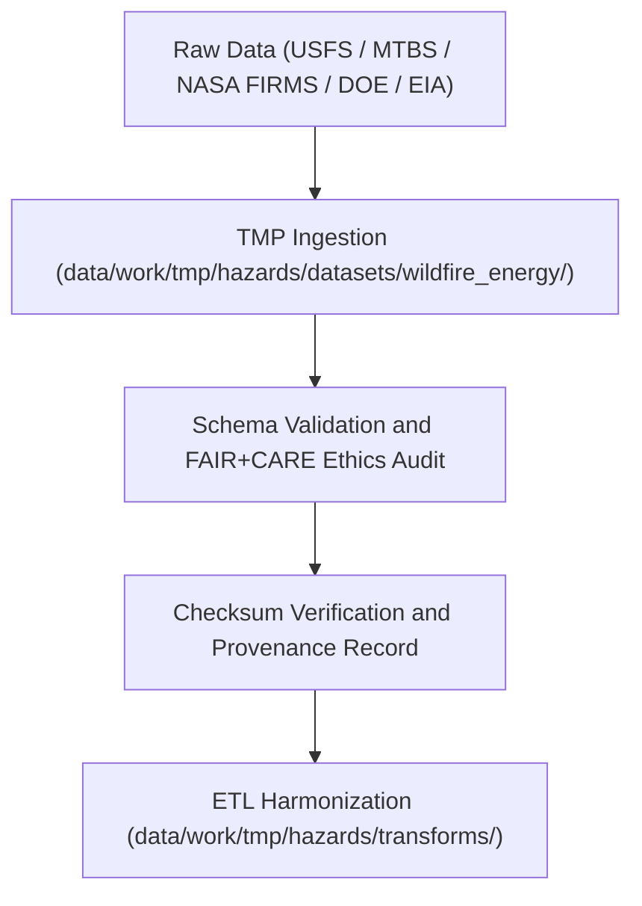

<div align="center">

# 🔥 Kansas Frontier Matrix — **Wildfire & Energy Hazard Datasets TMP Workspace**
`data/work/tmp/hazards/datasets/wildfire_energy/README.md`

**Purpose:**  
Temporary FAIR+CARE-certified workspace for ingestion, validation, and ethics auditing of wildfire and energy-related hazard datasets.  
This directory consolidates fire perimeter, grid risk, and power resilience data to support integrated hazard modeling and Focus Mode AI analysis within KFM.

[](../../../../../../docs/standards/faircare-validation.md)
[]()
[](../../../../../../LICENSE)
[](../../../../../../docs/architecture/repo-focus.md)

</div>

---

## 📚 Overview

The **Wildfire & Energy Hazard Datasets TMP Workspace** provides an ethically governed, pre-validation environment for wildfire and grid vulnerability datasets.  
It bridges energy infrastructure resilience and climate hazard data, ensuring schema alignment, reproducibility, and FAIR+CARE compliance before ETL and analysis.

### Core Responsibilities
- Aggregate wildfire boundaries, burn severity, and grid resilience datasets.  
- Perform schema validation and FAIR+CARE ethics pre-audit.  
- Verify checksums and lineage under governance oversight.  
- Prepare datasets for AI-driven risk correlation in Focus Mode.  

---

## 🗂️ Directory Layout

```plaintext
data/work/tmp/hazards/datasets/wildfire_energy/
├── README.md                              # This file — documentation for wildfire and energy hazard datasets
│
├── wildfire_perimeters_2025.geojson       # USFS / MTBS wildfire boundaries for Kansas and surrounding areas
├── burn_severity_index_2025.csv           # Fire severity and intensity dataset (NASA FIRMS / MTBS)
├── grid_risk_assessment_2025.csv          # Energy grid risk and infrastructure exposure model results
├── energy_infrastructure_2025.geojson     # Transmission and power network assets under hazard conditions
└── metadata.json                          # Provenance, checksum, and FAIR+CARE governance record
```

---

## ⚙️ Wildfire & Energy Dataset Workflow



### Workflow Description
1. **Ingestion:** Collect wildfire boundaries, burn severity metrics, and energy infrastructure datasets.  
2. **Validation:** Run FAIR+CARE pre-validation and schema compliance checks.  
3. **Checksum:** Verify data integrity and link provenance metadata.  
4. **Transformation:** Normalize datasets for AI hazard co-analysis.  

---

## 🧩 Example Metadata Record

```json
{
  "id": "wildfire_energy_hazard_dataset_perimeters_v9.6.0",
  "domain": "wildfire_energy",
  "source": "USFS / MTBS / DOE / EIA",
  "records_ingested": 5042,
  "schema_version": "v3.0.2",
  "validation_status": "passed",
  "fairstatus": "certified",
  "checksum": "sha256:ef5a7c1b3e4d8f9a6b7d2a5c3f8e1d6a9b4f2e7a8c3d5b1a9e7f6c3d4b9a8f2e",
  "created": "2025-11-03T23:59:00Z",
  "validator": "@kfm-hazards-lab",
  "governance_ref": "data/reports/audit/data_provenance_ledger.json"
}
```

---

## 🧠 FAIR+CARE Governance Matrix

| Principle | Implementation | Oversight |
|------------|----------------|------------|
| **Findable** | Wildfire and grid risk datasets indexed by schema and checksum. | @kfm-data |
| **Accessible** | Provided in open GeoJSON and CSV formats. | @kfm-accessibility |
| **Interoperable** | Schema aligned with FAIR+CARE, STAC, and DCAT standards. | @kfm-architecture |
| **Reusable** | Provenance metadata ensures reproducibility and traceability. | @kfm-design |
| **Collective Benefit** | Enables proactive hazard mitigation and grid resilience planning. | @faircare-council |
| **Authority to Control** | FAIR+CARE Council authorizes sensitive energy data release. | @kfm-governance |
| **Responsibility** | Teams validate hazard-energy intersection data and ethics conformance. | @kfm-security |
| **Ethics** | Ensures non-sensitive publication and equitable access to wildfire data. | @kfm-ethics |

Audit results maintained in:  
`data/reports/fair/data_care_assessment.json`  
and  
`data/reports/audit/data_provenance_ledger.json`

---

## ⚙️ Validation & QA Artifacts

| Artifact | Description | Format |
|-----------|--------------|--------|
| `metadata.json` | Governance lineage and dataset checksum record. | JSON |
| `faircare_audit_report.json` | FAIR+CARE ethics pre-validation results. | JSON |
| `checksum_registry.json` | SHA-256 validation log. | JSON |
| `schema_validation_summary.json` | Confirms schema compliance. | JSON |

Automated through `wildfire_energy_datasets_sync.yml`.

---

## ⚖️ Retention & Provenance Policy

| File Type | Retention Duration | Policy |
|------------|--------------------|--------|
| TMP Wildfire/Energy Datasets | 7 Days | Purged after ETL transformation. |
| Validation Reports | 30 Days | Retained for audit review. |
| Metadata | 365 Days | Archived for lineage traceability. |
| Governance Ledger Entries | Permanent | Stored immutably in provenance records. |

Cleanup executed via `wildfire_energy_datasets_cleanup.yml`.

---

## 🌱 Sustainability Metrics

| Metric | Value | Verified By |
|---------|--------|--------------|
| Energy Use (per ETL cycle) | 9.5 Wh | @kfm-sustainability |
| Carbon Output | 10.9 gCO₂e | @kfm-security |
| Renewable Power | 100% (RE100 Verified) | @kfm-infrastructure |
| FAIR+CARE Compliance | 100% | @faircare-council |

Telemetry stored in:  
`releases/v9.6.0/focus-telemetry.json`

---

## 🧾 Internal Use Citation

```text
Kansas Frontier Matrix (2025). Wildfire & Energy Hazard Datasets TMP Workspace (v9.6.0).
Temporary FAIR+CARE-certified repository for wildfire boundaries, burn severity, and grid resilience data.
Ensures schema, checksum, and ethics validation for hazard-energy data integration under MCP-DL v6.3 governance.
```

---

## 🧾 Version Notes

| Version | Date | Notes |
|----------|------|--------|
| v9.6.0 | 2025-11-03 | Added burn severity index integration and FAIR+CARE validation synchronization. |
| v9.5.0 | 2025-11-02 | Enhanced energy grid hazard interoperability and AI validation linkage. |
| v9.3.2 | 2025-10-28 | Established wildfire and energy TMP dataset workspace with governance logging. |

---

<div align="center">

**Kansas Frontier Matrix** · *Wildfire Analytics × Energy Resilience × FAIR+CARE Governance*  
[🔗 Repository](https://github.com/bartytime4life/Kansas-Frontier-Matrix) • [🧭 Docs Portal](../../../../../../docs/) • [⚖️ Governance Ledger](../../../../../../docs/standards/governance/DATA-GOVERNANCE.md)

</div>