<div align="center">

# 🔥 Kansas Frontier Matrix — **Wildfire & Energy Hazard Datasets TMP Workspace**
`data/work/tmp/hazards/datasets/wildfire_energy/README.md`

**Purpose:**  
Temporary **FAIR+CARE-certified** workspace for ingestion, validation, and ethics auditing of wildfire and energy-related hazard datasets.  
Integrates fire perimeter, burn severity, grid risk, and energy resilience data for governance-verified analysis and Focus Mode AI workflows.

[](../../../../../../docs/architecture/README.md)
[](../../../../../../docs/standards/faircare-validation.md)
[]()
[](../../../../../../LICENSE)

</div>

---

## 📘 Overview

The **Wildfire & Energy Hazard Datasets TMP Workspace** manages short-term ingestion and validation of wildfire and grid vulnerability data.  
It enables FAIR+CARE ethics compliance, schema integrity validation, and provenance traceability prior to ETL and cross-domain AI analysis.

### Core Responsibilities
- Aggregate wildfire, burn severity, and grid vulnerability datasets.  
- Perform FAIR+CARE ethics pre-validation and ISO schema checks.  
- Validate checksums and governance lineage.  
- Harmonize data for AI-assisted risk analysis and Focus Mode reasoning.  

---

## 🗂️ Directory Layout

```plaintext
data/work/tmp/hazards/datasets/wildfire_energy/
├── README.md
├── wildfire_perimeters_2025.geojson
├── burn_severity_index_2025.csv
├── grid_risk_assessment_2025.csv
├── energy_infrastructure_2025.geojson
└── metadata.json
```

---

## ⚙️ Workflow

```mermaid
flowchart TD
    A["Raw Data (USFS · MTBS · NASA FIRMS · DOE · EIA)"] --> B["TMP Ingestion (datasets/wildfire_energy/)"]
    B --> C["Schema Validation + FAIR + CARE Audit"]
    C --> D["Checksum Verification + Provenance Logging"]
    D --> E["ETL Transform (tmp/hazards/transforms/)"]
```



### Steps
1. **Ingest** — Gather datasets on wildfire perimeters, grid assets, and energy risk exposure.  
2. **Validate** — Apply FAIR+CARE audits and metadata schema checks.  
3. **Checksum** — Compute and verify integrity across datasets.  
4. **Transform** — Prepare normalized data for integration and AI correlation.  

---

## 🧩 Example Metadata Record

```json
{
  "id": "wildfire_energy_hazard_dataset_perimeters_v9.7.0",
  "domain": "wildfire_energy",
  "source": "USFS / MTBS / DOE / EIA",
  "records_ingested": 5042,
  "schema_version": "v3.1.0",
  "validation_status": "passed",
  "fairstatus": "certified",
  "checksum_sha256": "sha256:ef5a7c1b3e4d8f9a6b7d2a5c3f8e1d6a9b4f2e7a8c3d5b1a9e7f6c3d4b9a8f2e",
  "created": "2025-11-06T23:59:00Z",
  "validator": "@kfm-hazards-lab",
  "governance_ref": "data/reports/audit/data_provenance_ledger.json"
}
```

---

## 🧠 FAIR+CARE Governance Matrix

| Principle | Implementation | Oversight |
|-----------|----------------|-----------|
| **Findable** | Indexed by hazard type, schema, and checksum. | `@kfm-data` |
| **Accessible** | GeoJSON/CSV formats under FAIR+CARE license. | `@kfm-accessibility` |
| **Interoperable** | Aligned with STAC/DCAT + ISO metadata. | `@kfm-architecture` |
| **Reusable** | Metadata includes provenance + checksum lineage. | `@kfm-design` |
| **Collective Benefit** | Supports resilience planning and fire risk mitigation. | `@faircare-council` |
| **Authority to Control** | FAIR+CARE Council certifies publication clearance. | `@kfm-governance` |
| **Responsibility** | Validators document all schema + ethics validations. | `@kfm-security` |
| **Ethics** | Ensures equitable, privacy-safe wildfire data sharing. | `@kfm-ethics` |

**Audit References:**  
`data/reports/fair/data_care_assessment.json` · `data/reports/audit/data_provenance_ledger.json`

---

## ⚙️ Validation & QA Artifacts

| Artifact | Description | Format |
|-----------|--------------|--------|
| `metadata.json` | Provenance and governance record. | JSON |
| `faircare_audit_report.json` | FAIR+CARE ethics audit log. | JSON |
| `checksum_registry.json` | Dataset integrity verification registry. | JSON |
| `schema_validation_summary.json` | Schema and metadata validation summary. | JSON |

**Automation:** `wildfire_energy_datasets_sync.yml`

---

## ♻️ Retention & Sustainability

| Type | Retention | Policy |
|------|-----------:|--------|
| TMP Datasets | 7 Days | Purged after ETL harmonization. |
| Validation Logs | 30 Days | Archived for governance audits. |
| Metadata | 365 Days | Retained for lineage tracking. |
| Governance Records | Permanent | Immutable ledger storage. |

**Telemetry:** `../../../../../../releases/v9.7.0/focus-telemetry.json`

---

## 🌱 Sustainability Metrics

| Metric | Value | Verified By |
|:--|:--:|:--|
| Energy Use (per ETL cycle) | 9.5 Wh | `@kfm-sustainability` |
| Carbon Output | 10.9 gCO₂e | `@kfm-security` |
| Renewable Power | 100% | `@kfm-infrastructure` |
| FAIR+CARE Compliance | 100% | `@faircare-council` |

---

## 🧾 Citation

```text
Kansas Frontier Matrix (2025). Wildfire & Energy Hazard Datasets TMP Workspace (v9.7.0).
Temporary FAIR+CARE workspace for wildfire and grid resilience datasets—ensuring schema validation, checksum verification, and ethical provenance registration under MCP-DL v6.3.
```

---

<div align="center">

**Kansas Frontier Matrix**  
*Wildfire Analytics × Energy Resilience × FAIR+CARE Governance*  
© 2025 Kansas Frontier Matrix — MIT · Diamond⁹ Ω / Crown∞Ω Ultimate Certified  

[Back to Hazard Datasets](../README.md) · [Governance Charter](../../../../../../docs/standards/governance/DATA-GOVERNANCE.md)

</div>