<div align="center">

# 🔥 **Kansas Frontier Matrix — Wildfire & Energy Hazard Datasets TMP Workspace**  
`data/work/tmp/hazards/datasets/wildfire_energy/README.md`

**Purpose:**  
Governed TMP workspace for **wildfire and energy hazard ingestion**, handling:

- Wildfire perimeters  
- Burn severity & vegetation impacts  
- Grid vulnerability & energy infrastructure risk  
- Energy–environment interactions  
- Telemetry-backed ingestion workflows

Ensures:

- Schema contract alignment  
- FAIR+CARE & sovereignty compliance  
- Telemetry v2 sustainability metrics  
- Immutable provenance before harmonization  
- Readiness for Focus Mode AI v3 hazard reasoning  

[]()  
[]()  
[]()  
[]()  

</div>

---

## 1. 📘 Overview

This workspace ingests and pre-validates:

- **Wildfire perimeter incidents** (USFS, MTBS, FIRMS)  
- **Burn severity / intensity datasets**  
- **Grid risk assessments** (DOE/EIA)  
- **Energy infrastructure layers** (substations, lines, generation facilities)

It performs:

- Schema validation (KFM Data Contract v3)  
- FAIR+CARE + sovereignty ethics audit  
- Geometry + attribute QA  
- Telemetry logging (energy, carbon, runtime, coverage)  
- Checksum verification  
- Governance-ready provenance generation

Validated datasets transition to:

```
data/work/tmp/hazards/transforms/
```

for reprojection, harmonization, and fused hazard modeling.

---

## 2. 🗂️ Directory Layout (GitHub-Safe)

```text
data/work/tmp/hazards/datasets/wildfire_energy/
├── README.md
├── wildfire_perimeters_2025.geojson
├── burn_severity_index_2025.csv
├── grid_risk_assessment_2025.csv
├── energy_infrastructure_2025.geojson
└── metadata.json
```

Each dataset MUST be:

- Checksum-verified  
- Schema-aligned  
- FAIR+CARE-screened  
- Registered in `metadata.json`

---

## 3. ⚙️ Wildfire & Energy TMP Workflow

```mermaid
flowchart TD
    RAW["Raw Data (USFS · MTBS · FIRMS · DOE · EIA)"]
        --> INGEST["TMP Ingestion (datasets/wildfire_energy/)"]
    INGEST --> PREVAL["Schema Validation + FAIR+CARE Audit"]
    PREVAL --> LOG["Checksum + Telemetry Logging + Provenance"]
    LOG --> TRANSFORM["→ data/work/tmp/hazards/transforms/ (Harmonization)"]
```



---

## 4. 🧩 Example Metadata Record (v11)

```json
{
  "id": "wildfire_energy_dataset_perimeters_v11.0.0",
  "domain": "hazards",
  "subdomain": "wildfire_energy",
  "source": [
    "USFS",
    "MTBS",
    "NASA FIRMS",
    "DOE",
    "EIA"
  ],
  "records_ingested": 5042,
  "schema_version": "v3.2.0",
  "validation_status": "passed",
  "fairstatus": "certified",
  "telemetry": {
    "energy_wh": 1.1,
    "carbon_gco2e": 1.3,
    "coverage_pct": 100,
    "runtime_sec": 34
  },
  "checksum_sha256": "sha256:ef5a7c1b3e4d8f9a6b7d2a5c3f8e1d6a9b4f2e7a8c3d5b1a9e7f6c3d4b9a8f2e",
  "created": "2025-11-20T23:59:00Z",
  "validator": "@kfm-hazards-lab",
  "governance_ref": "data/reports/audit/data_provenance_ledger.json"
}
```

---

## 5. 🧠 FAIR+CARE Governance Matrix

| Principle | Implementation | Oversight |
|----------|----------------|-----------|
| **Findable** | Indexed by hazard subclass, schema, checksum, year | `@kfm-data` |
| **Accessible** | Internal FAIR+CARE-gated hydrology/wildfire layers | `@kfm-accessibility` |
| **Interoperable** | STAC/DCAT, ISO 19115, HazardExt ontology | `@kfm-architecture` |
| **Reusable** | Telemetry + metadata + provenance chain retained | `@kfm-design` |
| **Collective Benefit** | Supports wildfire planning & grid resilience | `@faircare-council` |
| **Authority to Control** | Governance Council approves all releases | `@kfm-governance` |
| **Responsibility** | Domain stewards maintain QA and ethics logs | `@kfm-security` |
| **Ethics** | Critical infrastructure masked; tribal sovereignty respected | `@kfm-ethics` |

---

## 6. 🧪 Validation & QA Artifacts

| Artifact | Description | Format |
|---------|-------------|--------|
| `metadata.json` | Ingestion provenance + telemetry + checksums | JSON |
| `schema_validation_summary.json` | Structural + contract validation | JSON |
| `faircare_audit_report.json` | Ethics & sensitivity checks | JSON |
| `checksum_registry.json` | SHA-256 registry | JSON |

Automation Workflow:  
`wildfire_energy_datasets_sync_v11.yml`

---

## 7. ♻️ Retention & Sustainability

| Asset Type | Retention | Policy |
|-----------|----------:|--------|
| TMP Wildfire/Energy Data | 7 days | Purged after promotion |
| Validation Reports | 30 days | Archived under governance | 
| Metadata | 365 days | Governance retention | 
| Ledger Entries | Permanent | Immutable provenance |

Telemetry Source:  
`../../../../../../releases/v11.0.0/focus-telemetry.json`

**Typical Ingestion Cycle:**

| Metric | Value | Verified By |
|--------|------:|-------------|
| Energy Use | 9.2 Wh | `@kfm-sustainability` |
| Carbon Output | 10.3 gCO₂e | `@kfm-security` |
| Renewable Power | 100% | `@kfm-infrastructure` |
| FAIR+CARE Compliance | 100% | `@faircare-council` |

---

## 8. 🧾 Citation

```text
Kansas Frontier Matrix (2025). Wildfire & Energy Hazard Datasets TMP Workspace (v11.0.0).
Ethically governed ingestion workspace for wildfire perimeters, burn severity, and energy
infrastructure risk datasets—with sustainability telemetry, schema alignment, sovereignty
protections, and governance-traceable provenance under MCP-DL v11 and KFM-PDC v11.
```

---

## 9. 🕰️ Version History

| Version | Date       | Author           | Summary |
|--------:|------------|------------------|---------|
| v11.0.0 | 2025-11-20 | `@kfm-hazards` | Upgraded to v11 formatting; governance, ontology, telemetry v2 integrated; spacing rules fixed. |
| v10.0.0 | 2025-11-09 | `@kfm-hazards` | Initial wildfire & energy TMP workspace with schema validation + FAIR+CARE support. |
| v9.7.0  | 2025-11-06 | `@kfm-hazards` | Introduced hazard ingest pipeline; baseline QA/validation set. |

---

<div align="center">

**Kansas Frontier Matrix — Wildfire & Energy Hazard Datasets TMP Workspace**  
🔥 FAIR+CARE Certified · Wildfire Analytics & Grid Resilience Hub · Diamond⁹ Ω / Crown⁹ Ω  

[Back to Hazard Datasets](../README.md) · [Hazards Domain Architecture](../../../../ARCHITECTURE.md) · [Governance Charter](../../../../../../docs/standards/governance/DATA-GOVERNANCE.md)

</div>
