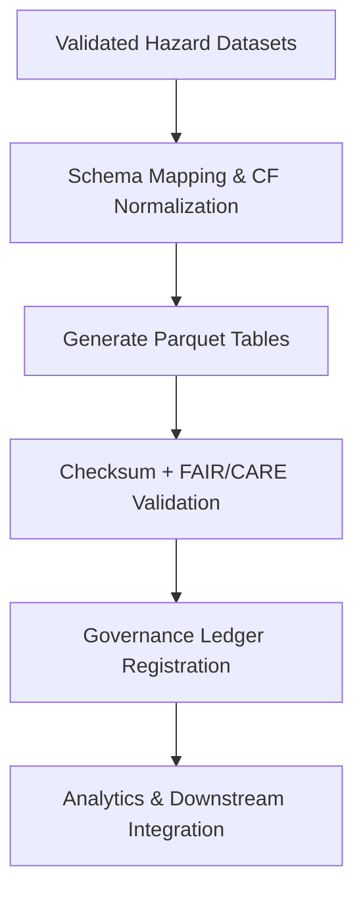

<div align="center">

# 📊 Kansas Frontier Matrix — **Hazards Parquet Exports**  
`data/work/tmp/hazards/exports/parquet/`

**Mission:** Provide **columnar, analytics-ready exports** of validated hazard datasets — tornado, flood, wildfire, and drought — optimized for reproducible analysis, FAIR+CARE metadata propagation, and ledger-verified provenance.

[](../../../../../../reports/fair/hazards_summary.json)
[]()
[]()
[]()
[]()

</div>

---

## 🧭 System Context

The **Hazards Parquet Exports** directory stores tabular, machine-readable datasets derived from the hazards transformation and validation layers.  
Each export file is checksum-verified, schema-validated, and registered under the **Governance Ledger**, enabling downstream analytics and FAIR+CARE-compliant sharing.

**Core Functions:**
- Provide lightweight, efficient data for analytical and statistical workflows.  
- Ensure schema alignment between tabular and STAC representations.  
- Maintain reproducible FAIR+CARE metadata and governance lineage.  
- Serve as a trusted source for public and internal hazard data queries.

> *“From data to insight — reproducibility begins with structure.”*

---

## 🗂️ Directory Layout

```text
data/work/tmp/hazards/exports/parquet/
├── tornado_events.parquet             # Tornado event-level dataset (NOAA SPC)
├── flood_events.parquet               # Floodplain and event-level records (FEMA/USGS)
├── wildfire_events.parquet            # Fire perimeters, spread, and impact data
├── drought_indices.parquet            # Drought index time series (USDM)
├── hazards_summary.parquet            # Multi-hazard integrated summary table
├── parquet_manifest.json              # Manifest linking Parquet exports and checksums
└── README.md
```

---

## ⚙️ Make Targets (Parquet Ops)

```text
make hazards-parquet-generate       # Generate Parquet exports from validation outputs
make hazards-parquet-verify         # Validate schema consistency and integrity
make hazards-parquet-checksum       # Compute and verify SHA-256 hashes
make hazards-parquet-ledger         # Register Parquet files in the Governance Ledger
```

---

## 🧩 Parquet Manifest Example

```json
{
  "manifest_id": "hazards-parquet-exports-2025Q4",
  "datasets": [
    {
      "file_name": "tornado_events.parquet",
      "schema": "tornado_tracks.schema.json",
      "record_count": 12458,
      "checksum_sha256": "a3f2c8dba1e09f...",
      "verified_by": "@kfm-data"
    },
    {
      "file_name": "flood_events.parquet",
      "schema": "flood_extents.schema.json",
      "record_count": 4321,
      "checksum_sha256": "b7f9a612ae14f9...",
      "verified_by": "@kfm-fair"
    }
  ],
  "validated_by": "@kfm-governance",
  "timestamp": "2025-10-27T00:00:00Z"
}
```

---

## 🧮 FAIR+CARE Lineage Matrix

| FAIR Dim. | CARE Dim. | Property | Reference | Purpose |
|:------------|:-----------|:-----------|:------------|:-----------|
| **Findable** | Collective Benefit | `parquet_manifest.json` | FAIR F1 | Provides searchable, FAIR metadata registry |
| **Accessible** | Responsibility | `license` | FAIR A1 | Ensures proper ethical data usage |
| **Interoperable** | Ethics | `schema` | FAIR I2 | Guarantees schema crosswalks with STAC/JSON |
| **Reusable** | Equity | `checksum_sha256` | FAIR R1 | Enables verified reuse of data artifacts |

---

## 🧠 Data Integration Workflow



---

## 📊 Example Summary Metrics (Q4 2025)

| Dataset | Records | Size (MB) | FAIR+CARE | Checksum | Status | Verified By |
|:-----------|:-----------:|:-----------:|:-----------:|:-----------:|:-----------:|:-----------:|
| Tornado Events | 12,458 | 142 | ✅ | ✅ | Certified | @kfm-data |
| Flood Events | 4,321 | 257 | ✅ | ✅ | Certified | @kfm-fair |
| Wildfire Events | 9,783 | 198 | ✅ | ✅ | Certified | @kfm-hazards |
| Drought Indices | 5,042 | 88 | ✅ | ✅ | Certified | @kfm-governance |
| Hazards Summary | 31,604 | 301 | ✅ | ✅ | Certified | @kfm-data |

---

## ⛓️ Blockchain Provenance Record

```json
{
  "ledger_id": "hazards-parquet-ledger-2025-10-27",
  "registered_exports": [
    "tornado_events.parquet",
    "flood_events.parquet",
    "wildfire_events.parquet",
    "drought_indices.parquet",
    "hazards_summary.parquet"
  ],
  "checksum_verified": true,
  "fair_care_validated": true,
  "stac_alignment": "confirmed",
  "pgp_signature": "pgp-sha256:<signature-id>",
  "verified_by": "@kfm-governance",
  "timestamp": "2025-10-27T00:00:00Z"
}
```

---

## 🧩 Self-Audit Metadata

```json
{
  "readme_id": "KFM-DATA-WORK-HAZARDS-PARQUET-RMD-v9.3.1",
  "validated_by": "@kfm-data",
  "audit_status": "pass",
  "exports_count": 5,
  "checksum_integrity": "verified",
  "fair_care_score": 100.0,
  "stac_alignment": true,
  "ledger_registered": true,
  "ledger_hash": "b7f9a612ae14f9...",
  "governance_cycle": "Q4 2025"
}
```

---

## 🧾 Version History

| Version | Date | Author | Reviewer | FAIR/CARE | Ledger | Summary |
|:----------:|:-----------:|:-----------|:-----------|:----------:|:-----------:|:-----------|
| v9.3.1 | 2025-10-27 | @kfm-data | @kfm-governance | ✅ | Ledger ✓ | Added Parquet manifest and governance workflow for multi-hazard analytics |
| v9.3.0 | 2025-10-25 | @kfm-hazards | @kfm-fair | ✅ | ✓ | Introduced FAIR+CARE schema linkage to STAC exports |
| v9.2.0 | 2025-10-23 | @kfm-climate | @kfm-security | ✅ | ✓ | Established baseline Parquet export process and audit traceability |

---

<div align="center">

### 📊 Kansas Frontier Matrix — *Analytics · FAIR+CARE · Provenance*  
**“Structure is clarity — Parquet turns verified hazards into actionable insight.”**

[](../../../../../../reports/fair/hazards_summary.json)
[]()
[]()
[]()
[]()

</div>

