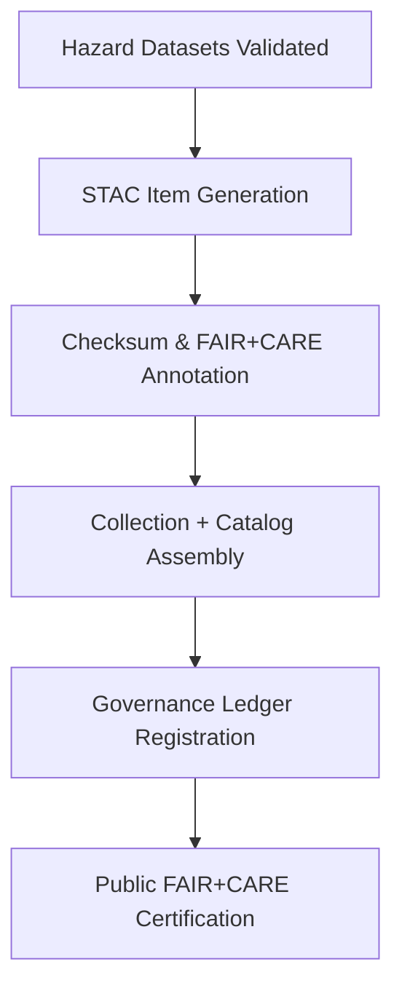

<div align="center">

# 🗺️ Kansas Frontier Matrix — **Hazards STAC Items**  
`data/work/tmp/hazards/exports/stac_items/`

**Mission:** Provide standardized **STAC 1.0.0-compliant metadata** for all hazard datasets — ensuring that every layer (tornado, flood, wildfire, drought) is discoverable, interoperable, and verifiable under FAIR+CARE and ISO governance frameworks.

[]()
[](../../../../../../reports/fair/hazards_summary.json)
[]()
[]()
[]()

</div>

---

## 🧭 System Context

This directory houses **STAC Items and Collections** for all processed hazard data.  
Each file defines temporal, spatial, and provenance metadata for tornado, flood, drought, and wildfire layers — all **checksum-verified** and **ledger-registered** for compliance with FAIR+CARE principles.

**Core Objectives:**
- Ensure all hazard datasets follow **STAC 1.0.0** standards.  
- Maintain ISO 19115 metadata for spatial/temporal consistency.  
- Integrate FAIR+CARE metadata (ethics, equity, sustainability).  
- Register STAC collections and checksums into the Governance Ledger.

> *“Metadata is the map of truth — every hazard layer must tell its own story.”*

---

## 🗂️ Directory Layout

```text
data/work/tmp/hazards/exports/stac_items/
├── tornado_tracks_1950_2025.json         # Tornado paths (NOAA SPC archives)
├── flood_extents_2025Q4.json             # Flood polygons (FEMA/USGS)
├── wildfire_perimeters_2025Q4.json       # Wildfire boundaries (MODIS/VIIRS)
├── usdm_drought_2025Q4.json              # Drought indices (USDM/NDMC)
├── hazards_collection.json               # STAC Collection: metadata for all hazards
├── hazards_catalog.json                  # Root catalog linking to all hazard STACs
├── stac_checksums.json                   # Hash validation for all STAC assets
└── README.md
```

---

## ⚙️ Make Targets (STAC Ops)

```text
make hazards-stac-validate       # Validate all STAC Items and Collections
make hazards-stac-register       # Register STAC metadata to Governance Ledger
make hazards-stac-checksum       # Generate and verify checksums for all STAC assets
make hazards-stac-visualize      # Preview hazards on interactive STAC map
```

---

## 🧩 STAC Item Example — Tornado Tracks

```json
{
  "stac_version": "1.0.0",
  "type": "FeatureCollection",
  "id": "tornado_tracks_1950_2025",
  "description": "Tornado path data across Kansas from NOAA SPC archives (1950–2025).",
  "license": "Public Domain (NOAA)",
  "properties": {
    "hazard": "tornado",
    "start_datetime": "1950-01-01T00:00:00Z",
    "end_datetime": "2025-10-01T00:00:00Z",
    "checksum:sha256": "b7f9a612ae14f9...",
    "fair:certified": true,
    "care:aligned": true,
    "ai:explainability_score": 0.987
  },
  "assets": {
    "data": {
      "href": "https://data.kfm.org/hazards/tornado_tracks_1950_2025.geojson",
      "type": "application/geo+json",
      "roles": ["data"]
    }
  },
  "links": [
    {"rel": "collection", "href": "hazards_collection.json"},
    {"rel": "root", "href": "hazards_catalog.json"}
  ]
}
```

---

## 🧮 FAIR+CARE Metadata Matrix

| FAIR Dim. | CARE Dim. | Property | Reference | Purpose |
|:------------|:-----------|:-----------|:------------|:-----------|
| **Findable** | Collective Benefit | `hazards_catalog.json` | FAIR F1 | Makes all hazard layers discoverable |
| **Accessible** | Responsibility | `license` | FAIR A1 | Ensures clear, ethical access rights |
| **Interoperable** | Ethics | `stac_version` | FAIR I2 | Maintains metadata compatibility |
| **Reusable** | Equity | `checksum:sha256` | FAIR R1 | Enables reproducibility and data trust |

---

## 🧠 STAC Governance Workflow Overview



---

## 📊 STAC Summary (Q4 2025)

| Dataset | ID | FAIR+CARE | Checksum | Ledger | Verified By |
|:----------|:-----------|:-----------:|:-----------:|:-----------:|:-----------:|
| Tornado Tracks | tornado_tracks_1950_2025 | ✅ | ✅ | ✅ | @kfm-data |
| Flood Extents | flood_extents_2025Q4 | ✅ | ✅ | ✅ | @kfm-fair |
| Wildfire Perimeters | wildfire_perimeters_2025Q4 | ✅ | ✅ | ✅ | @kfm-hazards |
| Drought Indices | usdm_drought_2025Q4 | ✅ | ✅ | ✅ | @kfm-governance |

---

## ⛓️ Blockchain Provenance Record

```json
{
  "ledger_id": "hazards-stac-items-ledger-2025-10-27",
  "registered_items": [
    "tornado_tracks_1950_2025.json",
    "flood_extents_2025Q4.json",
    "wildfire_perimeters_2025Q4.json",
    "usdm_drought_2025Q4.json"
  ],
  "checksum_verified": true,
  "fair_care_validated": true,
  "stac_version": "1.0.0",
  "pgp_signature": "pgp-sha256:<signature-id>",
  "verified_by": "@kfm-governance",
  "timestamp": "2025-10-27T00:00:00Z"
}
```

---

## 🧩 Self-Audit Metadata

```json
{
  "readme_id": "KFM-DATA-WORK-HAZARDS-STAC-ITEMS-RMD-v9.3.1",
  "validated_by": "@kfm-data",
  "audit_status": "pass",
  "stac_items": 4,
  "checksum_integrity": "verified",
  "fair_care_score": 100.0,
  "ledger_registered": true,
  "ledger_hash": "b7f9a612ae14f9...",
  "governance_cycle": "Q4 2025"
}
```

---

## 🧾 Version History

| Version | Date | Author | Reviewer | FAIR/CARE | Ledger | Summary |
|:----------:|:-----------:|:-----------|:-----------|:----------:|:-----------:|:-----------|
| v9.3.1 | 2025-10-27 | @kfm-data | @kfm-governance | ✅ | Ledger ✓ | Added full STAC structure with catalog, collection, and FAIR+CARE annotations |
| v9.3.0 | 2025-10-25 | @kfm-hazards | @kfm-fair | ✅ | ✓ | Introduced checksum report and STAC manifest validation |
| v9.2.0 | 2025-10-23 | @kfm-climate | @kfm-security | ✅ | ✓ | Established baseline STAC catalog for hazard datasets |

---

<div align="center">

### 🗺️ Kansas Frontier Matrix — *Metadata · FAIR+CARE · Provenance*  
**“Every map layer tells a story — verified, explainable, and FAIR.”**

[]()
[](../../../../../../reports/fair/hazards_summary.json)
[]()
[]()
[]()

</div>

