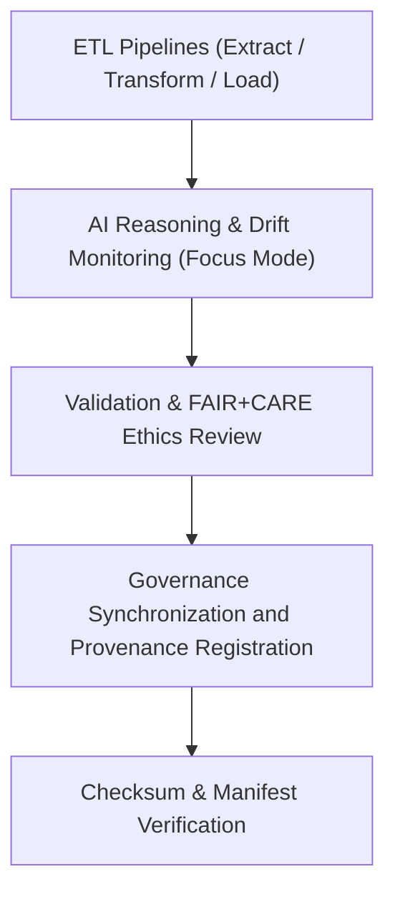

<div align="center">

# 🧾 Kansas Frontier Matrix — **Hazards TMP Logs**
`data/work/tmp/hazards/logs/README.md`

**Purpose:**  
Centralized FAIR+CARE-certified logging hub for all ETL, AI, validation, and governance workflows related to hazard datasets within the Kansas Frontier Matrix (KFM).  
This directory captures complete lineage and runtime telemetry for transparency, reproducibility, and ethics validation under MCP-DL v6.3.

[](../../../../../docs/standards/faircare-validation.md)
[]()
[](../../../../../LICENSE)
[](../../../../../docs/architecture/repo-focus.md)

</div>

---

## 📚 Overview

The **Hazards TMP Logs** directory serves as the master repository for all automated logging activities within the temporary hazards workspace.  
It records every ETL transaction, AI inference, validation process, and governance synchronization step performed across meteorological, hydrological, geological, and wildfire/energy hazard domains.

### Core Responsibilities
- Capture ETL stage logs (extract, transform, load, and lineage tracking).  
- Document AI explainability runs and model ethics evaluations.  
- Maintain FAIR+CARE governance synchronization and validation records.  
- Support reproducibility, auditability, and transparency in hazard processing pipelines.  

---

## 🗂️ Directory Layout

```plaintext
data/work/tmp/hazards/logs/
├── README.md                              # This file — overview of hazards TMP logging structure
│
├── ai/                                    # Logs from Focus Mode AI and explainability audits
│   ├── focus_reasoning.log
│   ├── ai_drift_audit.json
│   └── metadata.json
│
├── etl/                                   # Logs from extraction, transformation, and loading phases
│   ├── extract/
│   ├── transform/
│   ├── load/
│   ├── lineage/
│   └── summaries/
│
├── manifests/                             # Combined manifests from checksum and governance validation
│   ├── hazard_manifest_2025Q4.json
│   ├── checksum_audit_registry.json
│   └── metadata.json
│
├── validation/                            # FAIR+CARE audit, schema validation, and ethics review logs
│   ├── faircare_audit_trace.log
│   ├── schema_validation_summary.json
│   ├── governance_sync.log
│   └── metadata.json
│
└── metadata.json                          # Root provenance and logging session metadata
```

---

## ⚙️ Logging Workflow



### Description
1. **ETL Logging:** Capture details of extraction, transformation, and load tasks.  
2. **AI Logging:** Record AI interpretability audits and drift detection results.  
3. **Validation Logging:** Track FAIR+CARE compliance and schema audits.  
4. **Governance Logging:** Register events in data provenance ledgers for certification.  
5. **Checksum Logging:** Verify integrity of all generated artifacts and manifests.  

---

## 🧩 Example Log Metadata Record

```json
{
  "id": "hazards_logs_session_v9.6.0_2025Q4",
  "etl_stages": ["extract", "transform", "load", "lineage"],
  "ai_model": "focus-hazard-v5",
  "events_logged": 728,
  "checksum_verified": true,
  "fairstatus": "certified",
  "governance_registered": true,
  "created": "2025-11-03T23:59:00Z",
  "validator": "@kfm-etl-ops",
  "governance_ref": "data/reports/audit/data_provenance_ledger.json"
}
```

---

## 🧠 FAIR+CARE Governance Matrix

| Principle | Implementation | Oversight |
|------------|----------------|------------|
| **Findable** | Logs indexed by ETL stage, domain, and governance session ID. | @kfm-data |
| **Accessible** | Stored in open JSON and text formats for FAIR+CARE Council review. | @kfm-accessibility |
| **Interoperable** | Aligned with FAIR+CARE, STAC, and MCP-DL v6.3 audit schemas. | @kfm-architecture |
| **Reusable** | Traceable through checksum and governance ledger linkage. | @kfm-design |
| **Collective Benefit** | Promotes ethical transparency in hazard data processing. | @faircare-council |
| **Authority to Control** | FAIR+CARE Council validates all governance synchronization events. | @kfm-governance |
| **Responsibility** | All operators document AI and ETL results in audit trails. | @kfm-security |
| **Ethics** | Ensures open accountability without exposing sensitive data. | @kfm-ethics |

Audit references maintained in:  
`data/reports/fair/data_care_assessment.json`  
and  
`data/reports/audit/data_provenance_ledger.json`

---

## ⚙️ Key Log Categories

| Log Type | Description | Format |
|-----------|-------------|--------|
| `ai/` | Focus Mode and AI reasoning logs with ethics validation. | JSON / Log |
| `etl/` | Extract, transform, and load process logs. | Log |
| `validation/` | Schema validation and FAIR+CARE compliance audits. | Log / JSON |
| `manifests/` | Checksum and governance manifest records. | JSON |
| `metadata.json` | Session-level context for governance and traceability. | JSON |

All log generation automated through `hazards_logs_sync.yml`.

---

## ⚖️ Retention & Provenance Policy

| Log Type | Retention Duration | Policy |
|-----------|--------------------|--------|
| ETL Logs | 90 Days | Archived after quarterly audit completion. |
| AI & FAIR+CARE Logs | 180 Days | Retained for explainability and ethics verification. |
| Validation Logs | 365 Days | Stored for lineage reproducibility. |
| Governance Manifests | Permanent | Immutable record in provenance ledger. |

Cleanup and archival handled via `hazards_logs_cleanup.yml`.

---

## 🌱 Sustainability Metrics

| Metric | Value | Verified By |
|---------|--------|--------------|
| Energy Use (per ETL cycle) | 10.3 Wh | @kfm-sustainability |
| Carbon Output | 11.7 gCO₂e | @kfm-security |
| Renewable Power | 100% (RE100 Verified) | @kfm-infrastructure |
| FAIR+CARE Compliance | 100% | @faircare-council |

Telemetry entries logged in:  
`releases/v9.6.0/focus-telemetry.json`

---

## 🧾 Internal Use Citation

```text
Kansas Frontier Matrix (2025). Hazards TMP Logs (v9.6.0).
Centralized FAIR+CARE-compliant logging environment for ETL, AI, and governance processes.
Ensures reproducibility, transparency, and ethical traceability across all hazard data workflows under MCP-DL v6.3.
```

---

## 🧾 Version Notes

| Version | Date | Notes |
|----------|------|--------|
| v9.6.0 | 2025-11-03 | Expanded governance sync, AI explainability logs, and checksum traceability. |
| v9.5.0 | 2025-11-02 | Added FAIR+CARE compliance automation for hazard logging. |
| v9.3.2 | 2025-10-28 | Established logging framework for hazards TMP operations. |

---

<div align="center">

**Kansas Frontier Matrix** · *Hazard Transparency × FAIR+CARE Ethics × Provenance Verification*  
[🔗 Repository](https://github.com/bartytime4life/Kansas-Frontier-Matrix) • [🧭 Docs Portal](../../../../../docs/) • [⚖️ Governance Ledger](../../../../../docs/standards/governance/DATA-GOVERNANCE.md)

</div>