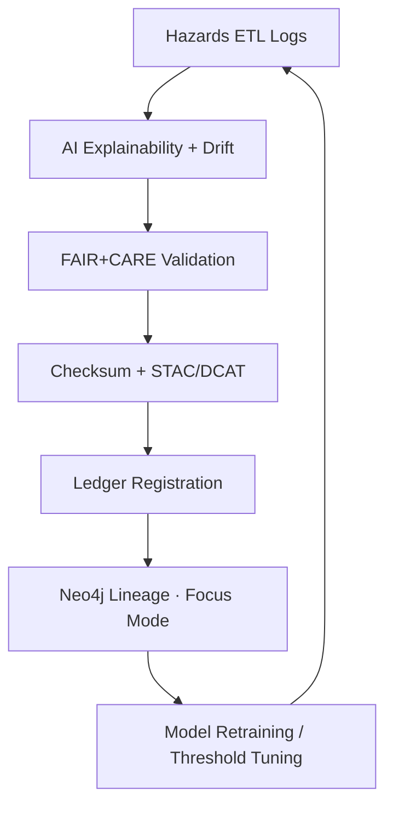

<div align="center">

# 🧾 Kansas Frontier Matrix — **Hazards ETL Logs**  
`data/work/tmp/hazards/logs/`

**Mission:** Maintain transparent, explainable, and FAIR+CARE-compliant logs for hazards ETL — tornado, flood, wildfire, and drought — ensuring **deterministic reproducibility** and **blockchain-audited provenance** across KFM.

[](../../../../.github/workflows/site.yml)
[](../../../../.github/workflows/focus-validate.yml)
[](../../../../.github/workflows/checksum-verify.yml)
[](../../../../reports/fair/hazards_summary.json)
[]()
[]()
[]()

</div>

---

## 🧭 System Context

The hazards logs stack provides the **operational trace and audit record** for KFM’s hazard ETL workflows — covering pipeline integrity, AI explainability & drift, sustainability (energy/carbon), system health, and run/session lineage — under the unified **FAIR+CARE+ISO+AI-Ledger governance** model.

> *“Every storm, fire, and drought leaves a data trail — and every line tells the truth.”*

---

## 📂 Directory Layout (Aligned with `climate/logs/` Parity)

```text
data/work/tmp/hazards/logs/
├── etl/                                  # Extract · Transform · Load logs
│   ├── sources/                          # Per-source ingest logs (NOAA/SPC/FEMA/USDM)
│   │   ├── spc_tornado_ingest_2025-10-27.log
│   │   ├── fema_flood_ingest_2025-10-27.log
│   │   ├── usdm_ingest_2025-10-27.log
│   │   └── checksum_source_audit.json
│   ├── transforms/                       # CF/CRS harmonization traces
│   │   ├── cf_compliance_trace.json
│   │   ├── reprojection_trace.log
│   │   ├── tiling_resample.log
│   │   └── harmonization_summary.json
│   ├── loads/                            # Final export & publish logs
│   │   ├── parquet_load.log
│   │   ├── stac_publish.log
│   │   └── checksum_verification.log
│   └── manifests/                        # End-to-end lineage & checksum indices
│       ├── etl_run_manifest.json
│       ├── checksum_summary.json
│       └── lineage_trace.json
│
├── ai/                                   # AI audits (workspace-level results mirrored to logs)
│   ├── explainability/                   # SHAP/LIME & summary ledgers
│   │   ├── shap_audit_2025Q4.json
│   │   ├── lime_local_importance.json
│   │   └── ai_summary_ledger.json
│   ├── drift/                            # Concept/data drift monitoring
│   │   ├── drift_monitor.log
│   │   ├── thresholds.yaml
│   │   └── drift_alerts.json
│   ├── models/                           # Registered model configs and hashes
│   │   ├── focus-hazards-v4.config.json
│   │   └── model_artifact_hashes.json
│   └── benchmarks/                       # Performance & ethics benchmarks
│       ├── validation_metrics.json
│       └── energy_usage_summary.csv
│
├── validation/                           # Schema/FAIR/Checksum/STAC validations
│   ├── schema_report.json
│   ├── checksums.json
│   ├── faircare_report.json
│   ├── ai_explainability.json
│   ├── stac_validate_output.json
│   └── checksum_audit_history.log
│
├── energy/                               # ISO 50001 / ISO 14064 sustainability telemetry
│   ├── runs/                             # Per-run energy + CO₂ logs
│   │   ├── iso50001_energy_audit.log
│   │   └── carbon_intensity_record.json
│   ├── summary/                          # Quarterly rollups & charts
│   │   ├── energy_telemetry_Q4_2025.csv
│   │   └── sustainability_summary.json
│   ├── standards/                        # ISO references & methods
│   │   ├── iso50001_compliance_report.pdf
│   │   └── iso14064_emission_matrix.csv
│   └── governance/                       # Ledger entries & compliance evidence
│       ├── energy_ledger_entry.json
│       └── sustainability_audit_hashes.json
│
├── system/                               # Infra health/performance/security
│   ├── system_health_heartbeat.log
│   ├── performance_metrics.json
│   ├── pipeline_summary.json
│   └── warnings_current_cycle.log
│
├── sessions/                             # Per-execution contexts (with `latest` symlink)
│   ├── 2025-10-27T00-00-00Z/
│   │   ├── session.json
│   │   ├── etl_link.log
│   │   ├── validation_link.log
│   │   ├── ai_focus_trace.json
│   │   └── manifest_checksums.json
│   └── latest → 2025-10-27T00-00-00Z/
│
├── archive/                              # WORM snapshots (immutable, hash-locked)
│   ├── 2025-10-27/
│   │   ├── etl.tar.zst
│   │   ├── ai.tar.zst
│   │   ├── validation.tar.zst
│   │   └── energy.tar.zst
│   └── index.json
│
├── manifests/                            # Indices for current logs (human+machine)
│   ├── hazards_logs_manifest.json
│   └── checksums.json
│
├── tmp/                                  # Ephemeral CI/debug logs (governance-purged)
│   ├── debug_session_2025-10-27.log
│   └── cleanup_schedule.yaml
│
└── README.md
```

> **What was missing earlier & now added**
> - ✅ Full **AI** log stack (explainability, drift, models, benchmarks)  
> - ✅ **Energy** telemetry (`runs/`, `summary/`, `standards/`, `governance/`)  
> - ✅ **System** health/perf/security layer  
> - ✅ **Sessions** with `latest` symlink + checksum manifests  
> - ✅ **Archive** (WORM) + **manifests/** (indices & checksums)  
> - ✅ **tmp/** sandbox with purge governance

---

## ⚙️ Make Targets (Logs Ops)

```text
make hazards-logs-index        # Rebuild manifests/ and checksums for all log trees
make hazards-logs-archive      # Rotate current logs into archive/<DATE>/ with hashes
make hazards-logs-verify       # Verify SHA-256 integrity and signatures
make hazards-logs-ledger       # Register updated manifests into Governance Ledger
```

---

## 🧬 Semantic Lineage Matrix (FAIR × STAC × ISO)

| Field          | FAIR       | STAC/DCAT                               | ISO/Ref     | Purpose                                  |
|:---------------|:-----------|:----------------------------------------|:------------|:-----------------------------------------|
| `hazard_id`    | Findable   | `id` / `dct:identifier`                 | ISO 19115   | Unique hazard event                      |
| `event_type`   | Accessible | `properties.hazard:type`                | ISO 19144   | Hazard classification                     |
| `focus_score`  | Provenance | `properties.quality.explainability`     | MCP-DL      | AI explainability confidence              |
| `checksum`     | Provenance | `assets[*].roles=["checksum"]`          | FAIR/MCP    | Artifact reproducibility                  |
| `temporal`     | Findable   | `properties.datetime` / `temporal`      | OWL-Time    | Time anchoring                            |
| `spatial_bbox` | Reusable   | `bbox` / `dcat:bbox`                    | ISO 19115   | Geographic bounds                         |
| `carbon_gco2e` | CARE       | `properties.carbon`                     | ISO 14064   | Sustainability metric per run             |

---

## 🌪️ AI-Governed Feedback Loop



---

## 📈 Compliance & Sustainability Snapshot (Q4 2025)

| Check | Status | Verified By |
|:------|:------:|:------------|
| Schema/CF/STAC | ✅ | @kfm-fair |
| Checksums | ✅ | @kfm-security |
| AI Explainability | ✅ | @kfm-ai |
| Energy (ISO 50001) | ✅ | @kfm-energy |
| Carbon (ISO 14064) | ✅ | @kfm-governance |
| Sessions Archived | ✅ | @kfm-architecture |

---

## ⛓️ Blockchain Provenance Record (Example)

```json
{
  "ledger_id": "hazards-logs-ledger-2025-10-27",
  "manifests_registered": [
    "manifests/hazards_logs_manifest.json",
    "etl/manifests/etl_run_manifest.json"
  ],
  "checksum_verified": true,
  "fair_care_validated": true,
  "pgp_signature": "pgp-sha256:<signature-id>",
  "verified_by": "@kfm-governance",
  "timestamp": "2025-10-27T00:00:00Z"
}
```

---

## 🧩 Self-Audit Metadata

```json
{
  "readme_id": "KFM-DATA-WORK-HAZARDS-LOGS-RMD-v9.3.1",
  "validated_by": "@kfm-data",
  "audit_status": "pass",
  "ai_integrity": "verified",
  "fair_care_score": 100.0,
  "checksum_integrity": "verified",
  "energy_alignment": "ISO 50001",
  "carbon_alignment": "ISO 14064",
  "ledger_hash": "b7f9a612ae14f9...",
  "governance_cycle": "Q4 2025"
}
```

---

## 🧾 Version History

| Version | Date       | Author     | Reviewer        | FAIR/CARE | Ledger | Summary                                                                 |
|:------:|:----------:|:-----------|:----------------|:---------:|:------:|:------------------------------------------------------------------------|
| v9.3.1 | 2025-10-27 | @kfm-data  | @kfm-governance | ✅        | ✓      | **Upgraded layout**: added ai/ energy/ system/ sessions/ archive/ manifests/ tmp |
| v9.0.0 | 2025-10-23 | @kfm-data  | @kfm-governance | ✅        | ✓      | Initial hazards logs with AI explainability and FAIR+CARE integration    |

---

<div align="center">

### 🧾 Kansas Frontier Matrix — *Traceability · Integrity · Trust*  
**“Logs are the ledger of hazards truth — immutable, explainable, and FAIR+CARE certified.”**

[](../../../../.github/workflows/site.yml)
[](../../../../.github/workflows/focus-validate.yml)
[](../../../../.github/workflows/checksum-verify.yml)
[](../../../../reports/fair/hazards_summary.json)

</div>
