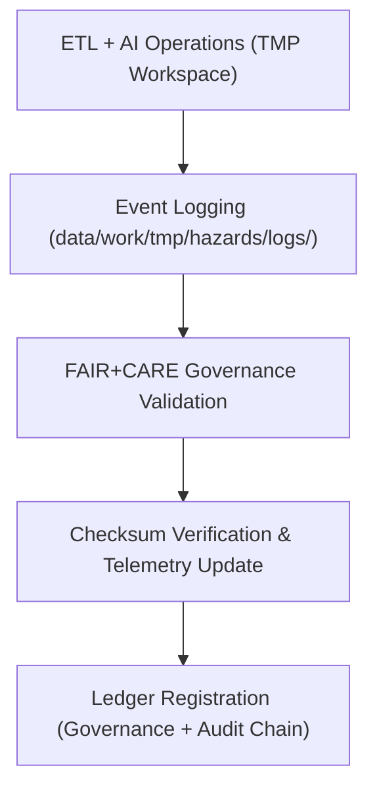

<div align="center">

# 🧾 Kansas Frontier Matrix — **Hazard TMP Logs**
`data/work/tmp/hazards/logs/README.md`

**Purpose:**  
Centralized governance and QA log repository for **hazard ETL, AI, validation, and audit activities** within the Kansas Frontier Matrix (KFM).  
This workspace ensures transparency, traceability, and FAIR+CARE-certified documentation across all hazard TMP operations.

[](../../../../docs/standards/faircare-validation.md)
[](../../../../LICENSE)
[](../../../../docs/architecture/repo-focus.md)

</div>

---

## 📚 Overview

The `data/work/tmp/hazards/logs/` directory functions as the **operational logging hub** for all temporary hazard data activities.  
Every transformation, validation, AI inference, and governance event is documented here with full provenance linkage and checksum integrity validation.

### Core Functions
- Log ETL activity (Extract, Transform, Load) with timestamped audit trails.  
- Capture AI explainability, model drift, and Focus Mode insights.  
- Store FAIR+CARE compliance and schema validation reports.  
- Maintain synchronization records with the KFM Governance Ledger and Telemetry systems.  

---

## 🗂️ Directory Layout

```plaintext
data/work/tmp/hazards/logs/
├── README.md                              # This file — overview of hazard TMP logs
│
├── ai/                                    # Focus Mode AI reasoning and explainability logs
├── energy/                                # Energy grid exposure and resilience analytics logs
├── etl/                                   # Extract, Transform, Load logs for hazard data pipelines
│   ├── extract/                           # Source ingestion and raw data acquisition logs
│   ├── transform/                         # ETL transformation and harmonization logs
│   ├── load/                              # Publication and staging synchronization logs
│   ├── lineage/                           # Provenance and dependency chain records
│   └── summaries/                         # Aggregated ETL performance and audit summaries
│
├── manifests/                             # TMP manifest files linking checksum, telemetry, and validation metadata
├── validation/                            # FAIR+CARE schema validation and checksum verification logs
├── archive/                               # Historical log archives and immutable checksum bundles
├── system/                                # Internal orchestration, runtime, and automation logs
└── metadata.json                          # Provenance metadata for TMP log operations
```

---

## ⚙️ Logging Workflow



### Workflow Description
1. **Event Capture:** Every TMP pipeline generates standardized logs for ETL, validation, and AI operations.  
2. **Governance Integration:** FAIR+CARE validation ensures ethical and transparent event documentation.  
3. **Checksum Verification:** All logs cryptographically signed and validated via manifest.  
4. **Provenance Recording:** Logs registered in governance ledger and linked to telemetry reports.

---

## 🧩 Example Log Metadata Record

```json
{
  "id": "hazards_tmp_logs_v9.5.0_2025Q4",
  "log_categories": ["etl", "ai", "validation", "governance"],
  "records_logged": 29872,
  "checksum_verified": true,
  "fairstatus": "compliant",
  "governance_synced": true,
  "telemetry_ref": "releases/v9.5.0/focus-telemetry.json",
  "governance_ref": "reports/audit/ai_hazards_ledger.json",
  "created": "2025-11-02T19:40:00Z",
  "validator": "@kfm-etl-ops"
}
```

---

## 🧠 FAIR+CARE Governance Matrix

| Principle | Implementation |
|------------|----------------|
| **Findable** | Logs indexed by domain, timestamp, and checksum in ledger. |
| **Accessible** | Stored in open text and JSON formats for internal audit review. |
| **Interoperable** | Schema aligns with ISO 19115, DCAT, and KFM MCP-DL logging standards. |
| **Reusable** | Each log retains lineage, checksum, and governance context. |
| **Collective Benefit** | Provides transparency into all hazard TMP data activities. |
| **Authority to Control** | FAIR+CARE Council certifies log governance and retention. |
| **Responsibility** | ETL maintainers document and verify all pipeline actions. |
| **Ethics** | Logs anonymized to exclude sensitive operational or dataset identifiers. |

Governance and ethics results stored in:  
`reports/audit/ai_hazards_ledger.json` • `reports/fair/hazards_logs_summary.json`

---

## ⚙️ Validation & QA Artifacts

| File / Folder | Description | Format |
|----------------|--------------|--------|
| `ai/` | AI reasoning, drift, and explainability logs. | JSON / Log |
| `etl/` | Extract, transform, and load process event logs. | JSON / Log |
| `manifests/` | TMP lifecycle manifests with checksums and telemetry linkage. | JSON |
| `validation/` | FAIR+CARE, checksum, and schema compliance logs. | JSON |
| `system/` | Runtime orchestration and workflow automation logs. | Text |
| `metadata.json` | Log-level provenance metadata and governance references. | JSON |

Log creation and synchronization automated via `hazards_logs_sync.yml`.

---

## 🧾 Retention Policy

| Log Type | Retention Duration | Policy |
|-----------|--------------------|--------|
| AI & ETL Logs | 90 days | Archived after validation and audit registration. |
| Validation Logs | 365 days | Retained for FAIR+CARE re-certification review. |
| Governance & Manifests | Permanent | Stored indefinitely for lineage and reproducibility. |
| System Logs | 30 days | Purged automatically post-run verification. |

Retention handled by `hazards_logs_cleanup.yml`.

---

## 🧾 Internal Use Citation

```text
Kansas Frontier Matrix (2025). Hazard TMP Logs (v9.5.0).
Centralized FAIR+CARE-certified logging environment for ETL, validation, and AI-driven hazard data workflows.
Maintains checksum integrity, ethics compliance, and ledger traceability across all TMP processes.
```

---

## 🧾 Version Notes

| Version | Date | Notes |
|----------|------|--------|
| v9.5.0 | 2025-11-02 | Added telemetry schema v2, archive log integration, and governance manifest linkage. |
| v9.3.2 | 2025-10-28 | Expanded ETL lineage tracking and FAIR+CARE validation coverage. |
| v9.3.0 | 2025-10-26 | Established TMP logging workspace under MCP-DL v6.3 standards. |

---

<div align="center">

**Kansas Frontier Matrix** · *Operational Transparency × FAIR+CARE Ethics × Provenance Integrity*  
[🔗 Repository](https://github.com/bartytime4life/Kansas-Frontier-Matrix) • [🧭 Docs Portal](../../../../docs/) • [⚖️ Governance Ledger](../../../../docs/standards/governance/)

</div>